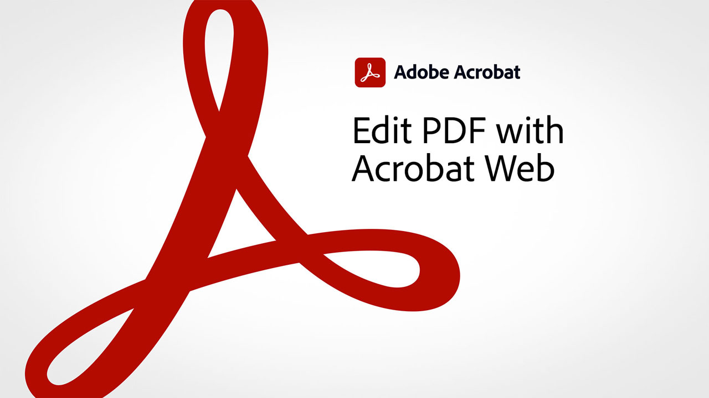

# Acrobat-overzicht van 60 seconden

60-Seconde Acrobat biedt tutorials ter grootte van een hapje om je te helpen in Acrobat in één minuut of minder een nieuwe truc te leren. Met deze taakgebaseerde tips kun je nieuwe vaardigheden voor het werken met PDF-bestanden opdoen door enkele verborgen Acrobat-elementen te ontgrendelen. Je kunt er een bekijken om snel antwoord te krijgen, of vijf bekijken om je documentproductiviteit te verhogen - en nog steeds tijd hebben om van je koffiepauze te genieten.

## Zelfstudies voor Acrobat van 60 seconden

## Bewerken

<table style="table-layout:fixed">
<tr>
   <td>
    
    

    <a href="edit.md"><strong>PDF bewerken met Acrobat Web</strong></a>
    

    <em>Eenvoudige bewerkingen uitvoeren op tekst en afbeeldingen zonder zelfs de PDF te downloaden</em>
     
  </td>
  <td>
    
    

     <a href="textrecognition.md"><strong>Tekst in een gescand PDF-bestand herkennen</strong></a>
    

    <em>Een gescande PDF omzetten zodat u naar tekst in de PDF kunt zoeken</em>
     
  </td>
  <td>
    
    

    <a href="combine-to-one-pdf.md"><strong>Bestanden combineren tot één PDF</strong></a>
    

    <em>Snel een nieuw document maken door verschillende typen bestanden te combineren tot één PDF</em>
     
  </td>
   <td>
    
    

    <a href="organize.md"><strong>Pagina's in een oogwenk ordenen</strong></a>
    

    <em>Leer hoe u het gereedschap Pagina's indelen gebruikt om een totaalbeeld van uw PDF te krijgen</em>
     
  </td>
</tr>
<tr>
  <td>
    
    

    <a href="editphoto.md"><strong>Een foto bewerken in uw PDF</strong></a>
    

    <em>Leer hoe u geavanceerde bewerkingen uitvoert op een foto in uw PDF met Photoshop</em>
     
  </td>
  <td>
    
    

    <a href="editgraphic.md"><strong>Een afbeelding in uw PDF bewerken</strong></a>
    

    <em>Leer hoe u geavanceerde bewerkingen kunt uitvoeren op een afbeelding in uw PDF met Illustrator</em>
     
  </td>
  <td>
      
        

         
  </td>
  <td>
      
        

         
  </td>
</tr>
</table>

## Converteren

<table style="table-layout:fixed">
<tr>
  <td>
    
    

    <a href="exportwordphone.md"><strong>Export PDF aan Word van uw telefoon</strong></a>
    

    <em>Een PDF-bestand converteren naar een volledig bewerkbaar Microsoft Word-document met de mobiele Acrobat-app</em>
     
  </td>
  <td>
      
        

         
  </td>
  <td>
      
        

         
  </td>
  <td>
      
        

         
  </td>
</tr>
</table>

## Maken

<table style="table-layout:fixed">
<tr>
  <td>
    
    

     <a href="wordform.md"><strong>Word converteren naar PDF, inclusief formuliervelden</strong></a>
    

    <em>Word-bestanden en -formulieren converteren naar PDF en automatisch formuliervelden maken</em>
     
  </td>
  <td>
      
      

      <a href="photo.md"><strong>In een oogwenk een PDF van foto's maken</strong></a>
      

      <em>Leer hoe je een paar JPG naar het Acrobat-pictogram sleept om een PDF te maken</em>
       
  </td>
  <td>
    
    

    <a href="phone.md"><strong>Zet een PPT-bestand om in PDF op uw telefoon</strong></a>
    

    <em>Leer hoe u een PowerPoint-e-mailbijlage kunt converteren naar PDF op uw telefoon</em>
     
  </td>
  <td>
      
      

      <a href="optimize.md"><strong>Eenvoudiger PDF-bestanden maken</strong></a>
      

      <em>Gebruik de Optimize PDF-tool om de grootte van uw PDF-bestanden aanzienlijk te verkleinen</em>
       
  </td>
</tr>
</table>

## Ondertekenen

<table style="table-layout:fixed">
<tr>
  <td>
    
    

    <a href="sign.md"><strong>Elektronisch een papieren document ondertekenen</strong></a>
    

    <em>Leer Adobe Scan gebruiken om een afgedrukt formulier te ondertekenen</em>
     
  </td>
  <td>
      
        

         
  </td>
  <td>
      
        

         
  </td>
  <td>
      
        

         
  </td>
</tr>
</table>

## Beveiligen

<table style="table-layout:fixed">
<tr>
  <td>
    
    

    <a href="protect.md"><strong>Protect uw PDF-bestanden met een wachtwoord</strong></a>
    

    <em>Protect a PDF zodat er een wachtwoord vereist is om de PDF te openen of te bewerken</em>
     
  </td>
  <td>
      
        

         
  </td>
  <td>
      
        

         
  </td>
  <td>
      
        

         
  </td>
</tr>
</table>

## Voorbereiden

<table style="table-layout:fixed">
<tr>
  <td>
    
    

    <a href="accessible.md"><strong>Acrobat helpen bij het maken van toegankelijke PDF</strong></a>
    

    <em>Controleren of een PDF toegankelijk is</em>
     
  </td>
  <td>
      
        

         
  </td>
  <td>
      
        

         
  </td>
  <td>
      
        

         
  </td>
</tr>
</table>

## Aanvullende onderwerpen

<table style="table-layout:fixed">
<tr>
  <td>
    
    

     <a href="search.md"><strong>Meerdere PDF-bestanden tegelijk zoeken</strong></a>
    

    <em>Een zoekopdracht starten in een PDF-bestand, vervolgens Geavanceerd zoeken openen en een hele map met PDF-bestanden doorzoeken</em>
     
  </td>
  <td>
    
    

    <a href="indesign.md"><strong>PDF-opmerkingen laden in InDesign</strong></a>
    

    <em>Leer hoe u PDF-opmerkingen weer in InDesign kunt laden na een gedeelde Acrobat-revisie</em>
     
  </td>
  <td>
      
        

         
  </td>
  <td>
      
        

         
  </td>
</tr>
</table>