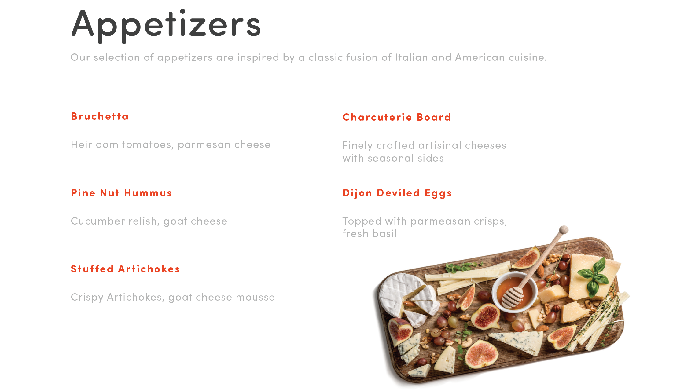
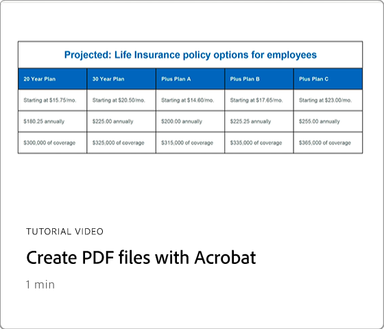

# Acrobat-overzicht van 60 seconden

60-Seconde Acrobat biedt tutorials ter grootte van een hapje om je te helpen in Acrobat in één minuut of minder een nieuwe truc te leren. Met deze taakgebaseerde tips kun je nieuwe vaardigheden voor het werken met PDF-bestanden opdoen door enkele verborgen Acrobat-elementen te ontgrendelen. Je kunt er een bekijken om snel antwoord te krijgen, of vijf bekijken om je documentproductiviteit te verhogen - en nog steeds tijd hebben om van je koffiepauze te genieten.

## Zelfstudies voor Acrobat van 60 seconden

## Bewerken

<table style="table-layout:fixed">
<tr>
   <td>
    
  </td>
  <td>
    
  </td>
  <td>
    
  </td>
   <td>
    
  </td>
</tr>
<tr>
  <td>
    
  </td>
  <td>
    
  </td>
  <td>
      
        

         
  </td>
  <td>
      
        

         
  </td>
</tr>
</table>

## Converteren

<table style="table-layout:fixed">
<tr>
  <td>
    
  </td>
 <td>
    
  </td>
  <td>
    
  </td>
  <td>
    
  </td>
</tr>
</table>

## Maken

<table style="table-layout:fixed">
<tr>
  <td>
    
  </td>
  <td>
    
  <td>
    
  </td>
  <td>
      
  </td>
</tr>
<tr>
  <td>
    
  </td>
  <td>
      
  </td>
  <td>
      
        

         
  </td>
  <td>
      
        

         
  </td>
</tr>
</table>

## Ondertekenen

<table style="table-layout:fixed">
<tr>
  <td>
    
  </td>
  <td>
      
        

         
  </td>
  <td>
      
        

         
  </td>
  <td>
      
        

         
  </td>
</tr>
</table>

## Beveiligen

<table style="table-layout:fixed">
<tr>
  <td>
    
  </td>
  <td>
    
  </td>
  <td>
      
        

         
  </td>
  <td>
      
        

         
  </td>
</tr>
</table>

## Delen en reviseren

<table style="table-layout:fixed">
<tr>
  <td>
    
  </td>
  <td>
    
  </td>
  <td>
    
  </td>
   <td>
    
  </td>
</tr>
</table>

## Voorbereiden

<table style="table-layout:fixed">
<tr>
  <td>
    
  </td>
 <td>
    
  </td>
  <td>
      
        

         
  </td>
  <td>
      
        

         
  </td>
</tr>
</table>

## Aanvullende onderwerpen

<table style="table-layout:fixed">
<tr>
  <td>
    
  </td>
 <td>
    
  </td>
  <td>
      
        

         
  </td>
  <td>
      
        

         
  </td>
</tr>
</table>