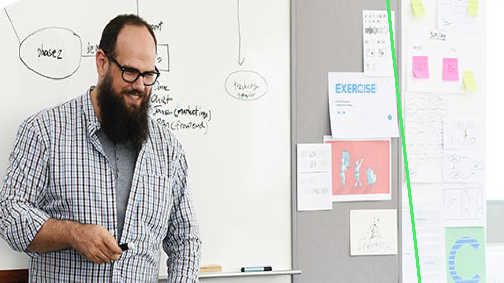

# Acrobat-overzicht van 60 seconden

60-Seconde Acrobat biedt tutorials ter grootte van een hapje om je te helpen in Acrobat in één minuut of minder een nieuwe truc te leren. Met deze taakgebaseerde tips kun je nieuwe vaardigheden voor het werken met PDF-bestanden opdoen door enkele verborgen Acrobat-elementen te ontgrendelen. Je kunt er een bekijken om snel antwoord te krijgen, of vijf bekijken om je documentproductiviteit te verhogen - en nog steeds tijd hebben om van je koffiepauze te genieten.

## Zelfstudies voor Acrobat van 60 seconden

## Bewerken

<table style="table-layout:fixed">
<tr>
   <td>
    
    

    <a href="edit.md"><strong> geef PDF met het Web van Acrobat </strong></a> uit
    

    Leer hoe u kunt bewerken op Acrobat-webpagina
     
  </td>
  <td>
    
    

    <a href="textrecognition.md"><strong> herken tekst in een gescand PDF dossier </strong></a>
    

    Leer hoe u tekst van een gescande afbeelding herkent
     
  </td>
  <td>
    
    

    <a href="combine-to-one-pdf.md"><strong> combineer dossiers in één PDF </strong></a>
    

    Leer hoe je snel bestanden kunt combineren tot één PDF
     
  </td>
   <td>
    
    

    <a href="organize.md"><strong> organiseer pagina's in onverwacht </strong></a>
    

    Leer hoe je snel pagina’s ordent in een PDF
     
  </td>
</tr>
<tr>
  <td>
    
    

    <a href="editphoto.md"><strong> geef een foto in uw PDF </strong></a> uit
    

    Leer hoe u een foto bewerkt in uw PDF
  </td>
  <td>
    
    

    <a href="editgraphic.md"><strong> geef grafisch in uw PDF </strong></a> uit
    

    Leer hoe je een afbeelding bewerkt in je PDF
  </td>
  <td>
      
        

         
  </td>
  <td>
      
        

         
  </td>
</tr>
</table>

## Converteren

<table style="table-layout:fixed">
<tr>
  <td>
    
    

    <a href="convert-pdf-word.md"><strong> zet een PDF in Word </strong></a> om
    

    Leer hoe u een PDF naar Word-indeling converteert
  </td>
 <td>
    
    

    <a href="convert-pdf-excel.md"><strong> zet een PDF in Excel </strong></a> om
    

    Leer hoe u een PDF naar Excel-indeling converteert
  </td>
  <td>
    
    

    <a href="convert-pdf-powerpoint.md"><strong> zet een PDF in PowerPoint </strong></a> om
    

    Leer hoe u een PDF omzet naar een PowerPoint-indeling
  </td>
  <td>
    
    

    <a href="exportwordphone.md"><strong> Export PDF aan Word van uw telefoon </strong></a>
    

    Leer hoe u een PDF van uw telefoon naar Word exporteert
  </td>
</tr>
</table>

## Maken

<table style="table-layout:fixed">
<tr>
  <td>
    
    

    <a href="word-to-pdf.md"><strong> creeer een PDF van Microsoft Word </strong></a>
    

    Leer hoe u een PDF rechtstreeks vanuit Word kunt maken
  </td>
  <td>
    
    

    <a href="create-from-acrobat.md"><strong> creeer PDF van Acrobat </strong></a>
    

    Leer hoe je PDF maakt vanuit Acrobat
  <td>
    
    

    <a href="wordform.md"><strong> zet Word in PDF met inbegrip van vormgebieden </strong></a> om
    

    Een Word-bestand converteren naar PDF en automatisch formuliervelden genereren
  </td>
  <td>
    
    

    <a href="photo.md"><strong> creeer een PDF van foto's in een ogenblik </strong></a>
    

    Een PDF van meerdere foto's maken
  </td>
</tr>
<tr>
  <td>
    
    

    <a href="phone.md"><strong> zet een Ppt- dossier in PDF op uw telefoon </strong></a> om
    

    Zet een dossier van PowerPoint in PDF op uw telefoon om
  </td>
  <td>
    
    

    <a href="optimize.md"><strong> creeer efficiëntere PDF dossiers in een breuk </strong></a>
    

    Optimaliseer je PDF-bestanden in een oogwenk
  </td>
  <td>
      
        

         
  </td>
  <td>
      
        

         
  </td>
</tr>
</table>

## Ondertekenen

<table style="table-layout:fixed">
<tr>
  <td>
    
    

    <a href="sign.md"><strong> Elektronisch een document van het document </strong></a> ondertekenen
    

    Leer hoe u een papieren document elektronisch ondertekent
  </td>
  <td>
      
        

         
  </td>
  <td>
      
        

         
  </td>
  <td>
      
        

         
  </td>
</tr>
</table>

## Beveiligen

<table style="table-layout:fixed">
<tr>
  <td>
    
    

    <a href="protect.md"><strong> Protect uw PDF dossiers met een wachtwoord </strong></a>
    

    Leer hoe u uw PDF met een wachtwoord kunt beveiligen
  </td>
  <td>
    
    

    <a href="redaction.md"><strong> Redaction: De juiste manier </strong></a>
    

    Leer hoe je gevoelige informatie in je PDF op de juiste manier kunt redigeren
  </td>
  <td>
      
        

         
  </td>
  <td>
      
        

         
  </td>
</tr>
</table>

## Delen en reviseren

<table style="table-layout:fixed">
<tr>
  <td>
    
    

    <a href="share-comment.md"><strong> Deel een PDF voor het becommentariëren </strong></a>
    

    Leer hoe u een PDF kunt delen zodat anderen opmerkingen kunnen maken over
  </td>
  <td>
    
    

    <a href="share-comment-teams.md"><strong> Aandeel en commentaar op de dossiers van de PDF in Teams </strong></a>
    

    Delen en opmerkingen plaatsen over een PDF-bestand in Microsoft Teams
  </td>
  <td>
    
    

    <a href="summarize-comments.md"><strong> Wrangling PDF commentaren met Samenvatten </strong></a>
    

    Al uw opmerkingen samenvatten in één PDF
  </td>
   <td>
    
    

    <a href="indesign.md"><strong> de commentaren van de Lading PDF in InDesign </strong></a>
    

    Leer hoe je al je PDF-opmerkingen in InDesign brengt
  </td>
</tr>
</table>

## Voorbereiden

<table style="table-layout:fixed">
<tr>
  <td>
    
    

    <a href="accessible.md"><strong> laat Acrobat helpen u Toegankelijke PDF </strong></a> maken
    

    Leer hoe je PDF algemeen toegankelijk maakt
  </td>
 <td>
    
    

    <a href="conform.md"><strong> zet een PDF aan een standaardformaat </strong></a> om
    

    Leer hoe u een PDF kunt omzetten in een bepaalde standaard
  </td>
  <td>
      
        

         
  </td>
  <td>
      
        

         
  </td>
</tr>
</table>

## Aanvullende onderwerpen

<table style="table-layout:fixed">
<tr>
  <td>
    
    

    <a href="compare.md"><strong> vlek de verschillen met PDF vergelijken </strong></a>
    

    Leer hoe u het verschil tussen twee PDF snel kunt vergelijken
  </td>
 <td>
    
    

    <a href="search.md"><strong> Onderzoek veelvoudige dossiers van de PDF tegelijkertijd </strong></a>
    

    Leer hoe u kunt zoeken in meerdere PDF-bestanden
  </td>
  <td>
      
        

         
  </td>
  <td>
      
        

         
  </td>
</tr>
</table>