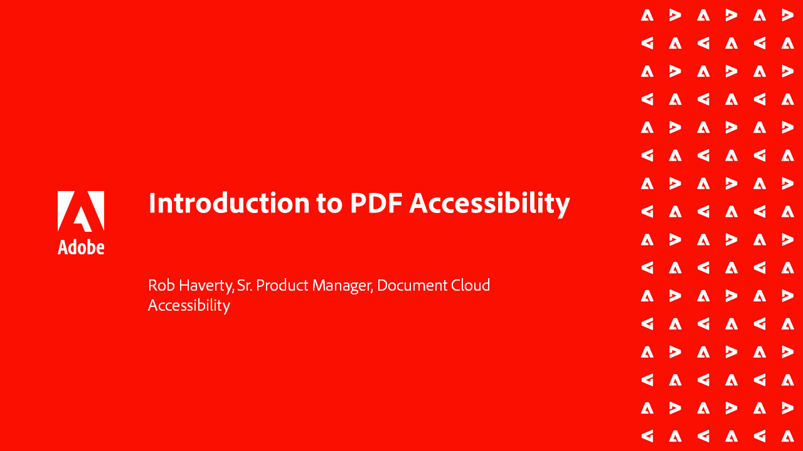

# Acrobat Accessibility-reeks

In deze zes-delige webinarseries, ga van de grondbeginselen van Toegankelijkheid naar een diepgaande duik van het etiketteren van uw PDF dossiers. Elke sessie bevat oefenbestanden om mee te doen.

<table style="table-layout:fixed">
<tr>
  <td>
    
    

    <a href="accessibilitysession1.md"><strong>Inleiding tot toegankelijkheid PDF</strong></a>
    

    <em>In deze sessie op aanvraag leert u wat het betekent om een PDF toegankelijk te maken, hoe u Acrobat Pro instelt om te werken aan PDF voor toegankelijkheid en hoe u het conversieproces van een brondocument naar een PDF doorvoert</em>
     
  </td>
  <td>
    
    

    <a href="accessibilitysession2.md"><strong>Een ontoegankelijke PDF herstellen</strong></a>
    

    <em>Leer in deze sessie op aanvraag de workflow voor het converteren van een Word-document en het oplossen van enkele basiscoderingsproblemen met de Acrobat Pro-tools die in de inleiding van het webinar worden getoond</em>
     
  </td>  
  <td>
    
    

    <a href="accessibilitysession3.md"><strong>Complexe tabellen</strong></a>
    

    <em>Deze on-demand sessie behandelt een van de meer voorkomende en uitdagende problemen bij het oplossen van een PDF voor toegankelijkheid: complexe tabellen</em>
     
  </td>
</tr>
<tr>
  <td>
    
    

    <a href="accessibilitysession4.md"><strong>Gescande documenten en complexe lijsten</strong></a>
    

    <em>Deze on-demand sessie behandelt de complexere problemen die mensen vaak tegenkomen, zoals gescande documenten en complexe lijsten</em>
     
  </td>
  <td>
    
    

    <a href="accessibilitysession5.md"><strong>Formuliervelden toevoegen aan een gecodeerde PDF</strong></a>
    

    <em>Deze sessie op verzoek is gericht op het toevoegen van formuliervelden aan een eerder gecodeerde PDF</em>
     
  </td>  
  <td>
    
    

    <a href="accessibilitysession6.md"><strong>Formuliervelden toevoegen aan een niet-gecodeerde PDF</strong></a>
    

    <em>Deze sessie op verzoek gaat dieper in op het maken van handmatige formuliervelden en aanvullende eigenschappen voor formuliervelden</em>
     
  </td> 
</tr>
</table>
