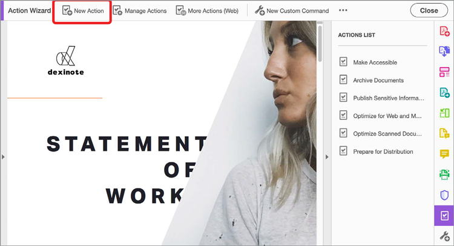

# Action Wizard

Om de beste klantervaringen te bieden, moet content sneller dan ooit worden gecreëerd. Bespaar tijd en toetsaanslagen door met een handeling automatisch een set opdrachten toe te passen op een of meerdere bestanden.

>[!NOTE]
>
>Alleen beschikbaar in Acrobat Pro.

1. Selecteren **[!UICONTROL Action Wizard]** van de [!UICONTROL Gereedschappen] in het midden of het rechterdeelvenster.

   

   Vooraf gedefinieerde handelingen worden weergegeven in het dialoogvenster **Handelingenlijst**.

1. Selecteren **[!UICONTROL Nieuwe handeling]** in het bovenste menu om een aangepaste handeling te maken.

   

1. Selecteer een taak in de lijst aan de linkerkant en selecteer vervolgens de middelste pijl om deze toe te voegen aan de rechterkolom in het dialoogvenster **[!UICONTROL Nieuwe handeling maken]** in.

   *In dit dialoogvenster worden de instellingen voor elke taak vooraf bepaald. U kunt de gebruiker ook vragen de benodigde beslissingen te nemen tijdens het uitvoeren van de handeling.*

   

1. Selecteren **[!UICONTROL Opslaan]** en geef de handeling een naam, zodat deze wordt weergegeven op de **[!UICONTROL Handelingenlijst]**.

Nu kunt u de aangepaste handeling altijd uitvoeren wanneer u die specifieke reeks stappen wilt uitvoeren op een of meer PDF-bestanden.

>[!TIP]
>
>Deze video maakt deel uit van de cursus [Werk slimmer met Acrobat DC en Microsoft 365](https://experienceleague.adobe.com/?recommended=Acrobat-U-1-2021.microsoft365) dat is gratis beschikbaar op Experience League !
