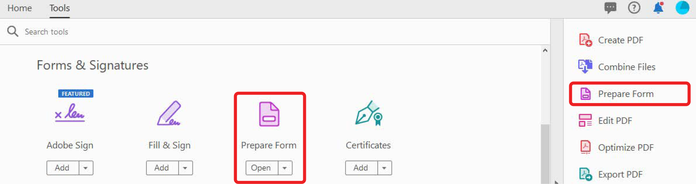
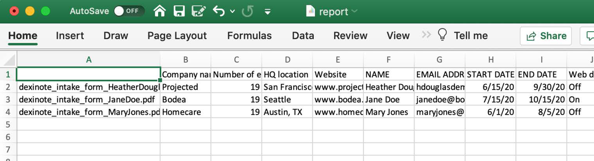

# Werken met formuliergegevens

Als u een reeks ingevulde formulieren hebt en de gegevens moet compileren, kunt u Acrobat gebruiken om de reacties samen te voegen tot één spreadsheet.

1. Plaats eerst al uw voltooide PDF forms in een map op uw computer.

   

1. Open een van de ingevulde formulierbestanden en selecteer **[!UICONTROL Prepare Form]** in het gereedschappencentrum of het rechterdeelvenster.

   

1. Selecteren **[!UICONTROL Meer]** **>** **[!UICONTROL Gegevensbestanden samenvoegen in spreadsheet]** in het rechterdeelvenster.

   

1. Selecteer de map die u met de ingevulde formulieren hebt gemaakt.

   Acrobat haalt de gegevens uit elk formulier op en maakt een spreadsheet van alle gegevens.

   
