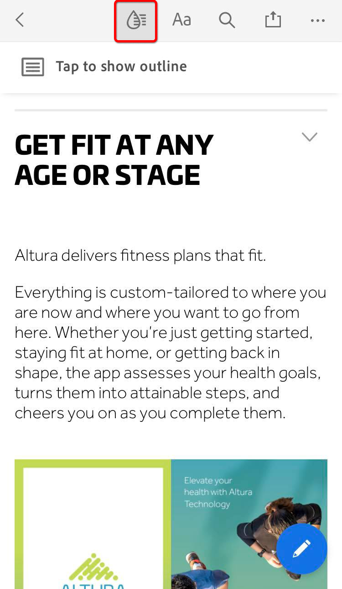

# Optimize PDF voor SEO (Search Engine Optimization)

Leer hoe je een PDF optimaliseert voor een verbeterde vindbaarheid en positie van zoekmachines op het web.

## &#x200B;1. Maak unieke inhoud

Maak PDF-inhoud die afwijkt van de informatie op uw webpagina&#39;s.

+++Details bekijken over het maken van unieke inhoud

PDF-inhoud moet uniek zijn en als volgt zijn gestructureerd:

* Eén hoofdkop/titel gebruiken die begint met een trefwoord
* Trefwoordsubkoppen gebruiken die zijn geordend in een hiërarchische structuur
* Korte alinea&#39;s met trefwoorden en lijsten gebruiken
* Interne en externe inhoud toevoegen aan uw website of andere websites met hyperlinks
* Een hyperlinkinhoudsopgave toevoegen voor documenten die langer zijn dan 25 pagina&#39;s
* Voer [&#x200B; tekstherkenning &#x200B;](https://experienceleague.adobe.com/en/docs/document-cloud-learn/acrobat-learning/getting-started/scan-and-ocr) op alle gescande documenten in werking
* Mobiele PDF maken
Om de mobiele het bekijken ervaring van uw PDF te controleren, open het dossier in de [&#x200B; mobiele app van Acrobat Reader &#x200B;](https://www.adobe.com/acrobat/mobile/acrobat-reader.html) en zet Vloeiende Wijze aan. U kunt desgewenst aanvullende subkoppen opnemen om de navigatie te verbeteren.

  

+++

 

## &#x200B;2. Documenteigenschappen toevoegen

PDF-bestanden hebben een titel en een meta-beschrijving, net als een webpagina.

+++Details weergeven over het toevoegen van documenteigenschappen

Voeg sleutel **[!UICONTROL Eigenschappen van het Document]** als volgt toe:

1. Selecteer **[!UICONTROL Dossier > Eigenschappen]** of gebruik de toetsenbordkortere weg *CTRL + D* op Vensters of *Cmd + D* op Mac en selecteer de **[!UICONTROL Beschrijving]** tabel.
1. Ga een sleutelwoord-geoptimaliseerde titel op de **[!UICONTROL Titel in:]** gebied.
1. Zorg de **[!UICONTROL Auteur ervoor:]** gebied identificeert geen specifiek individu binnen uw organisatie.
1. Ga een sleutelwoord-geoptimaliseerde samenvatting van uw document in het **[!UICONTROL Onderwerp in:]** gebied.
Probeer de samenvatting te beginnen met een actiewerkwoord zoals Leren, Ontdekken, Verkennen, enz.
1. Selecteer **[!UICONTROL Extra Meta-gegevens]** om auteursrecht of openbare domeininformatie toe te voegen indien van toepassing.

   

+++

 

## &#x200B;3. Tags toevoegen aan uw PDF

Het etiketteren van inhoud in uw PDF maakt niet alleen uw dossier [&#x200B; Toegankelijk &#x200B;](https://experienceleague.adobe.com/en/docs/document-cloud-learn/acrobat-learning/accessibility-tutorials/accessibility-overview) aan die individuen met gehandicapten-het verbetert ook SEO.

+++Details weergeven over het labelen van een PDF

Een PDF als volgt labelen:

1. Selecteer **[!UICONTROL Toegankelijkheid]** in het **[!UICONTROL centrum van Hulpmiddelen]**.
1. Selecteer **[!UICONTROL Autotag Document]** in de juiste ruit.
1. Volg de wenken voor reparatie in het linkerdeelvenster **[!UICONTROL Rapport van de Erkenning]**.
1. Voer **[!UICONTROL Vastgestelde Alternatieve Tekst]** indien nodig in.
1. De sleutelwoorden van het gebruik om het beeld in de **[!UICONTROL Afwisselende Tekst]** te beschrijven.

   

+++

>[!NOTE]
>
>Alleen beschikbaar in Acrobat Pro, Premium of Studio.

 

## &#x200B;4. Voorbereiden voor het web

Optimaliseer uw PDF door het voor Webmening voor te bereiden en [&#x200B; verminderend de grootte van het PDF- dossier &#x200B;](https://www.adobe.com/nl/acrobat/online/compress-pdf.html){target="_blank"}.

+++Bekijk details over hoe je PDF voorbereidt voor het web

Bereid uw PDF als volgt voor op het web:

Om uw PDF voor het Web voor te bereiden, selecteer **[!UICONTROL Dossier > sparen als Andere > Verminderde grootte PDF]**.

Deze stap vermindert de dossiergrootte en laat **Snelle Mening van het Web** in de PDF toe. **Snelle Mening van het Web** laat het dossier toe om onmiddellijk worden geopend, worden bekeken en worden gezocht alvorens het volledige dossier wordt gestroomd of gedownload - creërend een optimale eindgebruikerervaring. Open **[!UICONTROL de Eigenschappen van het Document]** CTRL + D *op Vensters of* Cmd + D *op Mac) om te bepalen als* Snelle Mening van het Web **wordt toegelaten.**

>[!TIP]
>
>Als u Acrobat Pro (Premium of Studio) hebt, voert u Optimaliseren voor web en mobiel uit in het gereedschap Action Wizard. Met deze handeling worden kleuren omgezet in sRGB en worden lettertypen ingesloten voor een consistente weergave van PDF op verschillende browsers en mobiele apparaten.

+++

 

## &#x200B;5. Maak een trefwoordbestandsnaam

+++Details weergeven over het maken van een trefwoordbestandsnaam

Maak als volgt een trefwoordbestandsnaam:

De bestandsnaam wordt onderdeel van de URL wanneer een PDF op het web wordt geplaatst. U kunt het beste de titel die is geoptimaliseerd voor trefwoorden laten overeenkomen met de bestandsnaam. Zoekvriendelijk zijn - gebruik kleine letters, geen leestekens of hashes en vermijd stopwoorden (a, an, the en, it, for, or, but, in, my, your, our, and their, etc.). Als u afzonderlijke woorden gebruikt, voegt u afbreekstreepjes of onderstrepingstekens toe tussen de woorden.

+++

 

## &#x200B;6. Beveilig uw PDF

De laatste stap is [&#x200B; uw PDF &#x200B;](https://www.adobe.com/nl/acrobat/online/password-protect-pdf.html){target="_blank"} te beschermen om onbevoegde veranderingen te verhinderen.

+++Bekijk details over het beveiligen van je PDF

Beveilig een PDF als volgt:

1. Open **[!UICONTROL de Eigenschappen van het Document]** CTRL + D *op Vensters of* Cmd + D *op Mac) en selecteer de* Veiligheid **[!UICONTROL tabel.]**
1. Controleer **[!UICONTROL het uitgeven en druk van het document. Een wachtwoord wordt vereist om deze montages te veranderen.]**
1. Onder **[!UICONTROL Toegestane Veranderingen:]** selecteer **[!UICONTROL niets]**.
1. Controle **[!UICONTROL laat teksttoegang voor de apparaten van de het schermlezer voor visueel gehandicapt toe.]**
1. Voer een sterk wachtwoord in en bevestig dit.
1. Selecteer **[!UICONTROL O.K.]** en sla het dossier op.

   

+++

Nu is je PDF klaar om op het web te worden geplaatst - met een optimaal beoordelingspotentieel voor trefwoorden en interactie met eindgebruikers.
