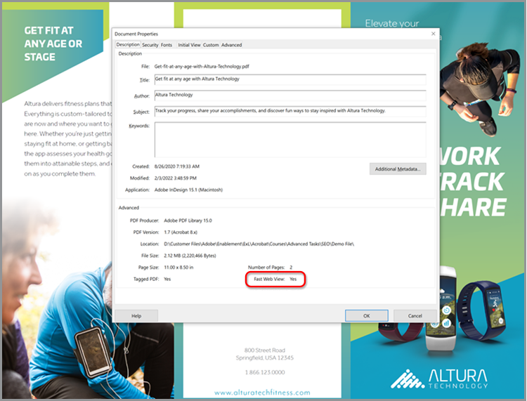

# Optimize PDF voor SEO (Search Engine Optimization)

Leer hoe je een PDF optimaliseert voor een verbeterde vindbaarheid en positie van zoekmachines op het web.

## 1. Unieke inhoud maken

Maak PDF-inhoud die afwijkt van de informatie op uw webpagina&#39;s.

+++Bekijk details over het maken van unieke inhoud

PDF-inhoud moet uniek zijn en als volgt zijn gestructureerd:

* Eén hoofdkop/titel gebruiken die begint met een trefwoord
* Trefwoordsubkoppen gebruiken die zijn geordend in een hiërarchische structuur
* Korte alinea&#39;s met trefwoorden en lijsten gebruiken
* Interne en externe (inhoud op uw website of andere websites) hyperlinks toevoegen
* Een hyperlinkinhoudsopgave toevoegen voor documenten die langer zijn dan 25 pagina&#39;s
* Uitvoeren [tekstherkenning](https://experienceleague.adobe.com/docs/document-cloud-learn/acrobat-learning/getting-started/scan-and-ocr.html) op alle gescande documenten
* Bouw PDF die mobiel vriendelijk zijn Om de mobiele kijkervaring van uw PDF te controleren, opent u het bestand in het [Acrobat Reader mobiele app](https://www.adobe.com/acrobat/mobile/acrobat-reader.html) en schakel de Vloeiende modus in. U kunt desgewenst aanvullende subkoppen opnemen om de navigatie te verbeteren.

   

+++

  

## 2. Documenteigenschappen toevoegen

PDF-bestanden hebben een titel en een meta-beschrijving, net als een webpagina.

+++Bekijk details over het toevoegen van documenteigenschappen

Sleutel toevoegen **[!UICONTROL Documenteigenschappen]** als volgt:

1. Selecteren **[!UICONTROL Bestand > Eigenschappen]** of gebruik de sneltoets *Ctrl + D* in Windows of *Cmd + D* op Mac en selecteer de **[!UICONTROL Beschrijving]** tabblad.
1. Voer een titel die is geoptimaliseerd voor trefwoorden in het dialoogvenster **[!UICONTROL Titel:]** veld.
1. Zorg ervoor dat de **[!UICONTROL Auteur:]** veld identificeert geen specifieke persoon binnen uw organisatie.
1. Voer in het dialoogvenster **[!UICONTROL Betreft:]** veld.
Probeer de samenvatting te beginnen met een actiewerkwoord zoals Leren, Ontdekken, Verkennen, enz.
1. Selecteren **[!UICONTROL Aanvullende metagegevens]** om, indien van toepassing, copyrightinformatie of informatie uit het publieke domein toe te voegen.

   

+++

  

## 3. Tag uw PDF

Inhoud in uw PDF taggen maakt niet alleen uw bestand [Toegankelijk](https://experienceleague.adobe.com/docs/document-cloud-learn/acrobat-learning/advanced-tasks/accessibility.html) voor mensen met een handicap: het verbetert ook de SEO.

+++Bekijk details over het labelen van een PDF

Een PDF als volgt labelen:

1. Selecteren **[!UICONTROL Toegankelijkheid]** in de **[!UICONTROL Gereedschappen]** midden.
1. Selecteren **[!UICONTROL Automatisch labelen van document]** in het rechterdeelvenster.
1. Volg de tips voor herstel in het linkerdeelvenster **[!UICONTROL Herkenningsrapport]**.
1. Uitvoeren **[!UICONTROL Alternatieve tekst instellen]** indien nodig.
1. Trefwoorden gebruiken om de afbeelding te beschrijven in het dialoogvenster **[!UICONTROL Alternatieve tekst]**.

   

+++

>[!NOTE]
>
>Alleen beschikbaar in Acrobat Pro.

  

## 4. Voorbereiden voor web

Optimaliseer de ervaring van interactie met uw PDF door deze voor te bereiden op webweergave en [verkleinen, grootte van PDF-bestand](https://www.adobe.com/nl/acrobat/online/compress-pdf.html){target=&quot;_blank&quot;}.

+++Bekijk details over hoe u uw PDF voorbereidt voor het web

Bereid uw PDF als volgt voor op het web:

Als u uw PDF wilt voorbereiden voor het web, selecteert u **[!UICONTROL Bestand > Opslaan als > Kleinere PDF]**.

Deze stap verkleint de bestandsgrootte en schakelt **Snelle webweergave** in de PDF. **Snelle webweergave** Hiermee kan het bestand direct worden geopend, weergegeven en doorzocht voordat het hele bestand wordt gestreamd of gedownload. Zo ontstaat een optimale ervaring voor de eindgebruiker. Openen **[!UICONTROL Documenteigenschappen]** (*Ctrl + D* in Windows of *Cmd + D* in Mac) om te bepalen of **Snelle webweergave** is ingeschakeld.

>[!TIP]
>
>Als u Acrobat Pro hebt, voert u Optimaliseren voor web en mobiel uit in het gereedschap Action Wizard. Met deze handeling worden kleuren omgezet in sRGB en worden lettertypen ingesloten voor een consistente weergave van PDF op verschillende browsers en mobiele apparaten.

+++

  

## 5. Een trefwoordbestandsnaam maken

+++Bekijk details over het maken van een trefwoordbestandsnaam

Maak als volgt een trefwoordbestandsnaam:

De bestandsnaam wordt onderdeel van de URL wanneer een PDF op het web wordt geplaatst. U kunt het beste de titel die is geoptimaliseerd voor trefwoorden laten overeenkomen met de bestandsnaam. Zoekvriendelijk zijn - gebruik kleine letters, geen leestekens of hashes en vermijd stopwoorden (a, an, the en, it, for, or, but, in, my, your, our, and their, etc.). Als u afzonderlijke woorden gebruikt, voegt u afbreekstreepjes of onderstrepingstekens toe tussen de woorden.

+++

  

## 6. Uw PDF beveiligen

De laatste stap is: [bescherm je PDF](https://www.adobe.com/nl/acrobat/online/password-protect-pdf.html){target=&quot;_blank&quot;} om ongeoorloofde wijzigingen te voorkomen.

+++Bekijk details over het beveiligen van je PDF

Beveilig een PDF als volgt:

1. Openen **[!UICONTROL Documenteigenschappen]** (*Ctrl + D* in Windows of *Cmd + D* in Mac) en selecteer de **[!UICONTROL Beveiliging]** tabblad.
1. Controleren **[!UICONTROL Bewerken en afdrukken van het document. U hebt een wachtwoord nodig om deze instellingen te kunnen wijzigen.]**
1. Onder **[!UICONTROL Wijzigingen toegestaan:]** selecteren **[!UICONTROL Geen]**.
1. Controleren **[!UICONTROL Teksttoegang voor slechtzienden op schermlezers inschakelen.]**
1. Voer een sterk wachtwoord in en bevestig dit.
1. Selecteren **[!UICONTROL OK]** en sla het bestand op.

   

+++

Nu is je PDF klaar om op het web te worden geplaatst - met een optimaal beoordelingspotentieel voor trefwoorden en interactie met eindgebruikers.
