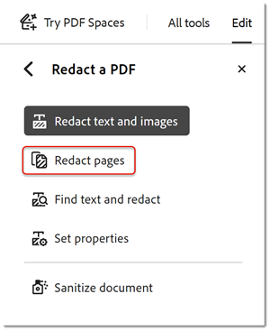

# Redigeren en ontsmetten

Leer hoe u met het gereedschap Redigeren persoonlijke of vertrouwelijke informatie permanent uit uw PDF verwijdert. Gebruik het gereedschap ontsmetten om informatie te verwijderen die niet zichtbaar is in het bestand, zoals opmerkingen, metagegevens of verborgen lagen.

>[!NOTE]
>
>Alleen beschikbaar in Acrobat Pro.

[!BADGE &#x200B; Organisatorische Gevolgen &#x200B;]
Bescherming van klantgegevens, risicobeheer

## Tekst en afbeeldingen redigeren

1. Selecteer **[!UICONTROL redigeren]** van het [!UICONTROL &#x200B; centrum van Hulpmiddelen &#x200B;] of juist-handruit.

   

1. Selecteer **[!UICONTROL Tekst &amp; Beelden]** redigeren **>** **[!UICONTROL Eigenschappen]** om de verschijning van uw redacties met inbegrip van kleur van redactievakken of tekstbedekking aan te passen.

   

Als u informatie wilt redigeren, markeert u eerst de onderdelen die u wilt verwijderen en past u de redactie toe. U kunt volledige pagina&#39;s of geselecteerde inhoud redigeren.

1. Selecteer **[!UICONTROL pagina&#39;s]** redigeren, dan kies de pagina of paginabereik om te redigeren, en selecteer **[!UICONTROL O.K.]**.

   

U kunt ook de cursor gebruiken om de inhoud te selecteren die u wilt redigeren. U kunt een voorvertoning van de redactie zien door de muisaanwijzer op de geselecteerde inhoud te plaatsen.

   

1. Selecteer **[!UICONTROL Tekst &amp; Beelden]** redigeren **>** **[!UICONTROL Vondst Tekst &amp; redigeren]** om specifieke inhoud te vinden om te redigeren.

Gebruik het zoekvak om te zoeken naar een specifiek woord of specifieke woordgroep.

1. Selecteer **[!UICONTROL Patronen]** om bepaalde types te vinden of de informatie, controleert dan de dozen en selecteert **[!UICONTROL Onderzoek &amp; verwijdert Tekst]**.

   

1. Selecteer **[!UICONTROL pas]** in het  hoogste menu van het Redacteren toe om de duidelijke redactiewijzigingen toe te passen en het geredigeerde dossier op te slaan.

   

## Document ontsmetten

1. Selecteer **[!UICONTROL Sanitize Document]** in [!UICONTROL &#x200B; redigeren &#x200B;] hoogste menu.

1. Selecteer **[!UICONTROL O.K.]** om de verwijdering van verborgen informatie te bevestigen. Of, kies **[!UICONTROL hier]** klikken om verborgen informatie selectief te verwijderen.

   

>[!TIP]
>
>Om het redactieproces te versnellen, controleer de [&#x200B; Action Wizard &#x200B;](../advanced-tasks/action.md).

>[!TIP]
>
>Deze video maakt deel uit van playlist [&#x200B; Geavanceerde Taken in Adobe Acrobat &#x200B;](https://experienceleague.adobe.com/nl/playlists/acrobat-peform-advanced-tasks) uitvoert die voor vrij op Experience League beschikbaar is!
