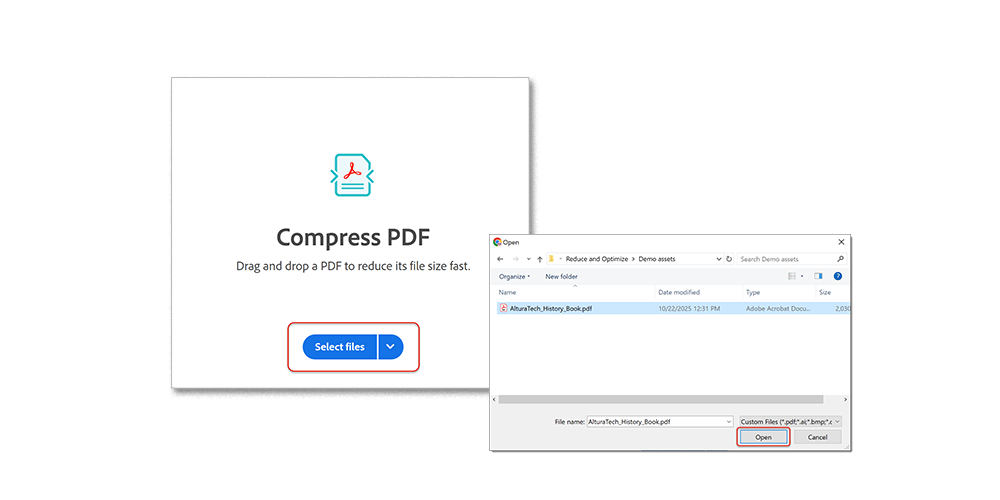

# Bestanden verkleinen en optimaliseren

Verklein grote bestanden en optimaliseer je PDF zonder dat dit ten koste gaat van de kwaliteit voor delen, posten of archiveren.

>[!NOTE]
>
>Alleen beschikbaar in Acrobat Pro.

1. Selecteren **[!UICONTROL Optimize PDF]** van de [!UICONTROL Gereedschappen] in het midden of het rechterdeelvenster.

   

1. Selecteren **[!UICONTROL Bestand verkleinen]** en kies of u één bestand of meerdere bestanden wilt verkleinen.

   Het bestand wordt verkleind tot de kleinst mogelijke grootte, maar de kwaliteit van het document blijft behouden.

   

1. Selecteren **[!UICONTROL Geavanceerde optimalisatie]** kiest u een keuze uit de opties in PDF optimaliseren.

   

1. Selecteren **[!UICONTROL Standaard]** van de **[!UICONTROL Instellingen]** om de standaardinstellingen te gebruiken.

   Als u instellingen wijzigt in het dialoogvenster **[!UICONTROL PDF Optimizer]** in het dialoogvenster **Instellingen** schakelt automatisch over naar **Aangepast**.

1. Selecteren **[!UICONTROL Bestaande behouden]** van de **[!UICONTROL Compatibel maken met]** om de huidige versie van de PDF te behouden of een specifieke Acrobat-versie te kiezen.

1. Schakel het selectievakje naast een deelvenster in (bijvoorbeeld Afbeeldingen, Lettertypen, Transparantie) en kies de gewenste opties in dat deelvenster.

   

   Als u wilt voorkomen dat alle opties in een deelvenster worden uitgevoerd tijdens de optimalisatie, schakelt u het selectievakje voor dat deelvenster uit.

1. **(Optioneel)** Selecteren **[!UICONTROL Opslaan]** en geef de huidige instelling een naam om een aangepaste selectie te maken. Als u een opgeslagen instelling wilt verwijderen, kiest u deze in het dialoogvenster **Instellingen** menu en selecteer **Verwijderen**.

   

>[!TIP]
>
>Als u meerdere PDF-bestanden wilt optimaliseren, kunt u de opdracht [Action Wizard](../advanced-tasks/action.md).