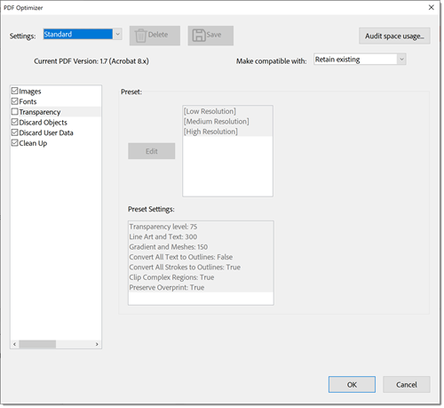

# Een PDF comprimeren en optimaliseren

Leer hoe u een PDF-bestand comprimeert en optimaliseert. Als u een PDF comprimeert, kunt u deze gemakkelijker delen via e-mail of uploaden naar websites met beperkingen op bestandsgrootte. U kunt ook de kijkervaring verbeteren en opslagkosten besparen door uw PDF te optimaliseren.

## Een PDF comprimeren in Acrobat op het bureaublad

1. Open een dossier en selecteer **[!UICONTROL Alle hulpmiddelen]** van de toolbar, dan kies **[!UICONTROL een PDF]** comprimeren.

   

1. Selecteer **[!UICONTROL Enige dossiers]** of **[!UICONTROL Veelvoudige dossiers]** in **[!UICONTROL Comprimeer een PDF]** paneel.

   

1. Selecteer **[!UICONTROL Opslaan]**.

   

   Het bestand wordt verkleind tot de kleinst mogelijke grootte, maar de kwaliteit van het document blijft behouden.

## Een PDF comprimeren in Acrobat op het web

1. Teken binnen aan [ acrobat.adobe.com ](https://acrobat.adobe.com/nl/nl) in browser.

1. Selecteer **[!UICONTROL Bekeerling > Comprimeer een PDF]** van het hoogste menu.

   

1. Kies **[!UICONTROL Uitgezochte dossiers]**, selecteer uw dossiers, en kies **[!UICONTROL Open]**.

   

1. Selecteer een compressieniveau en kies **[!UICONTROL Comprimeren]**.

   

## Een PDF optimaliseren in Acrobat op het bureaublad

>[!NOTE]
>
>Het optimaliseren van een PDF is alleen beschikbaar in Acrobat Pro op het bureaublad.

1. Open een dossier en selecteer **[!UICONTROL Alle hulpmiddelen]** van de toolbar, dan kies **[!UICONTROL een PDF]** comprimeren.

   

1. Selecteer **[!UICONTROL Geavanceerde Optimalisering]** van **[!UICONTROL Comprimeer een PDF]** paneel.

   

   Door gebrek **Standaard** wordt geselecteerd in het **menu van Montages**. Als u om het even welke montages in de de dialoogdoos van de Optimizer van de PDF verandert, schakelt het **menu van Montages** automatisch aan **Douane**.

1. Van **maak Compatibel met** dropdown, kies **Bestaand** om de huidige versie van de PDF te houden, of kies een versie van Acrobat. Selecteer de controledoos naast een paneel (bijvoorbeeld, Beelden, Doopvonten, Transparantie), en selecteer dan opties in dat paneel, dan kies O.K. **** en bewaar dan het dossier.

   

   Als u wilt voorkomen dat alle opties in een deelvenster worden uitgevoerd tijdens de optimalisatie, schakelt u het selectievakje voor dat deelvenster uit.

1. (Facultatief) om uw aangepaste montages op te slaan, uitgezocht **[!UICONTROL sparen]** en noem de montages. Om het bewaarde plaatsen te schrappen, verkies het in het **menu van Montages** en selecteer **[!UICONTROL Schrapping]**.

   

>[!TIP]
>
>Om veelvoudige PDF dossiers te optimaliseren, probeer gebruikend de [ Action Wizard ](../advanced-tasks/action.md).

<table style="table-layout:fixed">
  <td>
    
    

    <a href="reduce.md"><strong> Comprimeer en optimaliseer een PDF </strong></a>
    

    <em> verminder grote dossiers en optimaliseer uw PDF zonder kwaliteit voor het delen, het posten, of het archiveren </em> te compromitteren
     
  </td>
  <td>
        
        

         
      </td>
    <td>
        
        

         
    </td>
    <td>
        
        

         
    </td>
</tr>
</table>