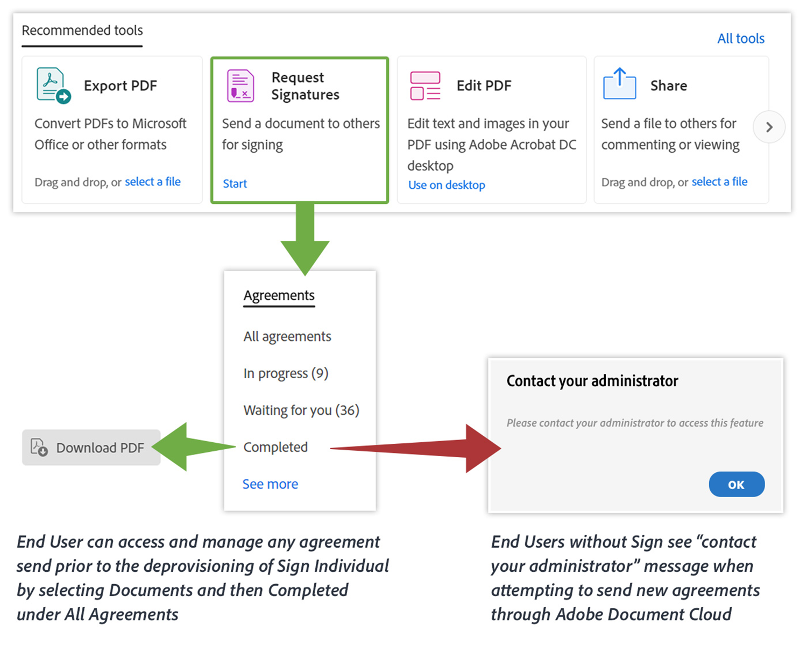

# Belangrijke Acrobat DC-productupdates voor ETLA-klanten

[!DNL Adobe Sign Individual] (ook wel Adobe Sign Pro genoemd) wordt pas vanaf augustus 2020 gedeprovisioning voor alle Acrobat DC-rechten die zijn opgenomen in de ETLA (Enterprise Term License Agreement) en loopt door tot 20 november 2020. [!DNL Adobe Sign Individual] biedt geen bedrijfsbrede functionaliteit en moet worden vervangen door Adobe Sign Enterprise for enterprise-klanten. Dit geldt ook voor Acrobat DC dat een licentie heeft voor een zelfstandige app en Acrobat DC dat een licentie heeft als onderdeel van het Creative Cloud voor ondernemingen - Alle apps.

De toegang tot [!DNL Adobe Sign Individual] is beschikbaar in Acrobat via het **Adobe Sign** hulpmiddel of het **Fill &amp; Sign** hulpmiddel ([&#x200B; Verzoek handtekeningen &#x200B;](https://www.adobe.com/nl/acrobat/online/request-signature.html){target="_blank"}).

![[!DNL Adobe Sign Individual] toegang in Acrobat DC &#x200B;](../assets/Deploy_SignEntitle1.png)

Als u Acrobat DC niet hebt bijgewerkt naar de meest recente versie, kan het zijn dat het gereedschap het label &quot;Send for Signature&quot; heeft.

## Waarom deprovisioning?

[&#x200B; in Oktober 2018, geven wij een gloednieuwe Acrobat DC &#x200B;](https://news.adobe.com/news/news-details/2018/Adobe-Redefines-What-Is-Possible-With-PDF-With-All-New-Acrobat-DC) vrij. Deze nieuwste release bevat nieuwe tools en functies voor een betere samenwerking met PDF op verschillende mobiele apparaten, het web en de desktop, plus gloednieuwe samenwerkingstools. Als Acrobat DC-abonnee hebt u deze fantastische functies al beschikbaar. Een andere belangrijke update die is uitgebracht, was onze oplossing voor elektronische handtekeningen Adobe Sign.

Vóór de versie van oktober 2018 konden Acrobat DC-gebruikers documenten verzenden voor elektronische ondertekening met gereedschappen in Acrobat met het label &quot;Fill &amp; Sign&quot; (of &quot;Adobe Sign&quot; of &quot;Send for Signature&quot;), waarvoor [!DNL Adobe Sign Individual] machtiging was verleend.

Hoewel deze optie een fantastische manier biedt om e-handtekeningen vast te leggen, is er sprake van deprovisioning [!DNL Adobe Sign Individual] omdat deze niet beschikt over de Enterprise-functionaliteit die beschikbaar is via Adobe Sign Enterprise, zoals:

* De mogelijkheid om gebruikers die gemachtigd zijn om overeenkomsten te verzenden of te ondertekenen centraal te beheren
* Beheerders toestaan om overeenkomsten te beheren die in de hele organisatie worden verzonden en gebruikt
* Korte besturingselementen voor het beheer van elektronische handtekeningen in de hele organisatie

Bovendien biedt Adobe Sign Enterprise meer functionaliteit dan beschikbaar was in de [!DNL Adobe Sign Individual] -machtiging, inclusief, maar niet beperkt tot:

* Beheer
   * Single Sign On
   * Accountdelegatie
* Integraties
   * Prebuilt Enterprise Integrations with Dropbox, Salesforce, Workday, etc.
   * Adobe Sign is de voorkeursoplossing voor elektronische handtekeningen over de [&#x200B; Microsoft &#x200B;](https://acrobat.adobe.com/us/en/business/integrations/microsoft.html) bedrijfsportefeuille, met inbegrip van Office 365, SharePoint, Dynamics, Teams, en Stroom
* Aanpassing en optimalisatie
   * Verbeterde e-handtekeningverificatie, geavanceerde identiteitsverificatie van ondertekenaars op basis van ID&#39;s, workflowontwerper, geavanceerde taalondersteuning, enz.

Adobe Sign is de toonaangevende, wereldwijd erkende oplossing voor het vastleggen van wettelijk conforme handtekeningen. Adobe Sign is volledig ontwikkeld om te voldoen aan de behoeften van je organisatie op het gebied van elektronische handtekeningen, met IT-beheervriendelijke tools om ervoor te zorgen dat jij en je gebruikers elektronische handtekeningen gebruiken die volledig voldoen aan de verschillende regionale en branchevoorschriften voor elektronische handtekeningen. Gelieve te bezoeken [&#x200B; hier &#x200B;](https://helpx.adobe.com/nl/enterprise/using/adobe-sign-for-enterprise.html) voor meer informatie over het beheren van Teken door [&#x200B; Adobe Admin Console &#x200B;](https://helpx.adobe.com/nl/enterprise/using/admin-console.html).

Neem contact op met uw Adobe om te bespreken hoe u de mogelijkheden voor elektronische ondertekening van uw organisatie kunt blijven bieden via ons bredere digitale documentplatform, inclusief Acrobat DC en Adobe Sign Enterprise.

## Toegang tot bestaande overeenkomsten

Gebruikers hebben via Adobe Document Cloud toegang tot alle overeenkomsten die vóór deze handeling zijn verzonden door zich aan te melden bij hun Adobe ID op https://documentcloud.adobe.com. Als deze gebruiker voor migratie aan de Onderneming van het Teken gepland is, moeten zij deze [&#x200B; instructies &#x200B;](https://helpx.adobe.com/nl/sign/kb/how-to-download-signed-documents---adobe-sign.html) volgen.

## Acrobat DC-ervaring zonder [!DNL Sign Individual] machtiging

De gebruikers die de rechten van de Onderneming van Adobe Sign hebben kunnen overeenkomsten binnen Acrobat verzenden gebruikend of Adobe Sign of [!UICONTROL &#x200B; Fill &amp; Sign &#x200B;] (de Handtekeningen van het Verzoek) hulpmiddel.
Gebruikers die geen Adobe Sign Enterprise-rechten hebben, kunnen geen nieuwe overeenkomsten verzenden en ontvangen een foutbericht. De onderstaande afbeelding geeft een overzicht van de mogelijke resultaten.

## Adobe Document Cloud Web Experience without Sign Individual Entitlement

Gebruikers kunnen zich aanmelden bij https://documentcloud.adobe.com/ om alle overeenkomsten te openen en te downloaden die zijn verzonden voordat ze de Adobe Sign Individual Entitlement deprovisioning.

## Ga voor meer informatie naar de volgende pagina&#39;s:

* [Aanmelden in Adobe Document Cloud](https://helpx.adobe.com/document-cloud/help/sign-in.html)
* [&#x200B; Beherend dossiers (waar zijn mijn dossiers?) &#x200B;](https://helpx.adobe.com/document-cloud/help/manage-files.html)
* [&#x200B; Gebruikend [!UICONTROL &#x200B; Customization Wizard van Acrobat &#x200B;] voor configuratie &#x200B;](https://www.adobe.com/devnet-docs/acrobatetk/tools/Wizard/WizardDC/index.html)
* [&#x200B; Overzicht van [!UICONTROL &#x200B; Admin Console &#x200B;] &#x200B;](https://helpx.adobe.com/nl/enterprise/using/admin-console.html)
* [&#x200B; Beherend Adobe Sign op de [!UICONTROL &#x200B; Admin Console &#x200B;] &#x200B;](https://helpx.adobe.com/nl/enterprise/using/adobe-sign-for-enterprise.html)

**Herzieningen** 20 mei, 2020; oorspronkelijk post - Augustus 2019
