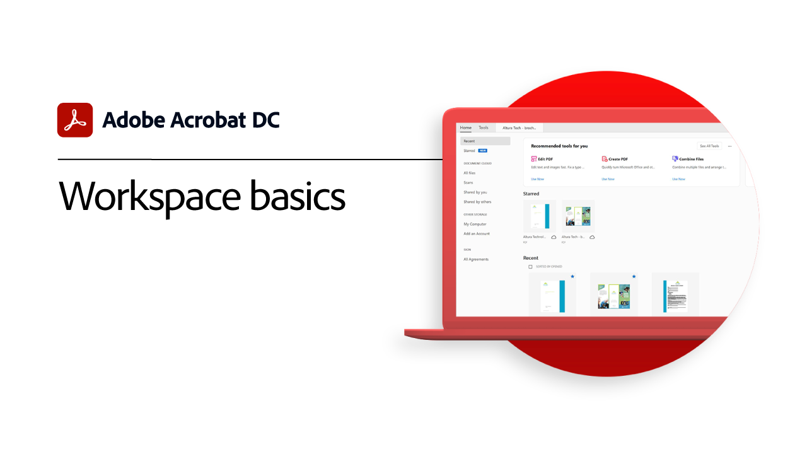
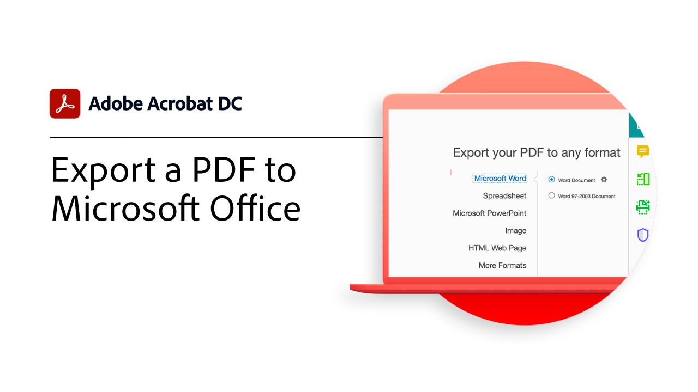
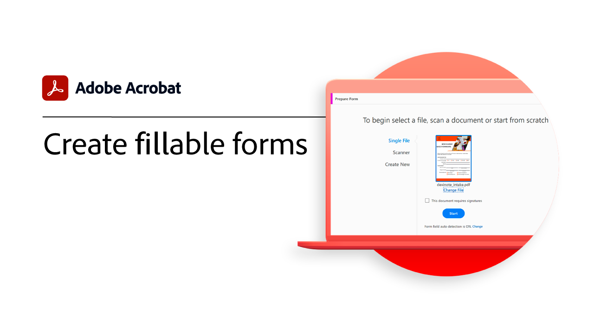

# Aan de slag - overzicht

Leer hoe u Adobe Acrobat kunt gaan gebruiken via deze korte stapsgewijze tutorials. Van het maken van een document tot het beschermen of [bewerken van PDF-bestanden](https://www.adobe.com/nl/acrobat/online/pdf-editor.html){target="_blank"}, is deze inhoud ontworpen om u te laten werken in PDF-workflows.

## Nieuw

* [Een PDF maken](create-pdf.md)
Leer hoe u PDF kunt maken van alle verschillende typen documenten

* [Deze PDF stileren](stylize-this-PDF.md)
Leer hoe je professioneel ogende PDF maakt met de geïntegreerde, gebruiksvriendelijke ontwerptools in Adobe Express

## Aan de slag - zelfstudies

<table style="table-layout:fixed">
<tr>
  <td>
    
    

    <a href="get-to-know-the-acrobat-dc-interface.md"><strong>Beginselen van de werkruimte</strong></a>
    

    <em>Kijk hoe je in de Acrobat-werkruimte gemakkelijk toegang hebt tot bestanden en tools op desktops, het web en mobiele apparaten</em>
     
  </td>
  <td>
    
    

    <a href="new-workspace.md"><strong>Nieuwe werkruimte-ervaring</strong></a>
    

    <em>Meer informatie over de nieuwe werkruimtervaring die u kunt activeren in Acrobat</em>
     
  </td>
  <td>
    
    

    <a href="acrobatweb.md"><strong>Overal werken met Acrobat Web</strong></a>
    

    <em>Leer hoe u vanaf elke locatie zakelijke documentverzoeken kunt verwerken met de Acrobat-webtools in uw browser</em>
     
  </td>
  <td>
    
    

     <a href="productivity.md"><strong>Productiviteit onderweg</strong></a>
    

    <em>Doe meer rechtstreeks vanaf je tablet of mobiele telefoon met de mobiele Acrobat Reader-app</em>
     
  </td>
</tr>
<tr>
    <td>
      
      

      <a href="../integrate/integrate-overview.md#microsoft"><strong>Werken met Microsoft 365</strong></a>
      

      <em>Verhoog de productiviteit en de workflows voor bedrijfsdocumenten met Acrobat en [!DNL Microsoft 365]</em>
       
    </td>
    <td>
      
      

      <a href="where-do-pdfs-come-from.md"><strong>Waar komen PDF vandaan?</strong></a>
      

      <em>Begrijpen waar PDF vandaan komen en hoe ze worden gebruikt</em>
       
    </td>
    <td>
    
      

       
    </td>
    <td>
    
      

       
    </td>
  </tr>
  </table>

## Zelfstudies maken, combineren en ordenen

<table style="table-layout:fixed">
  <tr>
    <td>
      
      

      <a href="create-pdf.md"><strong>Een PDF maken</strong></a>
      

      <em>PDF maken van alle verschillende soorten documenten</em>
       
    </td>
    <td>
      
      

      <a href="combine-to-pdf.md"><strong>Bestanden combineren tot PDF</strong></a>
      

      <em>Vele verschillende bestandstypen combineren tot één PDF</em>
       
    </td>
    <td>
      
      

      <a href="organize.md"><strong>Pagina's indelen</strong></a>
      

      <em>Pagina's in uw PDF toevoegen, vervangen, extraheren, roteren, verwijderen en opnieuw rangschikken</em>
       
    </td>
    <td>
      
      

      <a href="add-custom-page.md"><strong>Aangepaste pagina toevoegen</strong></a>
      

      <em>Leer hoe u aangepaste pagina's aan uw PDF kunt toevoegen met de geïntegreerde Adobe Express-app</em>
       
    </td>
  </tr>
  </table>

## Zelfstudies bewerken en exporteren

<table style="table-layout:fixed">
  <tr>
    <td>
      
      

      <a href="edit-pdf.md"><strong>Een PDF bewerken</strong></a>
      

      <em>Tekst en afbeeldingen bewerken in PDF-bestanden</em>
       
    </td>
    <td>
      
      

      <a href="stylize-this-PDF.md"><strong>Deze PDF stileren</strong></a>
      

      <em>Meer informatie over de nieuwe bewerkingsmodus waarmee inhoud automatisch wordt aangepast</em>
       
    </td>
   <td>
      
      

      <a href="auto-adjust-layout.md"><strong>Lay-out automatisch aanpassen</strong></a>
      

      <em>Meer informatie over de nieuwe bewerkingsmodus waarmee inhoud automatisch wordt aangepast</em>
       
    </td>
    <td>
      
      

      <a href="export-pdf.md"><strong>Een PDF exporteren naar bewerkbare indelingen</strong></a>
      

      <em>Leer hoe u uw PDF-bestanden exporteert naar bewerkbare indelingen</em>
       
    </td>
  </tr>
  </table>

## Zelfstudies voor samenwerking

<table style="table-layout:fixed">
  <tr>
    <td>
      
      

      <a href="collaborate.md"><strong>Samenwerken in real-time</strong></a>
      

      <em>Verplaats je projecten vooruit door opmerkingen te verzamelen, samen te werken aan reacties en de voortgang van je documenten in real-time en vanaf elke locatie te volgen</em>
       
    </td>
    <td>
      
      

      <a href="comment-on-pdf-files.md"><strong>Opmerkingen over een PDF</strong></a>
      

      <em>Opmerkingen toevoegen aan een PDF-bestand en vervolgens delen met anderen</em>
       
    </td>
    <td>
    
      

       
    </td>
    <td>
    
      

       
    </td>
</tr>
</table>

## Aanvullende zelfstudies

<table style="table-layout:fixed">
<tr>
  <td>
    
    

    <a href="create-fillable-forms.md"><strong>Invulbare formulieren maken</strong></a>
    

    <em>Een in een andere toepassing gemaakt document omzetten in een invulbaar PDF-formulier</em>
     
  </td>
  <td>
    
    

    <a href="fill-and-sign.md"><strong>Fill &amp; Sign PDF forms</strong></a>
    

    <em>Snel een PDF-formulier invullen en ondertekenen</em>
     
  </td>
  <td>
    
    

    <a href="scan-and-ocr.md"><strong>Scan en OCR</strong></a>
    

    <em>Verklein grote bestanden en optimaliseer je PDF zonder dat dit ten koste gaat van de kwaliteit voor delen, posten of archiveren</em>
     
  </td>
  <td>
    
    

    <a href="password-protect.md"><strong>Protect een PDF-bestand met een wachtwoord</strong></a>
    

    <em>Een wachtwoord aan uw PDF toevoegen om te voorkomen dat anderen het bestand openen of bewerken</em>
     
  </td>
</tr>
<tr>
  <td>
    
    

    <a href="signatures.md"><strong>Handtekeningen ophalen</strong></a>
    

    <em>Houd je bedrijf gaande door juridisch bindende elektronische handtekeningen van anderen te verzamelen - vanaf elke locatie</em>
     
  </td>
  <td>
    
    

    <a href="track.md"><strong>Uw documenten volgen</strong></a>
    

    <em>Weet altijd welke bestanden wachten op handtekeningen en welke zijn ondertekend</em>
     
  </td>
  <td>
   
    

     
  </td>
  <td>
   
    

     
  </td>
</tr>
</table>
