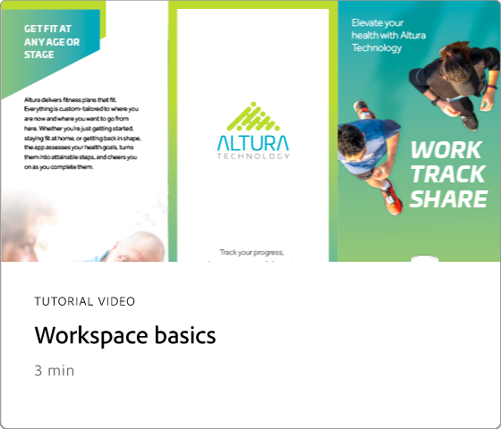
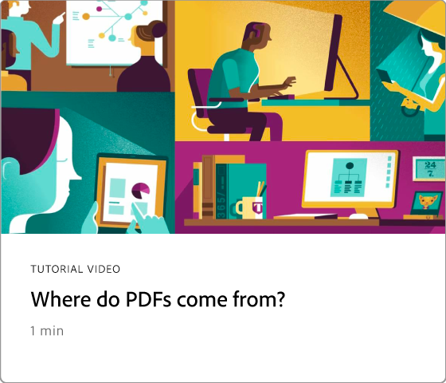
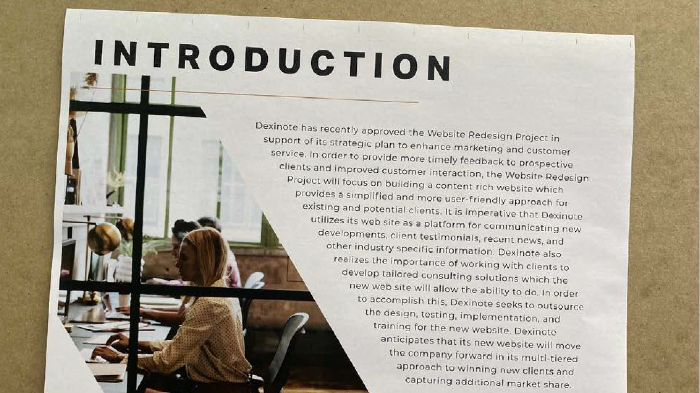

# Aan de slag - overzicht

Leer hoe u Adobe Acrobat kunt gaan gebruiken via deze korte stapsgewijze tutorials. Van het creëren van een document aan het beschermen van of [ het uitgeven van uw dossiers van de PDF ](https://www.adobe.com/nl/acrobat/online/pdf-editor.html) {target="_blank"}, wordt deze inhoud ontworpen om u in de werkschema&#39;s van de PDF te verlichten. Controle uit dit ervaren [ playlist ](https://experienceleague.adobe.com/en/playlists/acrobat-get-started-business-users) voor het worden begonnen met Acrobat.

## Nieuw

>[!BEGINTABS]

>[!TAB  Ontwerp een nieuwe pagina ]

Leer hoe te [ een nieuwe professioneel-kijkt pagina ](add-custom-page.md) in uw PDF ontwerpen gebruikend Adobe Express.

>[!TAB  geef grafiek in a PDF ] uit

Leer hoe te [, grafiek ](edit-graphics.md) in uw PDF creëren uit te geven en te verbeteren.

>[!TAB  Nieuwe werkruimteervaring ]

Leer over de [ nieuwe werkruimte ](new-workspace.md) in Acrobat die u helpt snel hulpmiddelen ontdekken en uw PDF taken efficiënt voltooien.

>[!TAB  Ontdek de inzichten van de PDF met de Medewerker van AI ]

Leer hoe te om inzichten van uw PDF dossiers te verkrijgen gebruikend de [ Medewerker AI ](ai-assistant.md).

>[!ENDTABS]

## Aan de slag - zelfstudies

<table style="table-layout:fixed">
<tr>
  <td>
    
    

    <a href="new-workspace.md"><strong> Nieuwe werkruimteervaring </strong></a>
    

    Meer informatie over de nieuwe werkruimte in Acrobat
     
  </td>
  <td>
    
    

    <a href="get-to-know-the-acrobat-dc-interface.md"><strong> de grondbeginselen van de Werkruimte </strong></a>
    

    Leer de basisbeginselen van de Acrobat-werkruimte
     
  </td>
  <td>
    
    

    <a href="ai-assistant.md"><strong> Ontdek de inzichten van de PDF met de Medewerker van AI </strong></a>
    

    Krijg inzichten uit je PDF-bestanden met behulp van de AI Assistant
     
  </td>
  <td>
    
    

    <a href="acrobatweb.md"><strong> Werk overal met het Web van Acrobat </strong></a>
    

    Leer vanaf elke locatie werken
     
  </td>
</tr>
<tr>
  <td>
    
    

    <a href="productivity.md"><strong> Productiviteit op de weg </strong></a>
    

    Leer meer te doen vanaf je tablet of mobiele telefoon
     
  </td>
    <td>
      
      

      <a href="../integrate/integrate-overview.md#microsoft"><strong> Werk met Microsoft 365 </strong></a>
      

      Werk naadloos met PDF-bestanden, rechtstreeks in Microsoft 365
        
    </td>
    <td>
      
      

      <a href="where-do-pdfs-come-from.md"><strong> waar komen PDF uit?</strong></a>
      

      Ontdek waar PDF vandaan komen en hoe je ze kunt gebruiken
       
    </td>
    <td>
    
      

       
    </td>
  </tr>
  </table>

## Zelfstudies maken, combineren en ordenen

<table style="table-layout:fixed">
  <tr>
    <td>
      
      

      <a href="create-pdf.md"><strong> creeer PDF dossiers </strong></a>
      

      PDF maken van alle verschillende typen documenten
       
    </td>
    <td>
      
      

      <a href="combine-to-pdf.md"><strong> combineer dossiers in één enkele PDF </strong></a>
      

      Combineer naadloos veel verschillende bestandstypen tot één PDF
       
    </td>
    <td>
      
      

      <a href="organize.md"><strong> organiseer pagina's </strong></a>
      

      Leer hoe je pagina’s opnieuw rangschikt op de manier die jij wilt
       
    </td>
    <td>
      
      

      <a href="add-custom-page.md"><strong> Ontwerp een nieuwe pagina </strong></a>
      

     Leer hoe je een nieuwe professioneel ogende pagina in je PDF maakt
       
    </td>
  </tr>
  </table>

## Zelfstudies bewerken en exporteren

<table style="table-layout:fixed">
  <tr>
    <td>
      
      

      <a href="edit-pdf.md"><strong> geef tekst in a PDF </strong></a> uit
      

      Bewerk woorden, woordgroepen of zelfs hele pagina's in je PDF
       
    </td>
    <td>
      
      

      <a href="edit-graphics.md"><strong> geef grafiek in a PDF </strong></a> uit
      

      Leer hoe je afbeeldingen maakt, bewerkt en verbetert in je PDF
       
    </td>
    <td>
      
      

      <a href="stylize-this-pdf.md"><strong> stileer deze PDF </strong></a>
      

      Leer hoe u professioneel ogende PDF kunt maken
       
    </td>
   <td>
      
      

      <a href="auto-adjust-layout.md"><strong> auto-pas lay-out </strong></a> aan
      

      Meer informatie over de nieuwe bewerkingsmodus waarmee inhoud opnieuw wordt geplaatst
       
    </td>
  </tr>
    <td>
      
      

      <a href="export-pdf.md"><strong> zet PDF in verschillende dossierformaten </strong></a> om
      

      Zet uw PDF-bestanden om in verschillende bestandsindelingen
       
    </td>
    <td>
   
    

     
  </td>
  <td>
   
    

     
  </td>
   <td>
   
    

     
  </td>
</tr>
</table>

## Zelfstudies voor samenwerking

<table style="table-layout:fixed">
  <tr>
    <td>
      
      

      <a href="collaborate.md"><strong> werk in echt samen - tijd </strong></a>
      

      Verplaats je projecten vooruit door in real-time samen te werken
    </td>
    <td>
      
      

      <a href="comment-on-pdf-files.md"><strong> Commentaar op een PDF </strong></a>
      

      Opmerkingen toevoegen en vervolgens uw PDF delen met anderen
       
    </td>
    <td>
    
      

       
    </td>
    <td>
    
      

       
    </td>
</tr>
</table>

## Aanvullende zelfstudies

<table style="table-layout:fixed">
<tr>
  <td>
    
    

      <a href="create-fillable-forms.md"><strong> creeer invulbare vormen </strong></a>
      

      Een gescand papier omzetten in een invulbaar formulier
       
  </td>
  <td>
    
    

    <a href="fill-and-sign.md"><strong> Fill &amp; Sign a PDF vorm </strong></a>
    

    Leer hoe u snel en eenvoudig een PDF-formulier invult en ondertekent
     
  </td>
  <td>
    
    

    <a href="scan-and-ocr.md"><strong> Scannen &amp; OCR </strong></a>
    

    Scans of afbeeldingen omzetten in doorzoekbare, bewerkbare PDF-bestanden
     
  </td>
  <td>
    
    

    <a href="password-protect.md"><strong> Protect een dossier van de PDF met een wachtwoord </strong></a>
    

    Leer hoe u een wachtwoord toevoegt aan uw PDF
     
  </td>
</tr>
<tr>
  <td>
    
    

    <a href="signatures.md"><strong> krijg handtekeningen </strong></a>
    

    Leer hoe je juridisch bindende elektronische handtekeningen kunt verzamelen
     
  </td>
  <td>
    
    

    <a href="track.md"><strong> spoor uw documenten </strong></a>
    

    Uw documenten voor elektronische handtekeningen bijhouden en beheren
     
  </td>
  <td>
   
    

     
  </td>
  <td>
   
    

     
  </td>
</tr>
</table>
