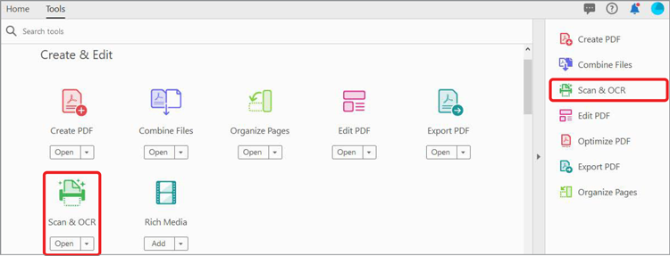
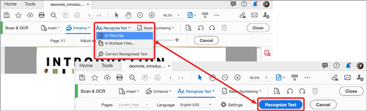

# Scan en OCR

Zet scans of afbeeldingen van documenten om in doorzoekbare, bewerkbare PDF-bestanden en pas de kwaliteit van het resulterende bestand aan.

>[!TIP]
>
>Als u meerdere PDF-bestanden wilt OCR, kunt u het beste de opdracht [Action Wizard](../advanced-tasks/action.md).

1. Selecteren **[!UICONTROL Scan en OCR]** van de [!UICONTROL Gereedschappen] in het midden of het rechterdeelvenster.

   

1. Selecteer een bestand.

   Dit bestand kan een foto zijn van een document of een bestand dat al is gescand en dat is gemaakt met een scanner of de mobiele Adobe Scan-app. U kunt ook een document scannen om een nieuw bestand te maken met een aangesloten scanner.

   

1. Kies **[!UICONTROL Gescand document]** of **[!UICONTROL Camera-afbeelding]** om het document te verbeteren.

1. Selecteren **[!UICONTROL Verbeteren]** om de afbeelding op te schonen.

   

   Acrobat herkent automatisch tekst uit gescande documenten.

1. Selecteren **[!UICONTROL Tekst herkennen]** om tekst in afbeeldingsbestanden handmatig te herkennen.

   

Het bestand is nu een doorzoekbaar, bewerkbaar PDF-bestand.

>[!TIP]
>
>Deze video maakt deel uit van de cursus [Werk slimmer met Acrobat DC en Microsoft 365](https://experienceleague.adobe.com/?recommended=Acrobat-U-1-2021.microsoft365) dat is gratis beschikbaar op Experience League !
