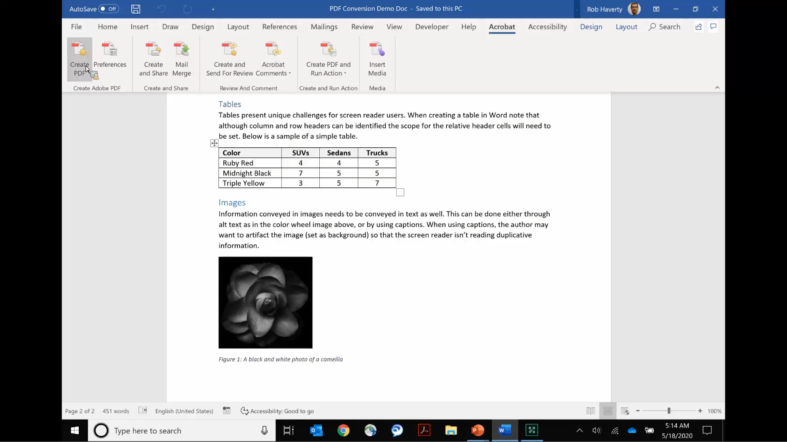

# Acrobat voor de overheid

Bekijk onze Acrobat-tutorials die speciaal zijn ontworpen voor federale, staats- en lokale overheden.

## 5 tips voor het overal werken met Acrobat

<table style="table-layout:fixed">
<tr>
  <td>
    
    

    <a href="5-tips-for-working-anywhere-with-acrobat-dc-for-government.md"><strong>5 tips voor het overal werken met Acrobat (volledige versie 15:12)</strong></a>
    

    <em>Leer hoe u de tools in Acrobat en de bijbehorende mobiele apps kunt gebruiken om overal te werken</em>
     
  </td>
  <td>
    
    

    <a href="get-your-tools.md"><strong>Tip 1: Verkrijg je tools</strong></a>
    

    <em>De eerste stap om vanaf elke locatie aan de slag te gaan, is het verkrijgen van je Acrobat-tools en mobiele apps</em>
     
  </td>  
  <td>
    
    

    <a href="collaborate-on-documents.md"><strong>Tip 2: Samenwerken aan documenten</strong></a>
    

    <em>Creëer eenvoudige en moeiteloze workflows voor het samenwerken aan documenten</em>
     
  </td>
  <td>
    
    

    <a href="protect-digital-documents.md"><strong>Tip 3: Protect digitale documenten</strong></a>
    

    <em>Een wachtwoord aan uw PDF toevoegen om te voorkomen dat bestanden worden gekopieerd, bewerkt of afgedrukt</em>
     
  </td>
</tr>
  <td>
    
    

    <a href="work-with-forms-and-signatures.md"><strong>Tip 4: Werken met formulieren en handtekeningen</strong></a>
    

    <em>Leer hoe u digitaal kunt blijven bij het invullen van formulieren</em>
     
  </td>
  <td>
    
    

    <a href="scan-and-edit-on-mobile.md"><strong>Tip 5: Scannen en bewerken op mobiele apparaten</strong></a>
    

    <em>Leer hoe je kunt werken met mobiele apps van Adobe Scan en Acrobat Reader om vanaf elke locatie werk gedaan te krijgen</em>
     
  </td>
  <td>
   
    

     
  </td>
  <td>
   
    

     
  </td>
</tr>
</table>

## Toegankelijkheid

<table>
<tr>
  <td>
    
    

    <a href="making-pdfs-accessible.md"><strong>PDF toegankelijk maken (14:11 voltooien)</strong></a>
    

    <em>Meer informatie over de optimale workflow voor het maken van toegankelijke PDF-bestanden</em>
     
  </td>
  <td>
    
    

    <a href="understanding-accessibility.md"><strong>PDF toegankelijk maken: Toegankelijkheid</strong></a>
    

    <em>Ontdek wat het betekent om een PDF toegankelijk te maken voor mensen met een handicap</em>
     
  </td>  
  <td>
    
    

    <a href="collaborate-on-documents.md"><strong>PDF toegankelijk maken: Ontwerpen in Word</strong></a>
    

    <em>Leer de beste werkwijzen voor het maken van PDF-bestanden die zijn gemaakt in [!DNL Microsoft Word]</em>
     
  </td>
   <td>
    
    

    <a href="finishing-in-acrobat.md"><strong>PDF toegankelijk maken: Voltooien in Acrobat</strong></a>
    

    <em>Leer hoe u uw PDF-bestand kunt openen met de tools in Acrobat Pro</em>
     
  </td>
</tr>
<tr>
  <td>
    
    

    <a href="making-pdf-ballots-accessible.md"><strong>PDF-stembiljetten toegankelijker maken</strong></a>
    

    <em>Dit webinar behandelt belangrijke gebieden van de toegankelijkheid van de PDF noodzakelijk om gebruikers van hulptechnologieën, zoals het schermlezers, toe te staan om hun stempels te lezen en te voltooien</em>
     
  </td>  
  <td>
   
    

     
  </td>
  <td>
   
    

     
  </td>
  <td>
   
    

     
  </td>
</tr>
</table>
