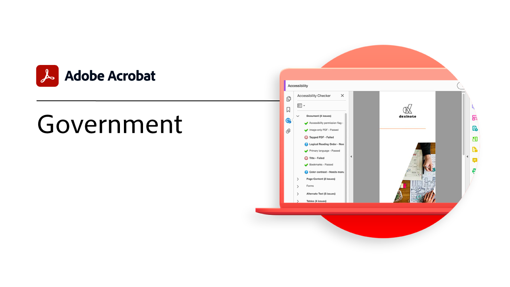

# Overzicht van sectoren en afdelingen

Ontdek hoe je klantervaringen en werknemerservaringen kunt transformeren door praktijkvoorbeelden en inspirerende ideeën te verkennen.

## Industrie en diensten

<table style="table-layout:fixed">
<tr>
  <td>
    
    

    <a href="gov/gov-overview.md"><strong>Zelfstudies voor de overheid</strong></a>
    

    <em>Ontdek onze Acrobat-tutorials die speciaal zijn ontworpen voor federale, staats- en lokale overheden</em>
     
  </td>
  <td>
   
    

     
  </td>  
  <td>
   
    

     
  </td> 
</tr>
</table>
