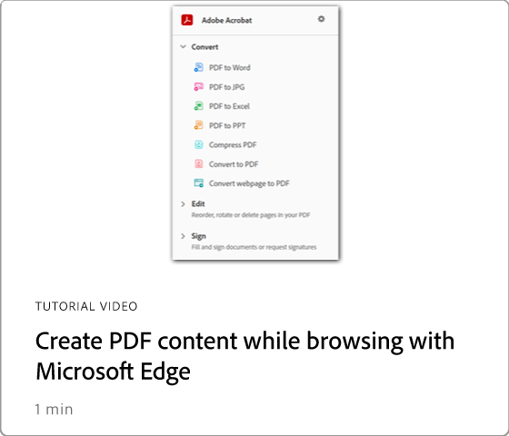

# Overzicht van integraties

Integreer Acrobat met apps [!DNL Box] , [!DNL Dropbox] , [!DNL Google Drive] , [!DNL OneDrive] en [!DNL Microsoft] .

## Microsoft

Leer hoe iedereen op uw team naadloos met de dossiers van de PDF kan werken, direct binnen [ Microsoft 365 ](https://www.adobe.com/documentcloud/integrations/microsoft-office-365.html). Controle uit dit ervaren [ playlist ](https://experienceleague.adobe.com/en/playlists/acrobat-integrate-microsoft-365) op Acrobat en Microsoft 365 integraties.

<table style="table-layout:fixed">
<tr>
  <td>
    
    

    <a href="createfromword.md"><strong> creeer PDF dossiers van Microsoft Word </strong></a>
    

    Leer hoe u rechtstreeks vanuit Microsoft Word krachtige PDF-bestanden maakt
     
  </td>
  <td>
    
    

    <a href="createofficeweb.md"><strong> creeer PDF in [!DNL Office] voor het Web </strong></a>
    

    Leer hoe u rechtstreeks vanuit Microsoft Word krachtige PDF-bestanden maakt
     
  </td> 
  <td>
    
    

    <a href="acrobatandsp.md"><strong> Werk met uw [!DNL SharePoint] dossiers </strong></a>
    

    Documentworkflows stroomlijnen met [!DNL SharePoint] en Acrobat
     
  </td>
  <td>
    
    

    <a href="acrobatandteams.md"><strong> PDF samenwerking in [!DNL Microsoft Teams]</strong></a>
    

    Werk samen met collega's door PDF te bekijken, van notities te voorzien en te reviewen zonder dat u [!DNL Microsoft Teams] hoeft te verlaten
     
  </td>
</tr>
<tr>
  <td>
    
    

    <a href="outlook.md"><strong> zet e-mailberichten en gehechtheid in PDF in Vooruitzichten </strong></a> om
    

    Leer hoe u op een professionelere en veiligere manier informatie kunt leveren binnen [!DNL Outlook]
     
  </td>
  <td>
    
    

    <a href="edge.md"><strong> PDF-inhoud maken tijdens bladeren met [!DNL Microsoft Edge]</strong></a>
    

    Leer hoe u webpagina's direct naar PDF kunt converteren met de Adobe Acrobat-extensie voor [!DNL Microsoft Edge]
     
  </td>
  <td>
    
    

    <a href="microsoftsensitivitylabels.md"><strong> Protect PDF die [!DNL Microsoft Purview Information] gevoeligheidsetiketten </strong></a> gebruikt
    

    Leer hoe u PDF kunt beschermen door rechtstreeks in Acrobat labels voor Microsoft Purview-informatie toe te voegen, te bewerken, aan te passen en te verwijderen
     
  </td>
  <td>
   
    

     
  </td>
</tr>
</table>

## Google Drive

Leer hoe u in minder tijd meer kunt doen met de essentiële PDF- en e-handtekeningtools in [!DNL Google Drive] .

<table style="table-layout:fixed">
<tr>
  <td>
    
    

    <a href="acrobatandgoogle.md"><strong> Adobe Acrobat voor de Aandrijving van Google </strong></a>
    

    Leer hoe u rechtstreeks vanuit de [!DNL Google Drive] -app toegang krijgt tot tijdbesparende PDF-tools en e-handtekeningworkflows
     
  </td>
  <td>
   
    

     
  </td>
  <td>
   
    

     
  </td>
  <td>
   
    

     
  </td>
</tr>
</table>

## Dropbox

Leer hoe eenvoudig het is om bestanden die zijn opgeslagen in [!DNL Dropbox] te openen en ermee te werken.

<table style="table-layout:fixed">
<tr>
  <td>
    
    

    <a href="acrobat-dropbox.md"><strong> Werken met bestanden van [!DNL Dropbox]</strong></a>
    

    Leer hoe u uw [!DNL Dropbox] -bestanden kunt openen, maken, bewerken, ondertekenen en opslaan vanuit Acrobat
     
  </td>
  <td>
   
    

     
  </td>
  <td>
   
    

     
  </td>
  <td>
   
    

     
  </td>
</tr>
</table>

## Box

Leer hoe Acrobat en [ Doos ](https://www.adobe.com/documentcloud/integrations/box.html) {target="_blank"} het voor iedereen in uw organisatie eenvoudiger maken om zaken te houden bewegend.
