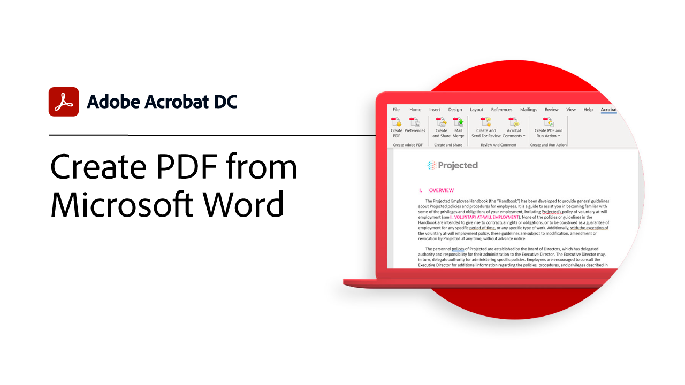
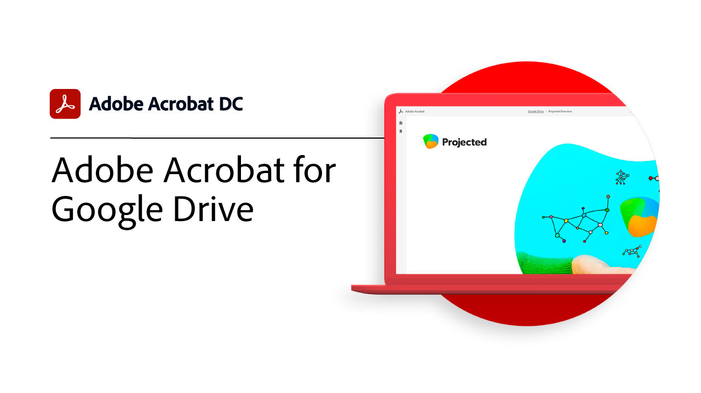

# Overzicht van integraties

Integreer Acrobat met [!DNL Box], [!DNL Dropbox], [!DNL Google Drive], [!DNL OneDrive], en [!DNL Microsoft] apps.

## Microsoft

Ontdek hoe iedereen in je team naadloos kan werken met PDF-bestanden, rechtstreeks vanuit je team [Microsoft 365](https://www.adobe.com/documentcloud/integrations/microsoft-office-365.html).

<table style="table-layout:fixed">
<tr>
  <td>
    
    

    <a href="createfromword.md"><strong>PDF-bestanden maken van [!DNL Microsoft Word]</strong></a>
    

    <em>Maak rijke, krachtige PDF-bestanden met hyperlinktabellen en kruisverwijzingen, bladwijzers en zelfs bijlagen rechtstreeks vanuit [!DNL Microsoft Word]</em>
     
  </td>
  <td>
    
    

    <a href="createofficeweb.md"><strong>PDF maken in [!DNL Office] voor het web</strong></a>
    

    <em>Leer hoe je PDF-bestanden maakt zonder dat je je hoeft te verlaten [!DNL Microsoft Office] voor webapps</em>
     
  </td> 
  <td>
    
    

    <a href="acrobatandsp.md"><strong>Werk met je [!DNL SharePoint] bestanden</strong></a>
    

    <em>Documentworkflows stroomlijnen met [!DNL SharePoint] en Acrobat</em>
     
  </td>
  <td>
    
    

    <a href="acrobatandteams.md"><strong>PDF samenwerking in [!DNL Microsoft Teams]</strong></a>
    

    <em>Werk samen met collega’s door PDF te bekijken, van notities te voorzien en te reviseren zonder dat je hoeft te vertrekken [!DNL Microsoft Teams]</em>
     
  </td>
</tr>
<tr>
  <td>
    
    

    <a href="outlook.md"><strong>E-mailberichten en bijlagen converteren naar PDF in [!DNL Outlook]</strong></a>
    

    <em>Leer hoe je op een professionelere en veiligere manier informatie levert binnen het [!DNL Outlook]</em>
     
  </td>
  <td>
    
    

    <a href="edge.md"><strong>PDF-inhoud maken tijdens het bladeren met [!DNL Microsoft Edge]</strong></a>
    

    <em>Leer hoe u webpagina's met de Adobe Acrobat-extensie kunt archiveren voor PDF [!DNL Microsoft Edge]</em>
     
  </td>
  <td>
    
    

    <a href="microsoftsensitivitylabels.md"><strong>Protect PDF gebruiken [!DNL Microsoft Purview Information] gevoeligheidslabels</strong></a>
    

    <em>Leer hoe u PDF kunt beschermen door toevoegen, bewerken, aanpassen en verwijderen [!DNL Microsoft Purview] sensitiviteitslabels direct in Acrobat</em>
     
  </td>
  <td>
   
    

     
  </td>
</tr>
</table>

## Google Drive

Leer hoe je sneller meer kunt doen met essentiële PDF- en e-handtekeningtools binnen [!DNL Google Drive].

<table style="table-layout:fixed">
<tr>
  <td>
    
    

    <a href="acrobatandgoogle.md"><strong>Adobe Acrobat for [!DNL Google Drive]</strong></a>
    

    <em>Krijg rechtstreeks vanuit het [!DNL Google Drive] app</em>
     
  </td>
  <td>
   
    

     
  </td>
  <td>
   
    

     
  </td>
  <td>
   
    

     
  </td>
</tr>
</table>

## Dropbox

Leer hoe eenvoudig het is om bestanden die zijn opgeslagen in [!DNL Dropbox].

<table style="table-layout:fixed">
<tr>
  <td>
    
    

    <a href="acrobat-dropbox.md"><strong>Werken met bestanden van [!DNL Dropbox]</strong></a>
    

    <em>Leer hoe je wijzigingen opent, maakt, bewerkt, ondertekent en opslaat in je [!DNL Dropbox] bestanden vanuit Acrobat</em>
     
  </td>
  <td>
   
    

     
  </td>
  <td>
   
    

     
  </td>
  <td>
   
    

     
  </td>
</tr>
</table>

## Box

Lees hoe Acrobat en [Box](https://www.adobe.com/documentcloud/integrations/box.html){target=&quot;_blank&quot;} maakt het voor iedereen in je organisatie eenvoudiger om zaken te doen.
