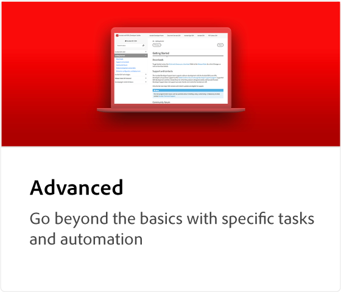
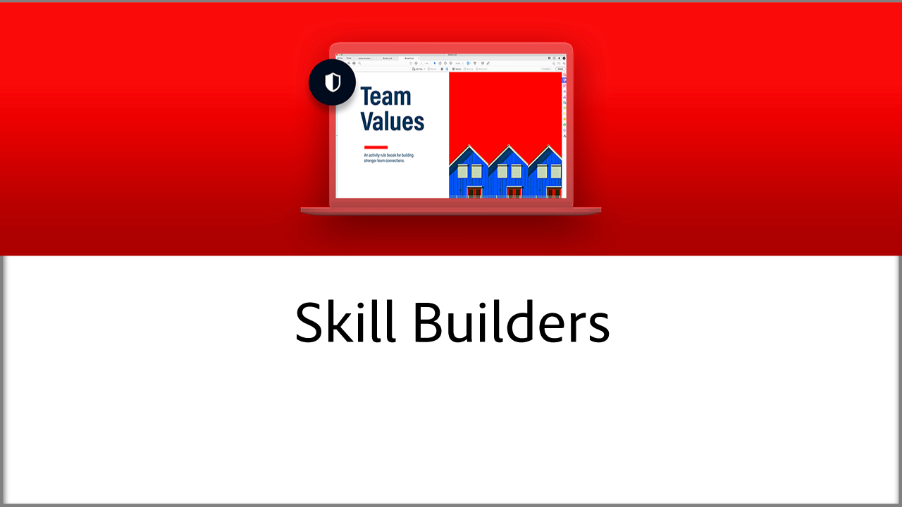

# Acrobat-zelfstudies

Adobe Acrobat, een Adobe Document Cloud-oplossing, helpt zaken te blijven doen door PDF te converteren, bewerken, delen en ondertekenen. Hier vind je een breed scala aan leerervaringen die zijn ontworpen om zowel beginners als geavanceerde gebruikers snel op Adobe Acrobat te laten kennismaken.

## Leerpaden

<table style="table-layout:fixed">
<tr>
  <td>
    
    

    <a href="getting-started/getting-started-overview.md"><strong>Aan de slag</strong></a>
    

    <em>Ga snel aan de slag met PDF-bestanden voor het maken, bewerken, converteren, beveiligen en meer</em>
     
  </td>
  <td>
    
    

    <a href="advanced-tasks/advanced-tasks-overview.md"><strong>Geavanceerde taken</strong></a>
    

    <em>Ga verder dan de basisbeginselen met specifieke taken en automatisering</em>
     
  </td>
  <td>
    
    

    <a href="skill-builder/skill-builder-webinars.md"><strong>Webinars van Skill Builder</strong></a>
    

    <em>Taakgebaseerde tips om je te helpen digitaal te gaan, digitaal te blijven en werk gedaan te krijgen</em>
     
  </td>
</tr>
<tr>
  <td>
    
    

    <a href="integrate/integrate-overview.md"><strong>Integraties</strong></a>
    

    <em>Voeg Acrobat toe aan uw bestaande bedrijfssystemen, processen en toepassingen</em>
     
  </td>
  <td>
    
    

    <a href="industry/industry-overview.md"><strong>Industrie en diensten</strong></a>
    

    <em>Ontdek hoe echte bedrijven 100% digitaal worden</em>
     
  </td>  
  <td>
    
    

    <a href="develop/develop-overview.md"><strong>Ontwikkelen</strong></a>
    

    <em>Ontwikkelbronnen ophalen op Adobe Acrobat</em>
     
  </td>
</tr>
<tr>
  <td>
    
    

    <a href="deploy/deploy-overview.md"><strong>Implementeren</strong></a>
    

    <em>Inzicht en best practices voor het implementeren van Acrobat binnen uw organisatie</em>
     
  </td>
  <td>
    
    

    <a href="mobile/mobile-overview.md"><strong>Mobiel</strong></a>
    

    <em>PDF maken, invullen en ondertekenen op je mobiele apparaat</em>
     
  </td>  
  <td>
   
    

     
  </td>
</tr>
</table>
