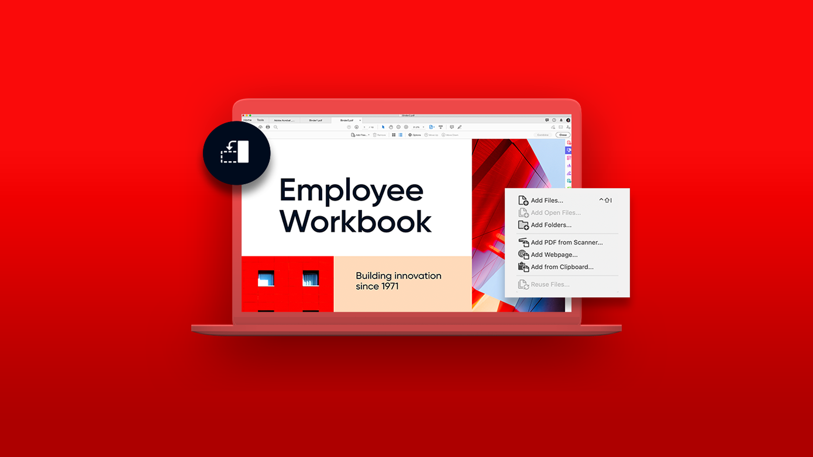

# Acrobat-zelfstudies

Adobe Acrobat, een Adobe Document Cloud-oplossing, helpt zaken te blijven doen door PDF te converteren, bewerken, delen en ondertekenen. Hier vind je een breed scala aan leerervaringen die zijn ontworpen om zowel beginners als geavanceerde gebruikers snel op Adobe Acrobat te laten kennismaken.

## Aanbevolen leerpaden

<table style="table-layout:fixed">
<tr>
  <td>
    
  </td>
  <td>
    
  </td>
  <td>
    
  </td>
  <td>
    
  </td>
</tr>
</table>
