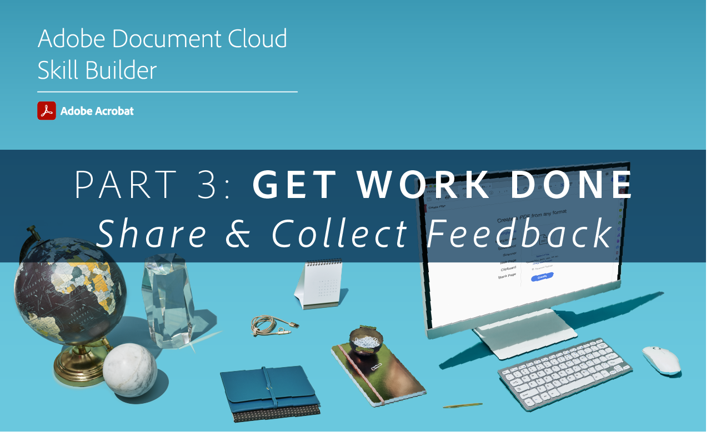
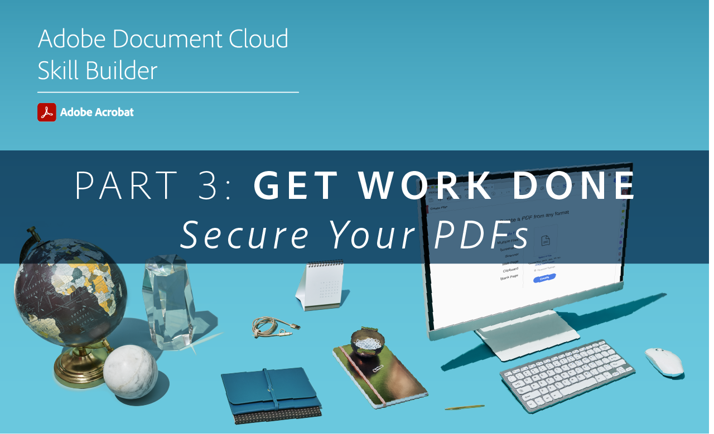

# Acrobat Skill Builders

Ga snel aan de slag op Acrobat met deze interactieve vaardigheidsbuilders. Of sluit u aan bij een [maandelijkse live sessie](skill-builder-webinars.md).

## Ga digitaal

<table style="table-layout:fixed">
<tr>
  <td>
    
    

    <a href="https://doccloud.adobeconnect.com/paperpdf/" target="_blank"><strong>Van papier naar PDF</strong></a>
    

    <em>Elk papieren document digitaal omzetten in PDF</em>
     
  </td>
  <td>
    
    

    <a href="https://doccloud.adobeconnect.com/skillbuilder-sigforms/" target="_blank"><strong>Voorbereiden voor ondertekening</strong></a>
    

    <em>PDF maken met velden voor elektronische handtekeningen</em>
     
  </td>
  <td>
    
    

     
  </td>
  <td>
    
    

     
  </td>
</tr>
</table>

## Blijf digitaal

<table style="table-layout:fixed">
<tr>
 <td>
    
    

    <a href="https://doccloud.adobeconnect.com/createpdfs/" target="_blank"><strong>PDF maken en indelen</strong></a>
    

    <em>PDF maken en ordenen, vanaf elk bestandstype</em>
     
  </td>
  <td>
    
    

    <a href="https://doccloud.adobeconnect.com/micro/" target="_blank"><strong>Acrobat en Microsoft 101</strong></a>
    

    <em>Rechtstreeks PDF maken en beheren in SharePoint</em>
     
  </td>
  <td>
    
    

    <a href="https://doccloud.adobeconnect.com/editpdf/" target="_blank"><strong>Uw PDF bewerken</strong></a>
    

    <em>Tekst, afbeeldingen, koppelingen en watermerken toevoegen aan uw PDF</em>
     
  </td>
  <td>
    
    

    <a href="https://doccloud.adobeconnect.com/sign/" target="_blank"><strong>Uw werk ondertekenen</strong></a>
    

    <em>Documenten rechtstreeks ondertekenen in Microsoft Outlook</em>
     
  </td>
</tr>
<tr>
  <td>
    
    

    <a href="https://doccloud.adobeconnect.com/convertpdfs/" target="_blank"><strong>Uw PDF converteren</strong></a>
    

    <em>PDF omzetten in Word, Excel en PowerPoint</em>
     
  </td>
  <td>
    
    

    <a href="https://doccloud.adobeconnect.com/fillsign/" target="_blank"><strong>Overal invullen en ondertekenen</strong></a>
    

    <em>Formulieren elektronisch invullen, ondertekenen en verzenden op elk apparaat</em>
     
  </td>
   <td>
    
    

    <a href="https://doccloud.adobeconnect.com/optimizepdfs/" target="_blank"><strong>Optimaliseer uw PDF</strong></a>
    

    <em>PDF voorbereiden voor verspreiding</em>
     
  </td>
</tr>
</table>

## Werk klaar maken

<table style="table-layout:fixed">
<tr>
  <td>
    
    

    <a href="https://doccloud.adobeconnect.com/skillbuilder-share/" target="_blank"><strong>Feedback delen en verzamelen</strong></a>
    

    <em>Verzamel en krijg feedback op je PDF</em>
     
  </td>
  <td>
    
    

    <a href="https://doccloud.adobeconnect.com/securepdfs/" target="_blank"><strong>Uw PDF beveiligen</strong></a>
    

    <em>Vertrouwelijke informatie in uw PDF redigeren en beschermen</em>
     
  </td>
  <td>
   
    

     
  </td>
  <td>
   
    

     
  </td>
  <td>
   
    

     
  </td>
</tr>
</table>
