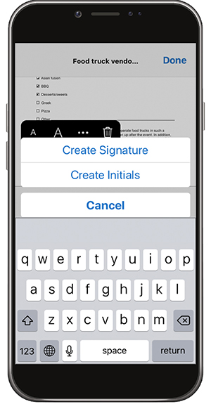
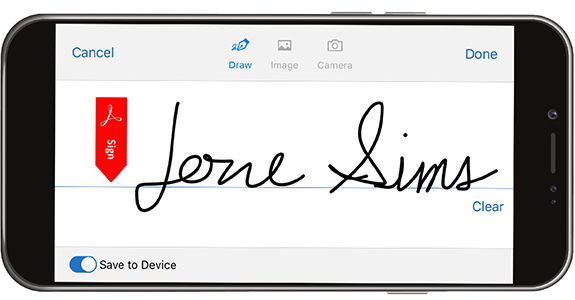
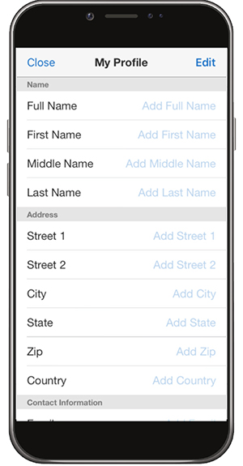

# Elk formulier invullen en ondertekenen op desktop of mobiel

Vul formulieren snel in, onderteken ze en verzend ze vanaf je desktop, browser of mobiele app. Adobe AI herkent en slaat veelgebruikte gegevens op voor gebruik in een PDF-formulier. Maak een handtekening door te tekenen, te scannen of door uw naam te typen en deze vervolgens veilig toe te passen op een document.

In deze oefening, zult u invoeren, zult, ondertekenen, en zult een van uw mobiele apparaat verzenden.

Hier zijn de [ demodossiers ](assets/03_FillSignScan.zip) voor deze oefening.

**Stap 1:** Download app [!DNL Adobe Fill & Sign] van de [!DNL Apple App] opslag of [!DNL Google Play].

**Stap 2:** Open app, tik **[!UICONTROL Uitgezocht een vorm om uit te vullen]**.

**Stap 3:** kies één van de de invoeropties. Voor deze oefening zullen we &quot;Een beeld maken&quot;.

**Stap 4:** Gebruik de witte knoop om een beeld te nemen, en dan te tikken **[!UICONTROL Foto]** van het Gebruik. Tik **[!UICONTROL Gedaan]** in de hogere juiste hoek.

**Stap 5:** bij de bodem van app, tik het **[!UICONTROL Uitsnijden]** hulpmiddel en gebruik de gidsen aan [ uitsnijd het beeld ](https://www.adobe.nl/acrobat/online/crop-pdf.html). Tik **[!UICONTROL Gedaan]** wanneer gebeëindigd.

**Stap 6:** gebruik het hulpmiddel van de Toverstaf om het beeld indien nodig schoon te maken. Tik **[!UICONTROL Gedaan]** wanneer gebeëindigd.

**Stap 7:** Tik overal op de pagina om een gebied tot stand te brengen en de noodzakelijke informatie toe te voegen aan uw document. Selecteer de ovaal om meer opties weer te geven.

**Stap 8:** Tik de **[!UICONTROL knoop van de Handtekening]** bij de bodem van app om uw handtekening toe te voegen.

**Stap 9:** gebruik een naald of uw vinger om in het handtekeningsgebied te ondertekenen. Verplaats en plaats het handtekeningveld.

**Stap 10:** Tik de **[!UICONTROL knoop van het Profiel]** bij de bodem van app om voorgevulde waarden zoals uw naam en datum te krijgen. U hoeft deze gegevens maar één keer in te vullen en deze vervolgens te gebruiken op alle toekomstige formulieren die u met de Fill &amp; Sign-app invult.

**Stap 11:** Zodra de vorm volledig is, tik de knoop van het Aandeel in de lagere juiste hoek aan e-mail.

## Recap:

* Open een bestand via een e-mail of maak een afbeelding van een papieren formulier met de camera van uw apparaat.

* Tik om tekst of vinkjes in de formuliervelden in te voeren. En gebruik voor snelheid aangepaste automatische invulling-items.

* Maak uw handtekening met uw vinger of stylus. Pas het vervolgens toe op het formulier of voeg waar nodig uw initialen toe.
