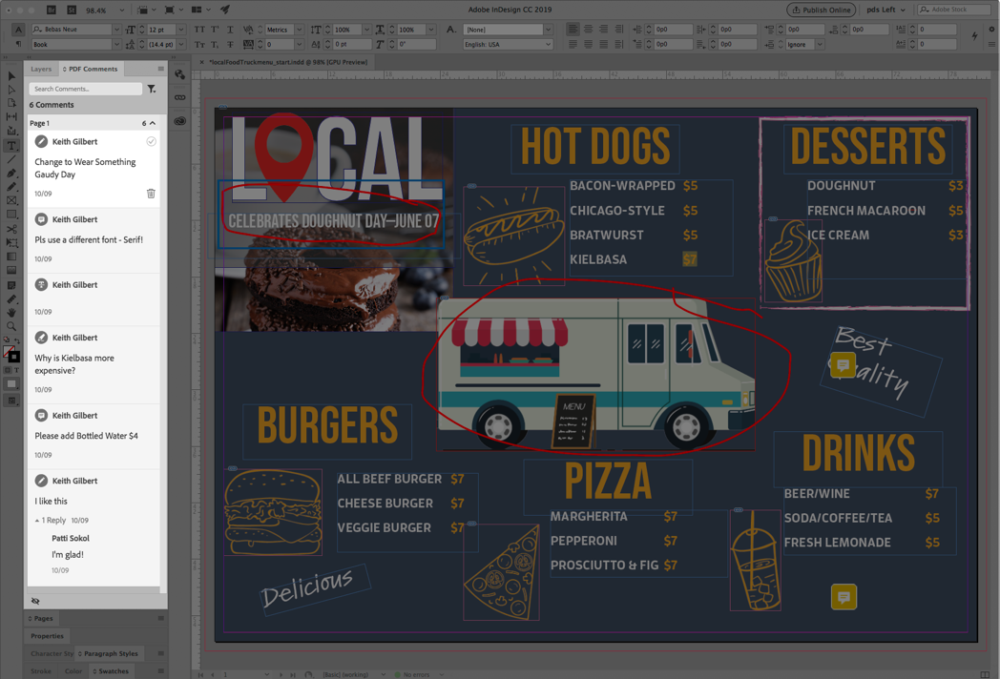

# PDF-bestanden delen en online reviewen

Gebruik de Adobe Document Cloud-revisieservice om eenvoudig PDF-bestanden te delen voor revisie vanuit de Acrobat-bureaubladtoepassing, het Document Cloud-web of de mobiele Acrobat Reader-app. Wanneer revisoren op de URL in de e-mailuitnodiging van hun computer klikken, kunnen ze gemakkelijk feedback geven in een browser zonder dat ze zich hoeven aan te melden of extra software hoeven te installeren.

In deze exercitie bekijken we hoe

* Persoonlijke uitnodigingen verzenden voor opmerkingen
* Een openbare of anonieme koppeling verzenden in een e-mail

Hier zijn de [demo-bestanden](assets/01_Review.zip) voor deze oefening.

## Persoonlijke uitnodigingen verzenden voor opmerkingen

**Stap 1:** Open de `localFoodTruckmenu_start.pdf` bestand in Adobe Acrobat.

**Stap 2:** Klik op **[!UICONTROL Send for Comments]** in het rechterdeelvenster of in het **[!UICONTROL Dit bestand delen met anderen]**   rechtsboven.

**Stap 3:** Voer de e-mailadressen van de ontvangers in. U kunt een bericht aan de ontvangers invoeren of een deadline voor de revisie toevoegen.

U ontvangt een e-mailbericht zodra de ontvangers uw bestand hebben bekeken.

## Reviewer-ervaring

Revisoren ontvangen een e-mailuitnodiging met een koppeling naar de revisie-PDF. Wanneer ze op de koppeling of op de knop **[!UICONTROL Revisie]** in de uitnodiging wordt de PDF in een webbrowser geopend. Ze kunnen de gereedschappen voor opmerkingen gebruiken om opmerkingen toe te voegen aan de PDF. Ze kunnen ook Acrobat Reader- of Acrobat-bureaubladtoepassingen gebruiken om opmerkingen toe te voegen.

## Een openbare of anonieme koppeling verzenden in een e-mail

**Stap 1:** Open de `localFoodTruckmenu_start.pdf` bestand in Adobe Acrobat.

**Stap 2:** Klikken **[!UICONTROL Een koppeling delen]** . De gedeelde koppeling wordt onmiddellijk gegenereerd. U hoeft niet te wachten totdat het bestand is geüpload naar de cloud. Standaard worden de [!UICONTROL Opmerkingen toestaan] switch is aan.

**Stap 3:** Klikken **[!UICONTROL Koppeling kopiëren]** en deel de koppeling met de ontvangers.

## Opmerkingen maken

**Stap 1:** Klik op de knop **[!UICONTROL Opmerking]** in het rechterdeelvenster.

**Stap 2:** Gebruik de gereedschappen op het bovenste lint om het document te markeren en/of een opmerking te typen.

Uw opmerkingen worden automatisch opgeslagen en kunnen door anderen worden weergegeven.

## PDF-opmerkingen importeren naar InDesign

Met InDesign CC 2019 kunt u opmerkingen rechtstreeks importeren uit PDF-bestanden. U kunt de wijzigingen met slechts één klik importeren, accepteren en toepassen. Als u een opmerking selecteert in het nieuwe deelvenster Opmerkingen PDF, wordt de opmerking gezocht en gemarkeerd in uw InDesign-bestand.

**Stap 1:** Download het PDF-bestand met de opmerkingen.

**Stap 2:** Open uw InDesign-bestand.

**Stap 3:** Klikken **[!UICONTROL Bestand]** in het bovenste menu.

**Stap 4:** Klikken **[!UICONTROL PDF-opmerkingen importeren]** uit de vervolgkeuzelijst.

**Stap 5:** Open de PDF met de opmerkingen.

Opmerkingen worden weergegeven in de gebruikersinterface.

## Recap:

Bekijk en deel ontwerpversies met Acrobat. Met Acrobat kunt u:

* Verzend een koppeling naar een PDF ter revisie door anderen.
* Overal reviewen - desktop, browser, mobiel.
* Verzamel in één document.
* Beheer feedback op één georganiseerde locatie.
* Je hebt alleen een browser nodig.

Je kunt eenvoudig opmerkingen verzenden en volgen, allemaal op één locatie. Ontvangers kunnen zelfs bekijken als ze geen Acrobat hebben! U kunt iemand uitnodigen om opmerkingen te maken via een browser. Bespaar tijd en moeite.
