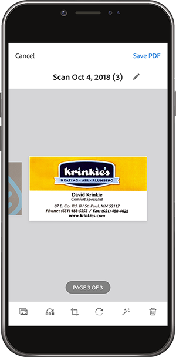

# Ga digitaal met Adobe Scan

Maak je werk overzichtelijker, orden of deel! Het is niet nodig om stapels papier op je bureau te houden of bonnetjes in je portemonnee. De mobiele app van Adobe Scan scant papieren documenten rechtstreeks in PDF&#39;s en herkent automatisch tekst.

In deze oefening, uploadt u inhoud van een bedrijfskaart rechtstreeks in uw contacten. Scan en sla een kwitantie op.

Verzamel een visitekaartje, kwitantie of ander papier waarmee u wilt werken.

## Een visitekaartje scannen

**Stap 1:** Download de Adobe Scan-app vanuit de Apple App Store of Google Play.

**Stap 2:** Open de Adobe Scan-app.

**Stap 3:** Neem vanuit de app een foto van de visitekaartje met de contactgegevens die u op uw telefoon wilt opslaan.

**Stap 4:** Als het scannen is voltooid, brengt u de aanpassingen aan om ervoor te zorgen dat uw kaart zich binnen het selectiekader bevindt.

**Stap 5:** Tik rechtsboven op  **[!UICONTROL PDF]** opslaan. Tik vervolgens op **[!UICONTROL Contactpersoon opslaan]**.

**Stap 6:** Maak om het even welke gewenste uitgeeft of toevoegingen aan de contactinformatie alvorens in uw telefoon op te slaan. Tik nogmaals op &quot;Opslaan&quot; om het opslaan in contactpersonen te voltooien.

## Een kwitantie scannen en opslaan

De Adobe Scan-app kan ook handig zijn om een kwitantie die u later nodig hebt, te scannen en op te slaan (bijvoorbeeld een onkostenrapport of andere terugbetaling).

**Stap 1:** Zorg dat de Adobe Scan-app is geopend en neem een foto van het kwitantie dat u wilt opslaan.

**Stap 2:** observeer wanneer de app uw kwitantie automatisch detecteert en leg de inhoud ervan vast.

**Stap 3:** Tik op  **[!UICONTROL PDF]** opslaan in de rechterbovenhoek om het ontvangstbewijs op te slaan op uw telefoon.

## Recap:

* Scan papieren documenten en formulieren naar PDF.
* Converteer JPG-afbeeldingen naar PDF.
* Bewerk rechtstreeks op je apparaat.
* Voeg bedrijfskaartgegevens rechtstreeks toe aan uw contactpersonen.

Steek het papier vast!
