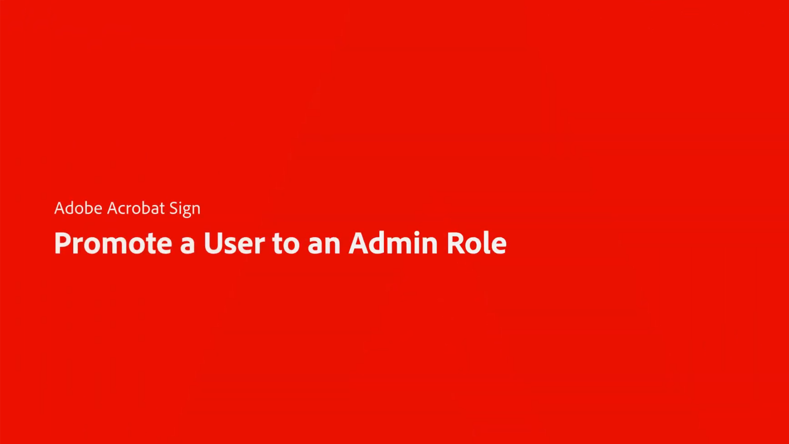

# Overzicht van beheerders

Lees meer over het toevoegen van gebruikers aan uw account, het instellen van groepen, het delen van toegang en het instellen van een workflow, een extern archief en gedeelde gebeurtenissen en waarschuwingen. Deze zelfstudies zijn ontworpen voor beheerders die de installatiefase hebben doorlopen en die klaar zijn om Acrobat Sign te gaan beheren. De geavanceerde taken omvatten onderwerpen die zich voorbij de beheerderopstelling uitbreiden en zich in het bepalen van globale montages, accounttoegang en het delen, en tekst het etiketteren bewegen.

## Nieuw

* [ Hoe te om een gebruiker aan een admin rol ](promote-admin.md) te bevorderen
Leer hoe u een gebruiker via de Admin Console promoot naar een Acrobat Sign-beheerdersrol
* [ Hoe te om veelvoudige profielen ](multiple-profiles.md) te gebruiken
Leer hoe u de profielkiezer kunt gebruiken om met meerdere Acrobat Sign-accounts te werken
* [ hoe te opstellingsprivacybeheerders ](privacy.md)
Leer hoe u privacybeheerders instelt en gebruikt
* [ Bulk het hulpmiddel van de Download ](bulk-download-tool.md)
Leer hoe u met het gereedschap Bulkdownload snel al uw ondertekende overeenkomsten kunt downloaden

## Aan de slag

<table style="table-layout:fixed">
<tr>
  <td>
    
    

    <a href="get-started-admin.md"><strong> Aan de slag voor nieuwe beheerders </strong></a>
    

    <em> in deze uitvoerige videogids, leer over alle hulpmiddelen noodzakelijk om uw organisatie in gebruik te krijgen met Acrobat Sign </em>
     
  </td>
  <td>
    
    

    <a href="up-and-running-admin.md"><strong> in gebruik voor Beheerders </strong></a>
    

    <em> Overzicht van 7 zeer belangrijke gebieden voor beheerders om in Acrobat Sign snel op te staan en in werking te stellen </em>
     
  </td>
  <td>
    
    

    <a href="set-up-shared-events-and-alert.md"><strong> vorm berichten voor gebeurtenissen en alarm </strong></a>
    

    <em> vorm berichten voor gebeurtenissen en alarm voor uw rekening </em>
     
  </td>
  <td>
    
    

    <a href="add-users-to-your-account.md"><strong> Toevoegend gebruikers </strong></a>
    

    <em> voeg en beheer gebruikers voor Acrobat Sign toe </em>
     
  </td>
</tr>
<tr>
 <td>
    
    

    <a href="create-and-manage-groups.md"><strong> het Creëren en het leiden groepen </strong></a>
    

    <em> creeer groepen, voeg gebruikers aan groepen toe, en geef groepsmontages uit </em>
     
  </td>
  <td>
    
    

    <a href="set-up-your-external-archive.md"><strong> Vestiging een extern archief </strong></a>
    

    <em> creeer een extern archief voor reserveexemplaren van overeenkomsten die zijn ondertekend </em>
     
  </td>
  <td>
    
    

    <a href="../sign-advanced-users/create-a-template.md"><strong> Creërend een documentmalplaatje </strong></a>
    

    <em> creeer een herbruikbaar documentmalplaatje voor snelheid en consistentie </em>
     
  </td>
  <td>
    
    

    <a href="../sign-advanced-users/creating-a-report.md"><strong> Meldend en transactieverbruik </strong></a>
    

    <em> Leer hoe te om rapporten te produceren en transactiegebruik te volgen </em>
     
  </td>
</tr>
<tr>
  <td>
    
    

    <a href="report-options.md"><strong> opties van het Rapport voor gebruikers </strong></a>
    

    <em> Leer hoe te opties van het opstellingsrapport voor gebruikers </em>
     
  </td>
  <td>
    
    

    <a href="../sign-advanced-users/webform.md"><strong> Creërend een Webvorm </strong></a>
    

    <em> creeer een document dat elektronisch op uw website </em> kan worden ondertekend
     
  </td>
  <td>
    
    

    <a href="../sign-advanced-users/modify-webform.md"><strong> wijzig een bestaand Webvorm </strong></a>
    

    <em> Leer om, een bestaande Webvorm onbruikbaar te maken uit te geven en re-toe te laten </em>
     
  </td>
  <td>
    
    

    <a href="../sign-advanced-users/megasign.md"><strong> verzend in bulk </strong></a>
    

    <em> verzamel duizenden handtekeningen in één keer voor om het even welk document </em>
     
  </td>
</tr>
<tr>
  <td>
    
    

    <a href="building-a-custom-workflow.md"><strong> Vestiging een werkschema </strong></a>
    

    <em> automatiseer documentworkflows om elektronische handtekeningen en gegevens snel te krijgen </em>
     
  </td>
  <td>
    
    

    <a href="audit-reports.md"><strong> de rapporten van de Controle </strong></a>
    

    <em> Leer om tot controlerapporten toegang te hebben, te gebruiken en te vormen </em>
     
  </td>
  <td>
    
    

    <a href="multiple-profiles.md"><strong> Hoe te om veelvoudige profielen </strong></a> te gebruiken
    

    <em> Leer hoe te om de profielkiezer te gebruiken om met veelvoudige rekeningen van Acrobat Sign te werken </em>
     
  </td>
  <td>
    
    

    <a href="promote-admin.md"><strong> Hoe te om een gebruiker aan een admin rol </strong></a> te bevorderen
    

    <em> Leer hoe te om een gebruiker aan een Acrobat Sign adminrol te bevorderen gebruikend de Admin Console </em>
     
  </td>
</table>

## Geavanceerde taken

<table style="table-layout:fixed">
<tr>
  <td>
    
    

    <a href="learn-about-global-settings.md"><strong> Globale montages </strong></a>
    

    <em> geef globaal productmontages voor uw volledige organisatie of voor specifieke groepen uit </em>
     
  </td>
  <td>
      
    

    <a href="share-account-access.md"><strong> het Delen van accounttoegang </strong></a>
    

    <em> opstelling mening-slechts toegang tot transacties in de rekening van een andere gebruiker </em>
     
  </td>
  <td>
    
    

    <a href="advanced-account-sharing.md"><strong> Geavanceerd account delend </strong></a>
    

    <em> de rekening die van de opstelling het delen om beheerders en gebruikers toe te staan om hun te delegeren verzenden, wijzigen, en meningstoestemmingen </em>
     
  </td>
  <td>
    
    

    <a href="bulk-download-tool.md"><strong> Bulk het hulpmiddel van de Download </strong></a>
    

    <em> Leer hoe te om het Bulk hulpmiddel van de Download te gebruiken om al uw ondertekende overeenkomsten snel te downloaden </em>
     
  </td> 
</tr>
<tr>
   <td>
     
    

    <a href="../sign-advanced-users/adobe-sign-text-tagging.md"><strong> Tekst Tagging van Acrobat Sign </strong></a>
    

    <em> bouw de vormgebieden van Acrobat Sign door tekst het etiketteren gebruikend Adobe Acrobat </em>
     
  </td>
  <td>
    
    

    <a href="use-bio-pharma-settings.md"><strong> Gebruikend Bio-Pharma montages </strong></a>
    

    <em> opstelling Bio-pharma montages die u toestaan om FDA 21 CFR Deel 11 vereisten </em> te voldoen
     
  </td>
  <td>
    
    

    <a href="privacy.md"><strong> hoe te opstellingsprivacybeheerders </strong></a>
    

    <em> Leer hoe te opstelling en privacybeheerders te gebruiken </em>
     
  </td>
  <td>
    
    

     
  </td>
</tr>
</table>
