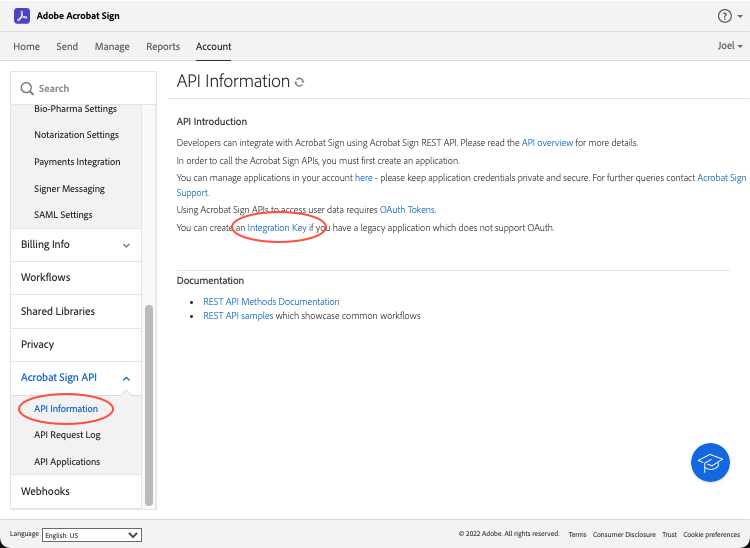
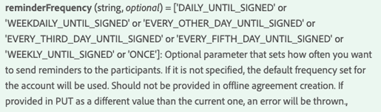

# Ingesloten ervaringen voor elektronische handtekeningen en documenten creëren

Leer hoe u Acrobat Sign API&#39;s kunt gebruiken om ervaringen voor elektronische ondertekening en documenten in te sluiten in uw webplatforms en content- en documentbeheersystemen. Deze praktische zelfstudie bevat vier onderdelen.

## Deel 1: Wat je nodig hebt

In deel 1 leert u hoe u aan de slag kunt gaan met alles wat u nodig hebt voor onderdelen 2-4. Laten we beginnen met het ophalen van API-referenties.

+++Bekijk details over het ophalen van API-referenties

* [Acrobat Sign-ontwikkelaarsaccount](https://acrobat.adobe.com/nl/nl/sign/developer-form.html)
* [Eenvoudige code](https://github.com/benvanderberg/adobe-sign-api-tutorial)
* [VS-code (of editor van uw keuze)](https://code.visualstudio.com)
* Python 3.x
   * Mac — Homebrew
   * Linux — Ingebouwd installatieprogramma
   * Windows — Chocolade
   * Alle — https://www.python.org/downloads/

+++

## Deel 2: Low/No Code — de kracht van webformulieren

In deel 2 verkent u de optie voor het gebruik van webformulieren met een lage of geen code. Het is altijd een goed idee om te zien of je kunt voorkomen dat je eerst code schrijft.

+++Bekijk details over het maken van een webformulier

1. Open Acrobat Sign met uw ontwikkelaarsaccount.

1. Selecteren **Een webformulier publiceren** op de startpagina.

   

1. Maak uw overeenkomst.

   

1. Sluit uw overeenkomst in op een platte HTML-pagina.

1. Experimenteer met het dynamisch toevoegen van queryparameters.

   

+++

## Deel 3: Overeenkomst verzenden met een formulier en gegevens samenvoegen

In deel 3 maakt u dynamisch overeenkomsten.

+++Bekijk details over het dynamisch maken van overeenkomsten

Ten eerste moet u toegang tot de computer tot stand brengen. Met Acrobat Sign kunt u op twee manieren verbinding maken via een API. OAuth-tokens en integratietoetsen. Tenzij u een zeer specifieke reden hebt om OAuth met uw toepassing te gebruiken, zou u de Sleutels van de Integratie eerst moeten onderzoeken.

1. Selecteren **Integratiesleutel** op de **API-informatie** onder het menu **Account** in Acrobat Sign.

   

Nu u toegang hebt tot de API en deze kunt gebruiken, kunt u zien wat u kunt doen met de API.

1. Navigeer naar de [Methoden voor Acrobat Sign REST API versie 6](http://adobesign.com/public/docs/restapi/v6).

   

1. Gebruik het token als een &quot;toonder&quot;-waarde.

   

Om uw eerste overeenkomst te verzenden, is het beter om te begrijpen hoe u de API kunt gebruiken.

1. Maak een document van voorbijgaande aard en verzend het.

>[!NOTE]
>
>Op JSON gebaseerde aanvraagaanroepen hebben een optie &quot;Model&quot; en &quot;Minimaal Modelschema&quot;. Dit geeft specs en een minimumladingsreeks.

Nadat u een overeenkomst voor de eerste keer hebt verzonden, kunt u de logica toevoegen. Het is altijd een goed idee om wat hulpverleners op te richten om herhaling te minimaliseren. Hier volgen enkele voorbeelden:

**Validatie**

**Kopteksten/auth**

**Basis-URI**

Houd rekening met de plaats waar overgangsdocs aankomen binnen het grootse schema van het Sign-ecosysteem.
Overgang -> Overgangsovereenkomst -> Sjabloon -> Overgangsovereenkomst -> Widget -> Overeenkomst

In dit voorbeeld wordt een sjabloon als documentbron gebruikt. Dit is meestal de beste manier, tenzij u een solide reden hebt om documenten dynamisch te genereren ter ondertekening (bijvoorbeeld het genereren van verouderde code of documenten).

De code is vrij eenvoudig; er wordt een bibliotheekdocument (sjabloon) gebruikt voor de documentbron. De eerste en tweede ondertekenaars worden dynamisch toegewezen. De `IN_PROCESS` staat betekent dat het document onmiddellijk wordt verzonden. Ook `mergeFieldInfo` wordt gebruikt om velden dynamisch te vullen.

+++

## Deel 4: Ondertekeningservaring, omleidingen en meer insluiten

In veel gevallen kunt u de activerende deelnemer toestaan om onmiddellijk een overeenkomst te ondertekenen. Dit is handig voor klantgerichte toepassingen en kiosken.

+++Bekijk details over het insluiten van de ondertekeningservaring

Als u niet wilt dat de eerste verzendende e-mail wordt geactiveerd, kunt u het gedrag eenvoudig beheren door de API-aanroep aan te passen.

Hieronder wordt beschreven hoe u de omleiding na ondertekening kunt beheren:

Na het bijwerken van het maken van de overeenkomst genereert de laatste stap de URL voor ondertekening. Deze aanroep is ook vrij eenvoudig en genereert een URL die een ondertekenaar kan gebruiken om toegang te krijgen tot zijn deel van het ondertekeningsproces.

>[!NOTE]
>
>De aanroep van de overeenkomst is technisch asynchroon. Dit betekent dat er een &#39;POST&#39;-overeenkomst kan worden aangeroepen, maar de overeenkomst is nog niet gereed. De beste manier is om een herhalingslus tot stand te brengen. Gebruik opnieuw proberen of wat dan ook de beste werkwijze voor je omgeving is.

Als alles samengebracht is, is de oplossing vrij eenvoudig. U maakt een overeenkomst en genereert vervolgens een ondertekenings-URL waarmee de ondertekenaar op het ondertekeningsritueel kan klikken en beginnen.

+++

## Aanvullende onderwerpen

* [JS-gebeurtenissen](https://www.adobe.io/apis/documentcloud/sign/docs.html#!adobedocs/adobe-sign/master/events.md)
* Webhook-gebeurtenissen
   * [REST-API](https://sign-acs.na1.echosign.com/public/docs/restapi/v6#!/webhooks/createWebhook)
   * [Webhooks in Acrobat Sign v6](https://www.adobe.io/apis/documentcloud/sign/docs.html#!adobedocs/adobe-sign/master/webhooks.md)
* [Verzoek-e-mails opnieuw activeren (met gebeurtenissen)](https://sign-acs.na1.echosign.com/public/docs/restapi/v6#!/agreements/updateAgreement)
* [Time-out vervangen door opnieuw proberen](https://stackoverflow.com/questions/23267409/how-to-implement-retry-mechanism-into-python-requests-library)
* Aangepaste herinneringen
   * Met het eerste ontwerp

     

   * Of voeg er een toe [tijdens de vlucht](https://sign-acs.na1.echosign.com/public/docs/restapi/v6#!/agreements/createReminderOnParticipant)
