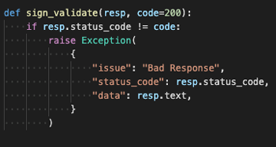
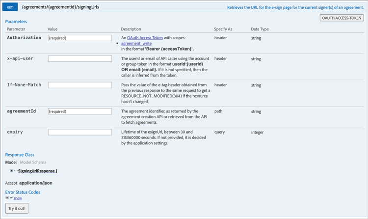

# Ingesloten ervaringen voor elektronische handtekeningen en documenten creëren

Leer hoe u Acrobat Sign API&#39;s kunt gebruiken om ervaringen voor elektronische ondertekening en documenten in te sluiten in uw webplatforms en content- en documentbeheersystemen. Deze praktische zelfstudie bevat vier onderdelen.

## Deel 1: Wat u nodig hebt

In deel 1 leert u hoe u aan de slag kunt gaan met alles wat u nodig hebt voor onderdelen 2-4. Laten we beginnen met het ophalen van API-aanmeldingsgegevens.

+++Meer informatie weergeven over het ophalen van API-aanmeldingsgegevens

* [Acrobat Sign-ontwikkelaarsaccount](https://www.adobe.com/acrobat/business/developer-form.html)
* [Startcode](https://github.com/benvanderberg/adobe-sign-api-tutorial)
* [&#x200B; de Code van VS (of redacteur van uw keus) &#x200B;](https://code.visualstudio.com)
* Python 3.x
   * Mac — Homebrew
   * Linux — Ingebouwd installatieprogramma
   * Windows — Chocolade
   * Alle — https://www.python.org/downloads/

+++

## Deel 2: Weinig/Geen code — de kracht van webformulieren

In deel 2 verkent u de optie voor het gebruik van webformulieren met een lage of geen code. Het is altijd een goed idee om te zien of je kunt voorkomen dat je eerst code schrijft.

+++Bekijk details over het maken van een webformulier

1. Open Acrobat Sign met uw ontwikkelaarsaccount.

1. Selecteer **Een webformulier** publiceren op de startpagina.

   

1. Maak uw overeenkomst.

    te creëren

1. Sluit uw overeenkomst in op een platte HTML-pagina.

1. Experimenteer met het dynamisch toevoegen van queryparameters.

   

+++

## Deel 3: overeenkomst verzenden met een formulier en gegevens samenvoegen

In deel 3 maakt u dynamisch overeenkomsten.

+++Details weergeven over het dynamisch maken van overeenkomsten

Eerst moet u toegang instellen. Er zijn twee manieren om verbinding te maken met Acrobat Sign via API. OAuth-tokens en integratietoetsen. Tenzij u een zeer specifieke reden hebt om OAuth met uw toepassing te gebruiken, zou u de Sleutels van de Integratie eerst moeten onderzoeken.

1. Selecteer **Sleutel van de Integratie** op het **API menu van de Informatie** onder het **lusje van de Rekening** in Acrobat Sign.

    te vinden

Nu u toegang hebt tot de API en deze kunt gebruiken, kunt u zien wat u kunt doen met de API.

1. Navigeer aan de [&#x200B; REST API Versie 6 Methoden van Acrobat Sign &#x200B;](http://adobesign.com/public/docs/restapi/v6).

   

1. Gebruik het token als een &quot;toonder&quot;-waarde.

   

Om uw eerste overeenkomst te verzenden, is het beter om te begrijpen hoe u de API kunt gebruiken.

1. Maak een document van voorbijgaande aard en verzend het.

>[!NOTE]
>
>Op JSON gebaseerde aanvraagaanroepen hebben een optie &quot;Model&quot; en &quot;Minimaal Modelschema&quot;. Dit geeft specs en een minimale ladingsreeks.

Nadat u voor het eerst een overeenkomst hebt verzonden, kunt u de logica toevoegen. Het is altijd een goed idee om een aantal helpers op te zetten om herhaling te minimaliseren. Hier volgen enkele voorbeelden:

**Validering**

**Kopballen/Auth**

**Basis URI**

Houd rekening met de plaats waar overgangsdocs aankomen binnen het grootse schema van het Sign-ecosysteem.
Overgang -> Overeenkomst
Overgang -> Sjabloon -> Overeenkomst
Overgang -> Widget -> Overeenkomst

In dit voorbeeld wordt een sjabloon als documentbron gebruikt. Dit is meestal de beste manier, tenzij u een solide reden hebt om documenten dynamisch te genereren ter ondertekening (bijvoorbeeld het genereren van verouderde code of documenten).

De code is vrij eenvoudig; er wordt een bibliotheekdocument (sjabloon) gebruikt voor de documentbron. De eerste en tweede ondertekenaars worden dynamisch toegewezen. De status `IN_PROCESS` betekent dat het document direct wordt verzonden. Daarnaast wordt `mergeFieldInfo` gebruikt om velden dynamisch te vullen.

+++

## Deel 4: ondertekenervaring, omleidingen en meer insluiten

In veel gevallen kunt u de activerende deelnemer toestaan om onmiddellijk een overeenkomst te ondertekenen. Dit is handig voor klantgerichte toepassingen en kiosken.

+++Bekijk details over het insluiten van de ondertekeningservaring

Als u niet wilt dat de eerste verzendende e-mail wordt geactiveerd, kunt u het gedrag eenvoudig beheren door de API-aanroep aan te passen.

Hieronder wordt beschreven hoe u de omleiding na ondertekening kunt beheren:

Na het bijwerken van het proces voor het maken van de overeenkomst bestaat de laatste stap uit het genereren van de ondertekenings-URL. Deze aanroep is ook vrij eenvoudig en genereert een URL die een ondertekenaar kan gebruiken om toegang te krijgen tot zijn deel van het ondertekeningsproces.

>[!NOTE]
>
>De aanroep om een overeenkomst te maken is technisch asynchroon. Dit betekent dat u een &#39;POST&#39;-overeenkomstoproep kunt maken, maar de overeenkomst nog niet klaar is. De beste manier is om een herhalingslus te creëren. Gebruik opnieuw proberen of wat dan ook de beste werkwijze voor je omgeving is.

 te vestigen

Als alles samengebracht is, is de oplossing vrij eenvoudig. U maakt een overeenkomst en genereert vervolgens een ondertekenings-URL waarmee de ondertekenaar op het ondertekeningsritueel kan klikken en beginnen.

+++

## Aanvullende onderwerpen

* [&#x200B; Gebeurtenissen JS &#x200B;](https://www.adobe.io/apis/documentcloud/sign/docs.html#!adobedocs/adobe-sign/master/events.md)
* Webhook-gebeurtenissen
   * [&#x200B; REST API &#x200B;](https://sign-acs.na1.echosign.com/public/docs/restapi/v6#!/webhooks/createWebhook)
   * [&#x200B; Webhooks in Acrobat Sign v6 &#x200B;](https://www.adobe.io/apis/documentcloud/sign/docs.html#!adobedocs/adobe-sign/master/webhooks.md)
* [&#x200B; Reactivate de E-mails van het Verzoek (met gebeurtenissen) &#x200B;](https://sign-acs.na1.echosign.com/public/docs/restapi/v6#!/agreements/updateAgreement)
* [&#x200B; vervang Onderbreking met opnieuw proberen &#x200B;](https://stackoverflow.com/questions/23267409/how-to-implement-retry-mechanism-into-python-requests-library)
* Aangepaste herinneringen
   * Met het eerste ontwerp

     

   * Of voeg één [&#x200B; in-vlucht &#x200B;](https://sign-acs.na1.echosign.com/public/docs/restapi/v6#!/agreements/createReminderOnParticipant) toe
