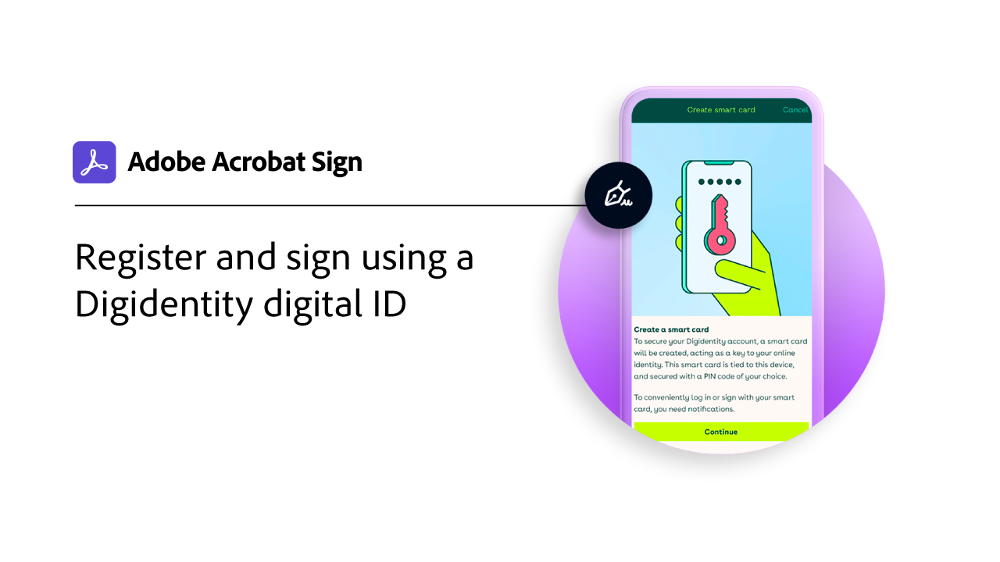
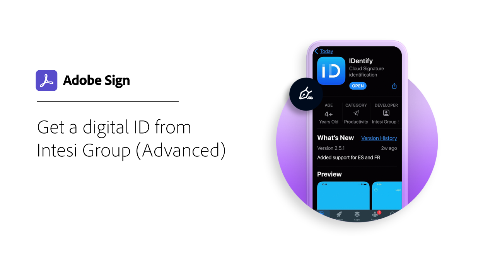

# Overzicht van digitale id

Net als bij een paspoort in elektronische vorm, kunt u met een digitale id op een veilige manier bewijzen dat u bent wie u zegt dat u bent. En als u zich elektronisch aanmeldt in Adobe Sign, biedt het gebruik van een digitale id een hogere mate van zekerheid dat u uw elektronische handtekening hebt geautoriseerd voor dat specifieke document. De volgende zelfstudies tonen hoe u digitale id&#39;s van over de hele wereld kunt gebruiken met Adobe Sign.

>[!NOTE]
>
>Voordat u een digitale id kunt gebruiken met een cloudhandtekening, moet u contact opnemen met de beheerder van uw organisatie om te bevestigen dat de oplossing van de provider is ingeschakeld in Adobe Sign.

## [!DNL Digidentity]

<table style="table-layout:fixed">
<tr>
 <td>
    
    

    <a href="digidentity-reg.md"><strong>Een digitale id ophalen van [!DNL Digidentity]</strong></a>
    

    <em>Leer hoe u een digitaal ondertekeningscertificaat kunt verkrijgen van [!DNL Digidentity]</em>
     
  </td>
  <td>
    
    

    <a href="digidentity-sign.md"><strong>Ondertekenen met [!DNL Digidentity]</strong></a>
    

    <em>Leer hoe u uw [!DNL Digidentity] digitale id kunt gebruiken met Adobe Sign</em>
     
  </td>
  <td>
    
    

     
  </td>
</tr>
</table>

## [!DNL Intesi Group]

<table style="table-layout:fixed">
<tr>
  <td>
    
    

    <a href="intesi-advanced.md"><strong>Een digitale id ophalen van [!DNL Intesi Group] (geavanceerd)</strong></a>
    

    <em>Leer hoe u een geavanceerd digitaal ondertekeningscertificaat kunt verkrijgen van [!DNL Intesi Group]</em>
     
  </td>
  <td>
    
    

    <a href="intesi-qualified.md"><strong>Een digitale id ophalen van [!DNL Intesi Group] (Gekwalificeerd)</strong></a>
    

    <em>Leer hoe u een gekwalificeerd digitaal ondertekeningscertificaat kunt verkrijgen van [!DNL Intesi Group]</em>
     
  </td>
  <td>
    
    

    <a href="intesi-sign.md"><strong>Ondertekenen met gebruik van [!DNL Intesi Group]</strong></a>
    

    <em>Leer hoe u uw [!DNL Intesi Group] digitale id kunt gebruiken met Adobe Sign</em>
     
  </td>
</tr>
</table>
