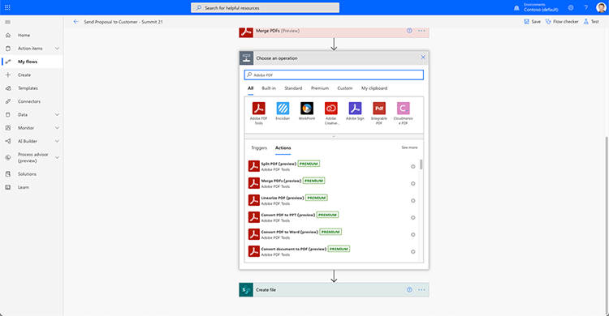

# Documentautomatisering met Acrobat Sign for Microsoft Power Platform

Leer hoe u de Acrobat Sign- en Adobe PDF Tools-connectors voor Microsoft Power Apps activeert en gebruikt. Bouw workflows waarmee je snel en veilig bedrijfsgoedkeurings- en ondertekeningsprocessen kunt automatiseren zonder code te schrijven. Deze zelfstudie bevat vier onderdelen die in de onderstaande koppelingen worden beschreven:

<table style="table-layout:fixed">
<tr>
  <td>
    
    

    <a href="documentautomation.md#part1"><strong>Deel 1: Ondertekende overeenkomst opslaan in SharePoint met Acrobat Sign</strong></a>
    

  </td>
  <td>
    
    

    <a href="documentautomation.md#part2"><strong>Deel 2: Geautomatiseerd goedkeuringsproces voor elektronische ondertekening met Acrobat Sign</strong></a>
    

  </td>
  <td>
   
    

    <a href="documentautomation.md#part3"><strong>Deel 3: Geautomatiseerde OCR van documenten met Adobe PDF Tools</strong></a>
    

  </td>
  <td>
   
    

    <a href="documentautomation.md#part4"><strong>Deel 4: Geautomatiseerde documentverzameling met Adobe PDF Tools</strong></a>
    

  </td>
</tr>
</table>

## Vereisten

* Microsoft 365 en Power Automate vertrouwdheid
* Acrobat Sign-kennis
* Microsoft 365-account met toegang tot SharePoint en Power Automate (basis voor Acrobat Sign, Premium voor Adobe PDF Tools)
* Acrobat Sign for enterprise of Acrobat Sign developer account

**Oefeningen 1 en 2**

* Acrobat Sign-account met toegang tot de API. Een ontwikkelingsaccount of een Enterprise-account.
* SharePoint-site toegankelijk via Power Automate waarop u bewerkingsmachtigingen hebt. Volledige beheertoegang wordt aanbevolen.
* Voorbeelddocument voor het goedkeuringsverzoek en de ondertekening van de handtekening.

**Oefeningen 3 en 4**

Materialen downloaden [hier](https://github.com/benvanderberg/adobe-sign-pdftools-powerautomate-tutorial)

## Deel 1: Ondertekende overeenkomst opslaan in SharePoint met Acrobat Sign {#part1}

In deel één gebruikt u een Power Automate Flow-sjabloon om een geautomatiseerde workflow in te stellen waarmee alle ondertekende overeenkomsten op uw SharePoint-site worden opgeslagen.

1. Navigeer naar Automatisch.
1. Zoek naar Acrobat Sign.

   

1. Kies **Een Acrobat Sign-overeenkomst opslaan naar een SharePoint-bibliotheek**.

   

1. Bekijk het scherm en configureer eventuele benodigde verbindingen. Schakel de Acrobat Sign-verbinding in.
1. Klik op blauw `+` symbool.

   

1. Voer de e-mail naar uw Acrobat Sign-account in en klik op het wachtwoordveld in het nieuwe venster.

   

   Wacht even totdat Adobe uw account heeft gecontroleerd.

   >[!NOTE]
   >
   >Deze controle leidt u naar de juiste aanmelding als u een Adobe ID of onze SSO gebruikt.

1. Voltooi de aanmelding.
1. Klikken **Doorgaan** naar het Flow-bewerkingsscherm gaan.
1. Geef de trigger een naam.

   

1. Configureer uw SharePoint-instellingen.

   

   **Site-adres:** Uw SharePoint-site
   **Mappad:** Pad naar de gedeelde documenten die u wilt gebruiken
   **Bestandsnaam:** De standaardinstelling accepteren
   **Bestandsinhoud:** De standaardinstelling accepteren

1. De workflow opslaan.

   

1. Navigeer met de blauwe pijl terug naar het scherm met het stroomoverzicht. U zult deze stroom in deel 2 testen.

   

U zult deze stroom in het volgende deel testen.

## Deel 2: Geautomatiseerd goedkeuringsproces voor elektronische ondertekening met Acrobat Sign {#part2}

In deel twee bouwen we het eerste deel af met een robuustere flow en testen we beide flows om ze in actie te zien.

1. Selecteren **Sjablonen** aan de linkerkant van de Power Automate interface.

   

1. Zoek naar &quot;managergoedkeuring&quot;.
1. Selecteren **Goedkeuring aanvragen van manager voor een geselecteerd bestand**.

   

   Bekijk de verbindingen en voeg eventuele ontbrekende verbindingen toe.

   >[!NOTE]
   >
   >Als dit de eerste stroom is u met goedkeuringen doet, zullen zij volledig worden gevormd wanneer de stroom loopt.

1. Klikken **Doorgaan** om naar het flowbewerkingsscherm te gaan.

   Deze flow heeft veel vooraf geconfigureerde stappen, waaronder foutcontrole en geneste voorwaardelijke stappen.

1. Configureren **Voor een geselecteerd bestand** als volgt:
   **Site-adres:** Uw SharePoint-site
   **Bibliotheeknaam:** De opslagplaats voor uw documenten
1. Voeg als volgt een invoer toe:
   **Type**: E-mail
   **Naam**: E-mail ondertekenaar

   

1. Configureren **Bestandseigenschappen ophalen:** als volgt:
   **Site-adres:** Uw SharePoint-site
   **Bibliotheeknaam:** De opslagplaats voor uw documenten

1. Omlaag schuiven en zoeken naar **Indien ja**.

   

1. Klikken **Een handeling toevoegen** in de **Indien ja** (niet de onderste versie) om de stappen toe te voegen die u ter ondertekening wilt verzenden.

   

1. Zoeken naar **SharePoint krijgt bestandsinhoud** en kiest u **Bestandsinhoud ophalen**.

   

1. Configureer de **Bestandsinhoud ophalen** als volgt:

   

   **Site-adres:** Uw SharePoint-site.
   **Bestands-id:** Zoek naar &quot;id&quot; en kies Identifier in het menu **Bestandseigenschappen ophalen** stap.
1. Zoek naar &quot;Adobe&quot; en kies **Acrobat Sign** om een andere handeling toe te voegen.

   

1. Typ &quot;upload&quot; in het zoekvak voor Acrobat Sign en selecteer **Een document uploaden en een document-id ophalen**.
1. Zoeken naar de dynamische variabele **Naam** om de naam op te halen van het item/document dat is geselecteerd in de trigger onder **Bestandsnaam**.
1. Klikken **Expressie** in de variabele assistent onder **Bestandsinhoud**.

   

1. Eén apostrof toevoegen en vervolgens weer klikken om **Dynamische inhoud**, verwijder uw apostrof, selecteer **Bestandsinhoud** en klik vervolgens op **OK**.

   Zorg ervoor dat er geen extra apostroffen zijn en het lijkt op het onderstaande voorbeeld.

   

1. Zoek naar &#39;maken&#39; in het zoekgebied van Acrobat Sign om nog een Acrobat Sign-actie toe te voegen.
1. Selecteren **Maken en overeenkomst vanuit een geüpload document en verzenden voor ondertekening**.

   

1. Configureer de vereiste informatie: Kies **Naam** van de dynamische variabele assistent in **Naam overeenkomst**.
Kies **Document-id** van de dynamische variabele assistent in **Document-id**.
Kies **E-mail ondertekenaar** van de dynamische variabele assistent in **E-mail deelnemer**.
Voer &quot;1&quot; in **Volgorde van deelnemers**.
Kies **Ondertekenaar** van vervolgkeuzelijst in **Deelnemerrol**.

   

1. **Opslaan** de flow.

### De stroom testen

Ga naar de documentrepository van uw SharePoint-site om deze uit te testen.

1. Selecteer het document en kies **Automatisch** en de **Stroom** die je zojuist hebt gemaakt.

   

1. Start de flow om de verbindingen te valideren (alleen eerste flowrun).
1. Voer een leuk bericht in voor de fiatteur in **Bericht**.
1. Voer de e-mail voor de documentondertekenaar in **E-mail ondertekenaar**.
1. Klikken **Stroom uitvoeren**.

De geconfigureerde fiatteur voor de gebruiker die de flow start, krijgt een goedkeuringsaanvraag. U kunt uw goedkeuring verlenen via e-mail of via het menu Power Automate Action Items.
Na goedkeuring ondertekent u uw document. Afhankelijk van uw gebruiker en als deze zijn aangemeld bij Sign, moet u de ondertekeningsvensters mogelijk openen in een privébrowservenster.

Voltooi de ondertekening en kijk terug in uw SharePoint-map.

## Deel 3: Geautomatiseerde OCR van documenten met Adobe PDF Tools {#part3}

In deel drie leert u hoe u OCR in PDF kunt automatiseren wanneer u deze importeert in Microsoft SharePoint. Hiermee wordt een probleem opgelost dat optreedt met gescande PDF-documenten die niet doorzoekbaar zijn in SharePoint.

### Een map instellen in SharePoint

Ga naar Microsoft SharePoint waar u documenten wilt opslaan.

1. Klikken **+ Nieuw** om een nieuwe map met de naam &quot;Verwerkte contracten&quot; te maken.
1. Klikken **+ Nieuw** om een nieuwe map met de naam &quot;Oude contracten&quot; te maken.

   

Naar deze mappen wordt nu verwezen als onderdeel van uw Power Automate-flow.

### Een flow maken op basis van een sjabloon

1. Meld u aan bij https://flow.microsoft.com.
1. Klikken **Sjablonen** in de zijbalk.

   

1. Selecteren **Nieuwe bestanden in SharePoint converteren naar doorzoekbare tekst-PDF**.
1. Klik op de knop **+** symbool naast Adobe PDF Tools.

   

1. Ga op een nieuw tabblad naar https://www.adobe.com/go/powerautomate_getstarted.
1. Klik op **Aan de slag**.

   

1. Meld u aan met uw Adobe ID.

   

1. Voer de naam en de beschrijving van de referenties in en klik op **Referenties maken**.

   

   Laat het venster met de referenties open. Je moet ze invoeren in Microsoft Power Automate.

   

1. Voer de referenties in en klik op **Maken in Microsoft Power Automate**.

   

1. Klik op **Doorgaan**.

   

   Nu kun je een weergave van de workflow zien, en je moet deze configureren voor je omgeving.

1. Selecteer het veld Site-adres en kies welke SharePoint-site u gebruikt onder de trigger **Wanneer een bestand in een map wordt gemaakt**.

   

1. Klik op het mappictogram om naar de map Oude contracten onder Map-id te navigeren.

   

1. Bewerk de **Bestand maken** actie onder aan de flow:

   Wijzigen **Site-adres** naar uw siteadres.
Geef de locatie van de map Verwerkte contracten op in het mappad.

1. Klikken **Opslaan** in de rechterbovenhoek.
1. Klikken **Testen**.
1. Selecteren **Handmatig**.
1. Klikken **Testen**.

   

### Probeer de nieuwe flow

1. Navigeer naar de map Old Contracts in SharePoint.
1. Navigeer naar E03/Old Contracts in de oefenbestanden die u hebt gedownload.
1. Kopieer de bestanden ReleaseFormXX.pdf naar de map Old Contracts in SharePoint.

   

Als u nu naar de map Verwerkte contracten navigeert, kunt u uw PDF zien nadat u de flow een paar minuten hebt kunnen uitvoeren. Als u de PDF opent, ziet u dat de tekst selecteerbaar is.
Bovendien indexeert SharePoint het document, zodat u de inhoud van uw documenten kunt doorzoeken vanuit de zoekbalk in SharePoint.

## Deel 4: Geautomatiseerde documentverzameling met Adobe PDF Tools {#part4}

In deel vier leert u hoe u een groot aantal documenten kunt samenvoegen op basis van de verstrekte informatie tijdens het selecteren en starten van een flow vanuit Microsoft SharePoint. In dit scenario zal de flow:

* Vraag om informatie om te kiezen wat u in een pakket voor een klant wilt opnemen.
* Op basis van de verstrekte informatie worden veel documenten samengevoegd. Deze documenten bevatten een omslagpagina en optionele whitepapers.
* Het samengevoegde document wordt opgeslagen in SharePoint.

### Exportbestanden importeren in SharePoint

1. Open de map E04 in de oefenbestanden.
1. Importeer de mappen Voorstel, Sjablonen en Gegenereerd document naar SharePoint.

   

Deze mappen worden ter referentie gebruikt. U zult met name het bestand Voorstel.docx gebruiken voor uw voorstel.

In de map Sjablonen vindt u een map Covers met daarin paginaomslagontwerpen voor verschillende steden. Er is ook een map Whitepapers met optionele extra whitepapers die aan het einde worden toegevoegd als deze is geselecteerd.

### Importeer de flow in Microsoft Power Automate

1. Meld u aan bij Microsoft Power Automate (https://flow.microsoft.com).
1. Klikken **Mijn stromen**.

   

1. Klik op **Importeren**.

   

1. Klikken **Uploaden** en kies de map GenerateVoorstel_20210311231623.zip in E04/Flows/.

   

1. Klik op **Importeren**.

1. Klik op het pictogram Sleutel onder Actie naast **Voorstel naar klant verzenden**.

   

1. Selecteren **Maken als nieuw** onder Setup.
1. Stel de naam van de flow in onder Bronnaam.
1. Klik op **Opslaan**.

   Herhaal dit voor de andere gerelateerde bronnen en selecteer uw verbinding.

   

1. Klikken **Importeren** nadat u al uw verbindingen hebt gemaakt.

### Instellen voor een geselecteerd bestand

Nu de flow is gemaakt, gaat u als volgt te werk:

1. Klik op **Bewerken**.

   

1. Trigger selecteren **Voor een geselecteerd bestand**.

   Voeg uw SharePoint-site toe aan het siteadres.
Voeg uw bibliotheek toe aan de bibliotheek.

   

### SjabloonMapPath instellen

1. Klik op de variabele templateFolderPath.
1. Stel het pad in naar de locatie van de map Sjablonen binnen de SharePoint-site die u hebt geïmporteerd.

### Omslag bestandsinhoud ophalen instellen

1. Klikken **Omslag** handeling, waarmee het bereik wordt uitgebreid.
1. Uitbreiden **Omslag: Bestandsinhoud ophalen**.

   Stel het siteadres in op uw SharePoint-site.

   

### Geselecteerd bestand instellen

1. Breid uit **Geselecteerd bestand** actie.

   Wijzig het siteadres en de bibliotheeknaam in respectievelijk uw SharePoint-site en -bibliotheek onder **Bestandseigenschappen ophalen**.
Wijzig het siteadres in uw SharePoint-site onder **Bestandsinhoud ophalen**.

   

### Whitepapers instellen

1. Klikken **Whitepapers** handeling.
1. Uitbreiden **Voorwaarde: Whitepaper toevoegen**.

   

1. Uitbreiden **Whitepaper 1: Bestandsinhoud ophalen met pad**.
Bewerk het siteadres in uw opgegeven SharePoint-site.

Herhaal dezelfde stappen voor **Voorwaarde: Whitepaper 2 toevoegen**.

### Bestand maken instellen

1. Uitbreiden **Bestand maken**.

   Bewerk het siteadres en mappad naar de SharePoint-site en het pad waar de map Gegenereerd document zich bevindt.

1. Klik op **Opslaan**.

### Uw flow testen

1. Navigeer naar de map Voorstel in SharePoint.
1. Selecteer de map Request.docx.

   

1. Selecteer uw flow onder de **Automatisch** -menu.

   

1. Klikken **Doorgaan** om de flow te starten.

   

1. Kies de omslag en de whitepapers die u wilt toevoegen.
1. Klikken **Stroom uitvoeren**.

   

Navigeer naar de map Generate Docs. U moet nu uw gegenereerde PDF-bestand bekijken.

### Protect en andere acties toevoegen aan flow

Nu u een flow hebt gemaakt, gaat u uw flow bewerken om het PDF-document te versleutelen met een wachtwoord. Dit doorloopt ook hoe u andere acties kunt gebruiken.

1. Ga terug naar het einde van de flow.
1. Klik op de knop **+** symbool tussen **PDF samenvoegen** en **Bestand maken**.

   

1. Selecteren **Een handeling toevoegen**.
1. Zoek naar &quot;Adobe PDF Tools&quot;.

   

1. Selecteren **Protect PDF van weergave**.
1. Dynamische inhoud gebruiken om het veld Bestandsnaam in te stellen op **PDF-bestandsnaam uit samenvoeging PDF**.

   

   In de trigger is er een veld Wachtwoord dat deel uitmaakt van het initiëringsformulier. We kunnen dat hier gebruiken.

1. Zoeken naar **Wachtwoordveld** dynamische inhoud gebruiken en in het veld Wachtwoord plaatsen.

   

1. Dynamische inhoud gebruiken om in te stellen op **PDF-bestandsinhoud uit PDF samenvoegen** in het veld Bestandsinhoud.
1. Wijzig de **Bestand maken** om de bestandsinhoud op te halen uit Protect PDF in plaats van PDF samenvoegen.
1. Uitbreiden **Bestand maken**.
1. Wis het veld Bestandsinhoud.
1. Dynamische inhoud plaatsen **Inhoud PDF-bestand** van **Protect PDF van weergave**.

### Uw flow testen

1. Navigeer naar de map Voorstel in SharePoint.
1. Selecteer Voorstel.docx.

   

1. Selecteren **Automatisch** om uw flow te kiezen.

   

1. Klikken **Doorgaan** om de flow te starten.

   

1. Kies de omslag en de whitepapers die u wilt toevoegen.
1. Stel het veld Wachtwoord in op het wachtwoord dat u wilt instellen.
1. Klikken **Stroom uitvoeren**.

   

1. Navigeer naar de map Generate Docs.
U moet het gegenereerde PDF-bestand zien. Open het PDF-bestand en u wordt gevraagd uw wachtwoord voor de PDF in te voeren.

   
