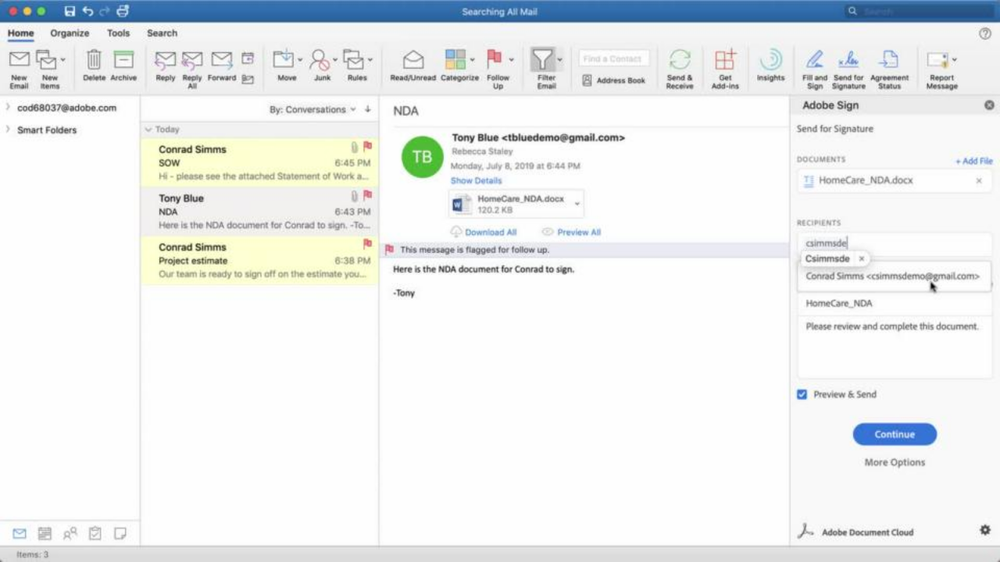
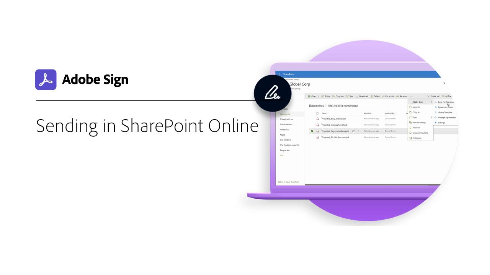
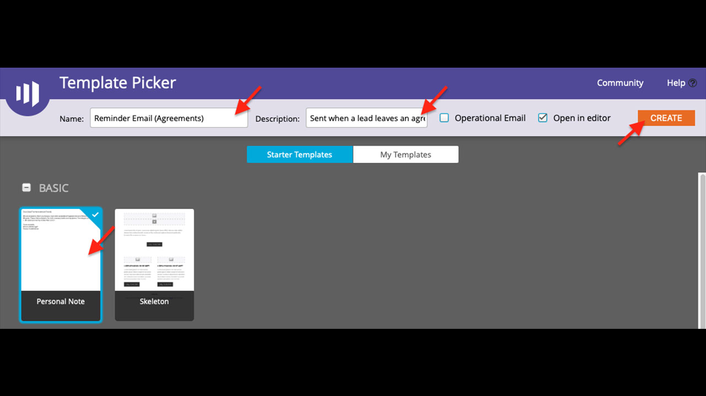

# Overzicht van integraties

U kunt Acrobat Sign gebruiken in andere toepassingen die uw organisatie al gebruikt, zoals Microsoft, Salesforce, Workday en Marketo om er een paar te noemen. Leer hoe je je workflows voor elektronische handtekeningen kunt vereenvoudigen in deze integratiehandleidingen en tutorials.

>[!NOTE]
> Als u problemen hebt met de toegang tot een van deze functies, neemt u contact op met de beheerder van uw organisatie om te controleren of de integratie is ingeschakeld.

## Zelfstudies voor Microsoft-integraties

<table style="table-layout:fixed">
<tr>
  <td>
    
    

    <a href="fill-and-sign-doc-microsoft-outlook.md"><strong>Invullen en ondertekenen in Microsoft Outlook</strong></a>
    

    <em>Een formulier rechtstreeks invullen en ondertekenen in Microsoft Outlook</em>
     
  </td>
  <td>
    
    

    <a href="send-for-signature-with-outlook.md"><strong>Verzenden ter ondertekening in Outlook</strong></a>
    

    <em>Een document rechtstreeks verzenden ter ondertekening in Microsoft Outlook</em>
     
  </td>
  <td>
    
    

    <a href="send-for-signature-with-sharepoint-online.md"><strong>Verzenden ter ondertekening in SharePoint Online</strong></a>
    

    <em>Een document rechtstreeks verzenden ter ondertekening binnen SharePoint Online</em>
     
  </td>
</tr>
<tr>
  <td>
    
    

    <a href="track-an-agreement-with-sharepoint-online.md"><strong>Tekstspatiëring in SharePoint Online</strong></a>
    

    <em>De voortgang van een overeenkomst rechtstreeks volgen in Microsoft Sharepoint</em>
     
  </td>
  <td>
    
    

    <a href="adobe-sign-teams-mortgage.md"><strong>Documenten ter ondertekening verzenden in [!DNL Microsoft Teams]</strong></a>
    

    <em>Verzend documenten ter ondertekening, rechtstreeks vanuit [!DNL Microsoft Teams]</em>
     
  </td>
  <td>
    
    

    <a href="documentautomation.md"><strong>Documentautomatisering met Acrobat Sign voor Microsoft Power Platform</strong></a>
    

    <em>Leer hoe u de Acrobat Sign- en Adobe PDF Tools-connectors voor Microsoft Power Apps activeert en gebruikt</em>
     
  </td>
</tr>
</table>

## Zelfstudies voor Salesforce-integraties

<table style="table-layout:fixed">
<tr>
  <td>
    
    

    <a href="create-an-agreement-template.md"><strong>Een documentsjabloon maken in Acrobat Sign voor Salesforce</strong></a>
    

    <em>Maak een herbruikbare documentsjabloon die snel en consistent is</em>
     
  </td>
  <td>
    
    

    <a href="set-up-data-mapping.md"><strong>Gegevenstoewijzing instellen</strong></a>
    

    <em>Gegevens weer in Salesforce opnemen nadat een overeenkomst is ondertekend</em>
     
  </td>
  <td>
    
    

    <a href="set-up-merging-map.md"><strong>Samenvoegingstoewijzing instellen</strong></a>
    

    <em>Salesforce-gegevens rechtstreeks samenvoegen in een overeenkomst</em>
     
  </td>
</tr>
<tr>
  <td>
    
    

    <a href="create-a-custom-button.md"><strong>Een aangepaste knop maken</strong></a>
    

    <em>Een aangepaste knop maken waarmee het verzendproces wordt gestart en automatisch een overeenkomst wordt ingevuld in Salesforce</em>
     
  </td>
  <td>
    
    

     
  </td>
  <td>
    
    

     
  </td>
</tr>
</table>

## Zelfstudies voor Workday-integratie

<table style="table-layout:fixed">
<tr>
  <td>
    
    

    <a href="workday.md"><strong>Acrobat Sign configureren met Workday</strong></a>
    

    <em>Leer hoe u Acrobat Sign configureert om rechtstreeks in Workday te werken om naadloos al uw HR-documenten te beheren</em>
     
  </td>
  <td>
    
    

     
  </td>
  <td>
    
    

     
  </td>
</tr>
</table>

## Zelfstudies en configuratiehandleidingen voor Marketo-integratie

<table style="table-layout:fixed">
<tr>
  <td>
    
    

    <a href="marketo-salesforce-sms.md"><strong>Meldingen verzenden met Acrobat Sign voor Salesforce en Marketo</strong></a>
    

    <em>Leer hoe u een tekstbericht, e-mail of pushmelding verzendt om de ondertekenaar te laten weten dat een overeenkomst onderweg is</em>
     
  </td>
  <td>
    
    

    <a href="marketo-salesforce-reminder.md"><strong>Videozelfstudie om herinneringen te verzenden met Acrobat Sign voor Salesforce en Marketo</strong></a>
    

    <em>Leer hoe u een e-mailherinnering van Marketo kunt verzenden als een overeenkomst na een bepaalde periode niet is ondertekend</em>
     
  </td>
  <td>
    
    

    <a href="marketo-salesforce-reminder.md"><strong>Herinneringen verzenden met de configuratiegids Acrobat Sign voor Salesforce en Marketo</strong></a>
    

    <em>Lees hoe u een e-mailherinnering van Marketo kunt verzenden als een overeenkomst na een bepaalde periode niet is ondertekend</em>
     
  </td>
</tr>
<tr>
  <td>
    
    

    <a href="marketo-dynamics-reminder.md"><strong>Herinneringen verzenden met Acrobat Sign voor Microsoft Dynamics en Marketo</strong></a>
    

    <em>Leer hoe u een e-mailherinnering kunt verzenden als een overeenkomst na een bepaalde periode niet is ondertekend</em>
     
  </td>
  <td>
    
    

    <a href="marketo-dynamics-sms.md"><strong>Meldingen verzenden met Acrobat Sign voor Microsoft Dynamics en Marketo</strong></a>
    

    <em>Leer hoe u een tekstbericht, e-mail of pushmelding verzendt om de ondertekenaar te laten weten dat een overeenkomst onderweg is</em>
     
  </td>
  <td>
    
    

     
  </td>
</tr>
</table>
