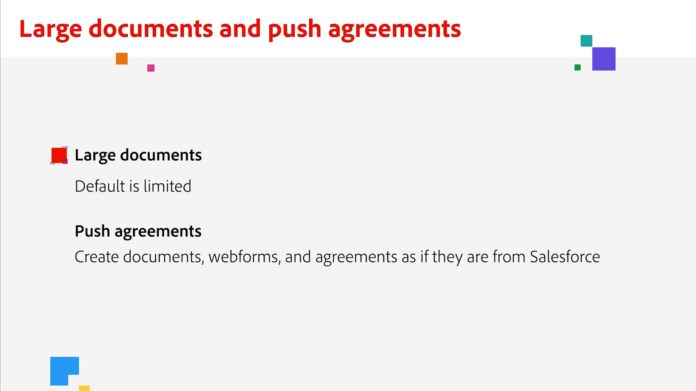

# Overzicht van integraties

U kunt Acrobat Sign gebruiken in andere toepassingen die uw organisatie al gebruikt, zoals Microsoft, Salesforce, Workday en Marketo om er een paar te noemen. Leer hoe je je workflows voor elektronische handtekeningen kunt vereenvoudigen in deze integratiehandleidingen en zelfstudies.

>[!NOTE]
> Als u problemen hebt met de toegang tot een van deze functies, neemt u contact op met de beheerder van uw organisatie om te controleren of de integratie is ingeschakeld.

## Nieuw

* [ de grote dossiers van de opstelling en pushtoewijzingen ](salesforce-large-files.md)
Leer hoe u grote documenten instelt en overeenkomstservices pusht in Salesforce
* [ opstelling automatische updates ](salesforce-automatic-updates.md)
Leer hoe u uw account eenvoudig aan Salesforce kunt koppelen om automatische updates te ontvangen
* [ het tabintegratie van Documenten voor  [!DNL Microsoft Teams]](acrobat-sign-teams-documents-tab.md)
Leer hoe u documenten rechtstreeks vanuit het tabblad Documenten kunt verzenden ter ondertekening in [!DNL Microsoft Teams]

## Zelfstudies voor Microsoft-integraties

<table style="table-layout:fixed">
<tr>
  <td>
    
    

    <a href="fill-and-sign-doc-microsoft-outlook.md"><strong> het Vullen en het ondertekenen in de Vooruitzichten van Microsoft </strong></a>
    

    <em> Vul een vorm in en onderteken direct binnen Microsoft Outlook </em>
     
  </td>
  <td>
    
    

    <a href="send-for-signature-with-outlook.md"><strong> verzend voor handtekening in Vooruitzichten </strong></a>
    

    <em> verzend een document voor handtekening direct binnen de Vooruitzichten van Microsoft </em>
     
  </td>
  <td>
    
    

    <a href="send-for-signature-with-sharepoint-online.md"><strong> verzend voor handtekening in SharePoint Online </strong></a>
    

    <em> verzend een document voor handtekening direct binnen SharePoint Online </em>
     
  </td>
   <td>
    
    

    <a href="track-an-agreement-with-sharepoint-online.md"><strong> het Volgen in SharePoint Online </strong></a>
    

    <em> spoor de vooruitgang van een overeenkomst direct binnen Microsoft Sharepoint </em>
     
  </td>
</tr>
<tr>
  <td>
    
    

    <a href="integrate-web-form-sharepoint-online.md"><strong> Integreer een webformulier met [!DNL SharePoint Online]</strong></a>
    

    <em> Leer hoe te om gegevens in kaart te brengen die van een Webvorm in een [!DNL SharePoint] lijst </em> worden verzameld
     
  </td>
  <td>
    
    

    <a href="auto-archive-sharepoint-power-automate.md"><strong> Bestanden automatisch archiveren in [!DNL SharePoint] met [!DNL Power Automate]</strong></a>
    

    <em> Leer hoe u ondertekende documenten automatisch kunt archiveren naar een [!DNL SharePoint] -bibliotheek met [!DNL Power Automate]</em>
     
  </td>
  <td>
    
    

    <a href="documentautomation.md"><strong> Documentautomatisering met [!DNL Acrobat Sign for Microsoft Power Platform]</strong></a>
    

    <em> Leer om [!DNL Acrobat Sign] en [!DNL Adobe PDF Tools] schakelaars voor [!DNL Microsoft Power] apps </em> te activeren en te gebruiken
     
  </td>
   <td>
    
    

    <a href="adobe-sign-teams-mortgage.md"><strong> Verzenden ter ondertekening in [!DNL Microsoft Teams]</strong></a>
    

    <em> Verzend documenten ter ondertekening, rechtstreeks binnen [!DNL Microsoft Teams]</em>
     
  </td>
</tr>
<tr>
  <td>
    
    

    <a href="live-sign-microsoft-teams.md"><strong> Live Sign in Adobe Acrobat Sign voor [!DNL Microsoft Teams]</strong></a>
    

    <em> Leer hoe te om een online het ondertekenen ervaring tot stand te brengen die op persoonlijk het ondertekenen tijdens een [!DNL Microsoft Teams] vergadering </em> lijkt
     
  </td>
   <td>
    
    

    <a href="acrobat-sign-teams-documents-tab.md"><strong> Integratie van het tabblad Documenten voor [!DNL Microsoft Teams]</strong></a>
    

    <em> Leer hoe u documenten rechtstreeks vanuit het tabblad Documenten kunt verzenden ter ondertekening in [!DNL Microsoft Teams]</em>
     
  </td>
 <td>
    
    

    <a href="simple-workflow-power-automate.md"><strong> Een eenvoudige workflow maken met [!DNL Power Automate]</strong></a>
    

    <em> Leer hoe te om een eenvoudig werkschema te creëren gebruikend [!DNL Power Automate] schakelaars </em>
     
  </td>
  <td>
    
    

    <a href="advanced-workflow-power-automate.md"><strong> creeer een geavanceerde werkschema met Macht automatiseren </strong></a>
    

    <em> Leer hoe te om een geavanceerde werkschema tot stand te brengen gebruikend [!DNL Power Automate] schakelaars </em>
     
  </td>
<tr>
  <td>
    
    

    <a href="dynamics-customer-service.md"><strong> Dynamics 365 van Microsoft voor de Dienst van de Klant </strong></a>
    

    <em> Leer hoe Acrobat Sign en [!DNL Microsoft Dynamics 365] voor de Dienst van de Klant worden gebruikt om klantentevredenheid op een zelfbedieningsWebportaal van de klant te verbeteren </em>
     
  </td>
  <td>
    
    

    <a href="dynamics-field-service.md"><strong> Dynamics 365 van Microsoft voor de Dienst van het Gebied </strong></a>
    

    <em> Leer hoe Acrobat Sign, [!DNL Power Automate], en [!DNL Microsoft Dynamics 365] voor de Dienst van het Gebied worden gebruikt om klanten onsite overeenkomsten te stroomlijnen </em>
     
  </td>
  <td>
    
    

    <a href="dynamics-sales.md"><strong> Dynamics 365 for Sales </strong></a>
    

    <em> Leer hoe Acrobat Sign en [!DNL Microsoft Dynamics 365] voor Verkoop worden gebruikt om het het ondertekenen van het verkoopcitaat te automatiseren proces </em>
     
  </td>
  <td>
    
    

     
  </td>
</tr>
</table>

## [!DNL Notarize] integratiezelfstudies

<table style="table-layout:fixed">
<tr>
  <td>
    
    

    <a href="send-document-notarize.md"><strong> verzend documenten voor notariatie </strong></a>
    

    <em> Leer hoe te om een document voor notarization te verzenden </em>
     
  </td>
  <td>
    
    

     
  </td>
  <td>
    
    

     
  </td>
  <td>
    
    

     
  </td>
</tr>
</table>

## Zelfstudies voor Salesforce-integraties

<table style="table-layout:fixed">
<tr>
  <td>
    
    

    <a href="create-an-agreement-template.md"><strong> Document Builder voor [!DNL Salesforce]</strong></a>
    

    <em> Leer hoe u een herbruikbare documentsjabloon maakt met Document Builder voor [!DNL Salesforce]</em>
     
  </td>
  <td>
    
    

    <a href="set-up-data-mapping.md"><strong> de gegevenstoewijzing van de Opstelling </strong></a>
    

    <em> Trek gegevens terug in Salesforce nadat een overeenkomst is ondertekend </em>
     
  </td>
  <td>
    
    

    <a href="set-up-merging-map.md"><strong> het Toewijzen van de Fusie van de Opstelling in Salesforce </strong></a>
    

    <em> Leer hoe te om gegevens van Salesforce direct in een document van Acrobat Sign samen te voegen </em>
     
  </td>
  <td>
    
    

    <a href="create-a-custom-button.md"><strong> Creërend een douaneknoop </strong></a>
    

    <em> creeer een douaneknoop die het verzendende proces begint en automatisch een overeenkomst binnen Salesforce bevolkt </em>
     
  </td>
</tr>
<tr>
  <td>
    
    

    <a href="salesforce-automatic-updates.md"><strong> opstelling automatische updates </strong></a>
    

    <em> Leer hoe te om uw rekening aan Salesforce gemakkelijk te verbinden om automatische updates te krijgen </em>
     
  </td>
 <td>
    
    

    <a href="salesforce-large-files.md"><strong> de grote dossiers van de opstelling en pushtoewijzingen </strong></a>
    

    <em> Leer hoe te opstelling grote documenten en de duw overeenkomstdiensten in Salesforce </em>
     
  </td>
  <td>
      
      

       
  </td>
  <td>
      
      

       
  </td>
</tr>
</table>

## Zelfstudies voor Workday-integratie

<table style="table-layout:fixed">
<tr>
 <td>
    
    

    <a href="acrobat-sign-workday-onboarding.md"><strong> Acrobat Sign + Workday nieuwe huur onboarding </strong></a>
    

    <em> Leer hoe te om onboardingworkflows met Acrobat Sign + Workday te stroomlijnen </em>
     
  </td>
 <td>
    
    

     
  </td>
  <td>
    
    

     
  </td>
  <td>
    
    

     
  </td>
</tr>
</table>

## Zelfstudies en configuratiehandleidingen voor Marketo-integratie

<table style="table-layout:fixed">
<tr>
  <td>
    
    

    <a href="marketo-salesforce-sms.md"><strong> Verzend berichten gebruikend Acrobat Sign voor Salesforce en Marketo </strong></a>
    

    <em> Leer hoe te om een tekstbericht, e-mail, of pushbericht te verzenden om de ondertekenaar te laten weten dat een overeenkomst op zijn weg is </em>
     
  </td>
  <td>
    
    

    <a href="marketo-salesforce-reminder.md"><strong> verzend herinneringen gebruikend Adobe Sign voor Salesforce en Marketo videozelfstudie </strong></a>
    

    <em> Leer hoe te om een e-mailherinnering van Marketo te verzenden wanneer een overeenkomst na een periode niet ondertekend </em> blijft
     
  </td>
  <td>
    
    

    <a href="marketo-salesforce-reminder.md"><strong> verzend herinneringen gebruikend Acrobat Sign voor Salesforce en de configuratiegids van Marketo </strong></a>
    

    <em> Lees hoe te om een e-mailherinnering van Marketo te verzenden wanneer een overeenkomst na een periode niet ondertekend </em> blijft
     
  </td>
   <td>
    
    

    <a href="marketo-dynamics-reminder.md"><strong> verzend herinneringen gebruikend Acrobat Sign voor de Dynamica van Microsoft en Marketo </strong></a>
    

    <em> Leer hoe te om een e-mailherinnering te verzenden wanneer een overeenkomst na een periode niet ondertekend </em> blijft
     
  </td>
</tr>
<tr>
  <td>
    
    

    <a href="marketo-dynamics-sms.md"><strong> verzend berichten gebruikend Acrobat Sign voor de Dynamica van Microsoft en Marketo </strong></a>
    

    <em> Leer hoe te om een tekstbericht, e-mail, of pushbericht te verzenden om de ondertekenaar te laten weten dat een overeenkomst op zijn weg is </em>
     
  </td>
  <td>
    
    

     
  </td>
  <td>
    
    

     
  </td>
  <td>
    
    

     
  </td>
</tr>
</table>
