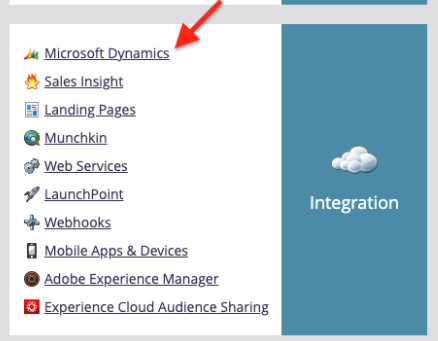

# Herinneringen verzenden met Adobe Sign voor Microsoft Dynamics 365 en Marketo

Leer hoe u een e-mailherinnering kunt verzenden als een overeenkomst na een bepaalde periode niet is ondertekend. Deze integratie maakt gebruik van Adobe Sign, Adobe Sign voor Microsoft Dynamics, Marketo en de Marketo Microsoft Dynamics Sync.

## Vereisten

1. Installeer de Marketo Microsoft Dynamics Sync.

   [Hier is informatie en de nieuwste plug-in voor Microsoft Dynamics Sync beschikbaar.](https://experienceleague.adobe.com/docs/marketo/using/product-docs/crm-sync/microsoft-dynamics/marketo-plugin-releases-for-microsoft-dynamics.html)

1. Installeer [Adobe Sign for Microsoft Dynamics](https://appsource.microsoft.com/nl-nl/product/dynamics-365/adobesign.f3b856fc-a427-4d47-ad4b-d5d1baba6f86).

   [Hier is informatie over deze plug-in beschikbaar.](https://helpx.adobe.com/ca/sign/using/microsoft-dynamics-integration-installation-guide.html)

## Het aangepaste object zoeken

Als de Marketo Microsoft Dynamics Sync en Adobe Sign for Dynamics zijn geconfigureerd, verschijnen er twee nieuwe opties in de Marketo Admin Terminal.


1. Klik op **[!UICONTROL Dynamics Entities Sync]**.

   Synchronisatie moet worden uitgeschakeld voordat u aangepaste entiteiten synchroniseert. Klik **Schema synchroniseren** als dit uw eerste keer is. Klik anders op **Schema vernieuwen**.

   

## Het aangepaste object synchroniseren

1. Zoek aan de rechterkant de op [!UICONTROL Lead], [!UICONTROL Contact] en [!UICONTROL Account] gebaseerde aangepaste objecten.

   * **Schakel** Synchroniseren in voor de objecten onder  **** Leadif als u een herinnering wilt verzenden wanneer een   lead in Dynamics geen overeenkomst heeft ondertekend.

   * **Schakel** Synchroniseren voor de objecten onder  **** Contactpersoon in als u een herinnering wilt verzenden wanneer een   Contactpersoon in Dynamics geen overeenkomst heeft ondertekend.

   * **Schakel** Syncfor de objecten onder  **** Account in als u een herinnering wilt verzenden wanneer een   account in Dynamics geen overeenkomst heeft ondertekend.

   * **Schakel** Syncfor het overeenkomstobject in onder de gewenste  **[!UICONTROL bovenliggende]**  items ([!UICONTROL lead],  [!UICONTROL contact] of  [!UICONTROL account]).

   

1. Selecteer in het nieuwe venster de eigenschappen die u onder Overeenkomst wilt gebruiken en schakel vervolgens de vakken onder **Restrictie** en **Trigger** in om deze beschikbaar te maken voor uw marketingactiviteiten.

   

   

1. Activeer de synchronisatie opnieuw nadat u synchronisatie voor de aangepaste objecten hebt ingeschakeld.

   Ga terug naar de beheerterminal, klik op **Microsoft Dynamics** en klik vervolgens op **Synchronisatie inschakelen**.

   

   

## Het programma en de token maken

1. Klik in de sectie Marketingactiviteiten van Marketo met de rechtermuisknop op **Marketingactiviteiten** op de linkerbalk.

   Selecteer **Nieuwe campagnemap** en geef deze een naam.

   

1. Klik met de rechtermuisknop op de gemaakte map, selecteer **Nieuw programma** en geef deze een naam.

   Laat alle andere elementen standaard staan en klik op **Maken**.

   

   

1. Klik op **Mijn tokens** en sleep **E-mailscript** naar het canvas.

   

1. Geef het een naam, dan klik op **Klik om uit te geven**.

   

1. Vouw **[!UICONTROL Aangepaste objecten]** aan de rechterkant uit en vouw vervolgens het object **[!UICONTROL Agreement]** uit.

   Zoek en sleep [!UICONTROL Naam], Overeenkomststatus, Verzonden op en Huidige URL ondertekenaar naar het canvas.

1. Schrijf een snelheidsscript met deze tokens om de overeenkomst-URL weer te geven van een overeenkomst die een week lang niet is ondertekend. Hier volgt een voorbeeld van de huidige datum die wordt vergeleken met Verzonden op:

   ```
   #foreach($agreement in $adobe_agreementList)
       #if($agreement.adobe_esagreementstatus == "Out for Signature")
           #set($todayCalObj = $date.toCalendar($date.toDate("yyyy-MM-dd",$date.get('yyyy-MM-dd'))) )
           #set($dateSentCalObj = $date.toCalendar($date.toDate("yyyy-MM-dd",$agreement.adobe_datesent)) )
           #set($dateDiff = ($todayCalObj.getTimeInMillis() - $dateSentCalObj.getTimeInMillis()) / 86400000 )
   
           #if($dateDiff >= 7)
               #set($agreementName = $agreement.adobe_name)
               #set($agreementURL = $agreement.adobe_currentsignerurl.substring(8))
               #break
           #else
           #end
       #else
       #end
   #end
   
   #if(${agreementName})
       <a href="https://${agreementURL}">${agreementName}</a>
   #else
       Please contact us. 
   #end
   ```

1. Klik op **[!UICONTROL Opslaan]**.

## Maak een herinnering en voeg personalisatie toe

Voorbeelden van personalisatie zijn: de naam van de ondertekenaar, de naam van de overeenkomst, een koppeling naar de overeenkomst, enz.

1. Klik met de rechtermuisknop op het programma dat u hebt gemaakt en klik op **[!UICONTROL Nieuw lokaal element]**. Selecteer vervolgens **[!UICONTROL E-mail]**.

   

1. Voer op het nieuwe tabblad een **[!UICONTROL Naam]** en **[!UICONTROL Beschrijving]** in voor de e-mail en selecteer een sjabloon in de sjabloonkiezer.

   

1. Klik op **[!UICONTROL Maken]**.

1. Stel de **[!UICONTROL Van naam]** en **[!UICONTROL Van adres]** in.

   

1. Klik op de berichttekst om de Editor te activeren.

   Klik op de knop **[!UICONTROL Token invoegen]**, zoek de aangepaste overeenkomst-URL-token die u hebt gemaakt en klik vervolgens op **[!UICONTROL Invoegen]**. Voltooi het aanpassen van uw e-mail en klik op **[!UICONTROL Opslaan]**.

   

1. Voorvertonen met een profiel waaraan een overeenkomst is toegewezen.

   Er wordt een koppeling naar de URL weergegeven met de overeenkomstnaam als label.

   

## Het filter Slimme campagne instellen

1. Klik met de rechtermuisknop op het programma dat u hebt gemaakt en klik vervolgens op **[!UICONTROL Nieuwe slimme campagne]**.

   

1. Geef het een naam van uw keuze en klik vervolgens op **[!UICONTROL Maken]**.

   

1. Zoek naar, klik en sleep **[!UICONTROL Heeft overeenkomst]** naar de slimme lijst.

   

   De velden die u aan de trigger blootstelt, moeten beschikbaar zijn in **[!UICONTROL Restrictie toevoegen]**.

1. Selecteer **[!UICONTROL Overeenkomststatus]** en andere velden waarop u wilt filteren.

   Definieer voor elk toegevoegd veld de waarden waarop u wilt filteren. In dit geval wordt de gebeurtenis alleen geactiveerd wanneer de **[!UICONTROL Overeenkomststatus]** *Verzonden voor ondertekening* is en **[!UICONTROL Verzonden op]** *in het verleden is vóór 1 week*.

   

   >[!NOTE]
   >
   > Voeg een unieke id toe aan de beperkingen, zoals **Naam**, als u wilt dat deze campagne alleen voor bepaalde overeenkomsten wordt uitgevoerd.

1. Bevestig het campagnepubliek en bekijk op het tabblad Planning wie hiervoor in aanmerking komt.

   

## De slimme-campagnestroom instellen

Omdat het campagnefilter **Dagen tot verloopt** is gebruikt, kunt u een geplande herhaling voor de campagne gebruiken.

1. Klik op het tabblad **[!UICONTROL Flow]** in de [!UICONTROL Slimme campagne].

   Zoek en sleep de **E-mail verzenden** naar het canvas en selecteer de herinnering die u in de vorige sectie hebt gemaakt.

   

1. Klik op het tabblad **[!UICONTROL Planning]** in de slimme campagne. Zorg ervoor dat de campagnestroom beperkt is tot één keer per persoon in de **Slimme campagne-instellingen**. Klik vervolgens op het tabblad **Herhaling plannen**.

   

1. Stel de **Planning** in op _Dagelijks_. Kies zo nodig een startdag en een tijd en einddatum voor de campagne.

   

>[!TIP]
>
>Deze zelfstudie maakt deel uit van de cursus [Versnel de verkoopcycli met Adobe Sign for Microsoft Dynamics en Marketo](https://experienceleague.adobe.com/?recommended=Sign-U-1-2021.1) die gratis beschikbaar is op Experience League!