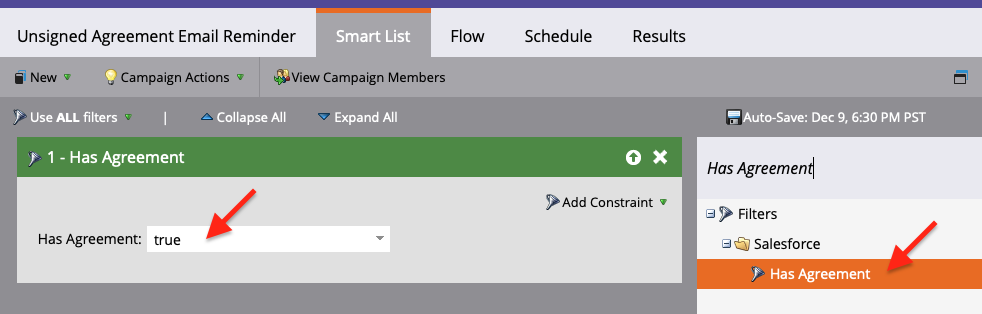

# Herinneringen verzenden met Acrobat Sign for Salesforce en Marketo Configuration Guide

Leer hoe u een e-mailherinnering van Marketo kunt verzenden als een overeenkomst na een bepaalde periode niet is ondertekend. Deze integratie maakt gebruik van Acrobat Sign, Acrobat Sign voor Salesforce, Marketo en de Marketo- en Salesforce-synchronisatie.

## Vereisten

1. Installeer de Marketo Salesforce-synchronisatie.

   De informatie en de recentste stop in voor de Synchronisatie van Salesforce zijn beschikbaar [&#x200B; hier.](https://experienceleague.adobe.com/docs/marketo/using/product-docs/crm-sync/salesforce-sync/understanding-the-salesforce-sync.html?lang=nl-NL)

1. Installeer Acrobat Sign voor Salesforce.

   De informatie over deze stop is beschikbaar [&#x200B; hier.](https://helpx.adobe.com/ca/sign/using/salesforce-integration-installation-guide.html)

## Het aangepaste object zoeken

Als de Marketo Salesforce Sync en Acrobat Sign for Salesforce-configuraties zijn voltooid, verschijnen er verschillende nieuwe opties in de Marketo Admin Terminal.


1. Klik **Schema van de Synchronisatie** als dit uw eerste keer is. Anders, verfrist de klik **Schema**.

   

1. Als de globale synchronisatie loopt, maak onbruikbaar door **Globale Synchronisatie** onbruikbaar te klikken.

   

1. Klik **vernieuwen Schema**.

   

## Het aangepaste object synchroniseren

Aan de rechterkant zie Aangepaste objecten voor leads, Contactpersoon en Account.

**laat Synchronisatie** voor de voorwerpen onder Lood toe als u een herinnering wilt verzenden wanneer een Lood geen overeenkomst in Salesforce heeft ondertekend.

**laat Synchronisatie** voor de voorwerpen onder Contact toe als u een herinnering wilt verzenden wanneer een Contact geen overeenkomst in Salesforce heeft ondertekend.

**laat Synchronisatie** voor de voorwerpen onder Rekening toe als u een herinnering wilt verzenden wanneer een Rekening geen overeenkomst in Salesforce heeft ondertekend.

1. **laat Synchronisatie** voor het **voorwerp van de Overeenkomst** toe dat onder de gewenste ouder (Lead, Contact, of Rekening) wordt getoond. Doe dit voor alle andere aangepaste objecten die u wilt synchroniseren.

   

1. De volgende activa tonen hoe te **toelaten Synchronisatie**.

   

   

## De aangepaste objectvelden beschikbaar maken voor triggers

1. Terwijl de Globale Synchronisatie wordt gedeactiveerd, selecteer het voorwerp van de douane van de Overeenkomst u synchronisatie voor, dan **uitgezocht Zichtbare Gebieden** toeliet.

1. Schakel het veld Overeenkomstnaam in de triggerkolom in om het veld beschikbaar te maken voor je Campaign Action Triggers. Controleer om het even welke andere gebieden u wilt filteren door, dan **sparen**.

    uit

    uit

1. Wanneer u klaar bent met het inschakelen van synchronisatie op de aangepaste objecten en het beschikbaar maken van de triggerwaarden, vergeet dan niet de synchronisatie opnieuw te activeren:

    toe

## Het programma en de token maken

1. In de sectie van de Activiteiten van de Marketing van Marketo, klik op **Activiteiten van de Marketing** op de linkerbar met de rechtermuisknop aan, selecteer **Nieuwe Omslag van de Campagne**, en geef het een naam.

   

1. Klik op de gecreeerde omslag met de rechtermuisknop aan, selecteer **Nieuw Programma**, en geef het een naam. Laat alles anders als gebrek, dan klik **creëren**.

   

   

1. Klik op **Mijn Tokens**, dan sleep **E-mailManuscript** over aan het canvas.

   

1. Geef het een naam, dan klik op **klik om uit te geven**.

    uit

1. Breid **de Objecten van de Douane** op de rechterkant uit, dan breid het **voorwerp van de Overeenkomst** uit. Zoek de overeenkomstnaam, de overeenkomststatus, de datum van ondertekening en de URL voor ondertekening naar het canvas en sleep deze.

1. Schrijf een snelheidsscript met deze tokens om de overeenkomst-URL weer te geven van een overeenkomst die een week lang niet is ondertekend. In het volgende voorbeeld wordt de huidige datum vergeleken met de verzonden datum:

   ```
   #foreach($agreement in $echosign_dev1__SIGN_Agreement__cList)
       #if($agreement.echosign_dev1__Status__c == "Out for Signature")
           #set($todayCalObj = $date.toCalendar($date.toDate("yyyy-MM-dd",$date.get('yyyy-MM-dd'))) )
           #set($dateSentCalObj = $date.toCalendar($date.toDate("yyyy-MM-dd",$agreement.echosign_dev1__DateSent__c)) )
           #set($dateDiff = ($todayCalObj.getTimeInMillis() - $dateSentCalObj.getTimeInMillis()) / 86400000 )
   
           #if($dateDiff >= 7)
               #set($agreementName = $agreement.Name)
               #set($agreementURL = $agreement.echosign_dev1__Signing_URL__c.substring(8))
               #break
           #else
           #end
       #else
       #end
   #end
   
   #if(${agreementName})
       <a href="https://${agreementURL}">${agreementName}</a>
   #else
       Please contact us. 
   #end
   ```

1. Klik op **Opslaan**.

## Maak een herinnering en voeg personalisatie toe

Voorbeelden van personalisatie zijn: de naam van de ondertekenaar, de naam van de overeenkomst, een koppeling naar de overeenkomst, enzovoort.

1. Klik op het programma met de rechtermuisknop u creeerde en klik **Nieuwe Lokale Activa**, dan uitgezocht **E-mail**.

   

1. In het nieuwe lusje, ga a **Naam** en **Beschrijving** voor e-mail in en selecteer een malplaatje van de malplaatjeplukker. Klik op **Maken**.

   

1. Plaats **van Naam** en **van Adres**.

   

1. Klik op de berichttekst om de Editor te activeren. Klik op het **Symbolische** knoop van het Tussenvoegsel, vind het symbolische van de douaneOvereenkomst URL u creeerde, dan klik **Tussenvoegsel**. Voltooi het aanpassen van uw e-mail, en klik **sparen**.

   

1. Voorvertonen met een profiel waaraan een overeenkomst is toegewezen. Er wordt een koppeling naar de URL weergegeven met de overeenkomstnaam als label.

   

## Het filter Slimme campagne instellen

1. Klik op het programma met de rechtermuisknop u creeerde, dan klik **Nieuwe Slimme Campagne**.

   

1. Geef het een naam van uw het kiezen, dan klik **creeer**.

   

1. Het onderzoek naar, dan klikt en sleept **heeft Overeenkomst** aan de Slimme Lijst.

   

1. De gebieden u aan de trekker blootstelde zouden nu beschikbaar moeten zijn in **Add Restrictie**. Selecteer **Status van de Overeenkomst** en om het even welke andere gebieden u wilt filtreren door. Definieer voor elk toegevoegd veld de waarden waarop u wilt filteren. In dit geval, zal het slechts teweegbrengen wanneer de **Status van de Overeenkomst** uit voor Ondertekening is en **Verzonden Datum** is in het verleden vóór 7 dagen.

   

   >[!NOTE]
   >
   > d een uniek herkenningsteken aan de beperkingen, zoals **Naam van de Overeenkomst**, als u deze campagne voor bepaalde overeenkomsten slechts wilt lopen.

1. Bevestig het campagnepubliek en bekijk op het tabblad Planning wie hiervoor in aanmerking komt.

   

## De slimme-campagnestroom instellen

Omdat het campagnefilter **Niet ondertekende Dagen** werd gebruikt, kunt u een geplande herhaling voor de campagne gebruiken.

1. Klik op het **Stroom** lusje in de Slimme Campagne. Zoek naar en sleep **verzendt e-mail** stroom naar het canvas en selecteer de herinnerings e-mail u in de vorige sectie creeerde.

   

1. Klik op het **lusje van het Programma** in de Slimme Campagne. Zorg ervoor dat de campagnestroom wordt beperkt tot slechts eenmaal per persoon in de **Slimme Montages van de Campagne**. Dan, klik op de **Terugkeer van het Programma** tabel.

   

1. Plaats het **Programma** aan Dagelijks, kies een begindag en tijd, en een einddatum voor de campagne indien nodig.

   

