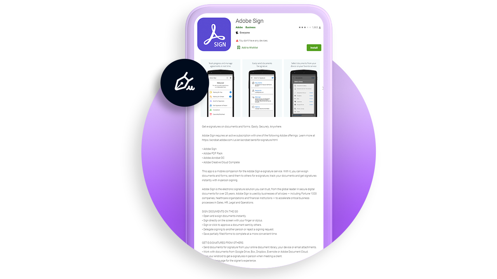

# Overzicht van mobiel

Verzend documenten ter ondertekening, volg de voortgang van elektronische ondertekening en krijg real-time updates op je mobiele apparaat.

<table style="table-layout:fixed">
<tr>
  <td>
    
    

    <a href="liquidmode.md"><strong>Vloeiende modus in Acrobat Sign</strong></a>
    

    <em>Leer hoe de Vloeiende modus de mobiele ondertekeningservaring verbetert</em>
     
  </td>
  <td>
    
    

    <a href="https://itunes.apple.com/nl/app/adobe-sign/id481082197?mt=8" target="_blank"><strong>Acrobat Sign Mobile-app downloaden voor iOS</strong></a>
     
  </td>
  <td>
    
    

    <a href="https://play.google.com/store/apps/details?id=com.adobe.echosign&amp;hl=nl" target="_blank"><strong>Acrobat Sign Mobile-app downloaden voor Android</strong></a>
     
  </td>
  <td>
    
    

     
  </td>
</tr>
</table>
