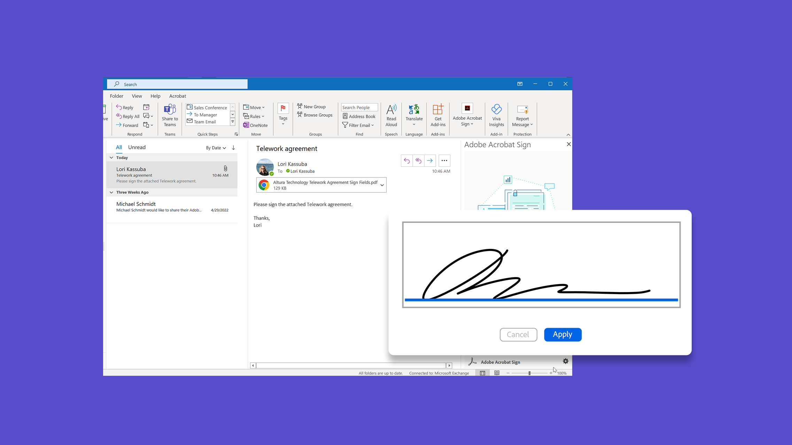

# Acrobat Sign-zelfstudies

Acrobat Sign, een Adobe Document Cloud-oplossing, wordt geschaald om aan de behoeften van je organisatie te voldoen, dankzij integraties, API’s, geavanceerde verificatie, extra beheerfuncties en meer. Hier vind je een breed scala aan leerervaringen die zijn ontworpen om snel zowel beginners als beheerders op Acrobat Sign up-to-date te brengen.

## Leerpaden

<table style="table-layout:fixed">
<tr>
  <td>
    
    

    <a href="sign-beginner-tutorials/beginner-users-overview.md"><strong>Aan de slag</strong></a>
    

    Ga snel aan de slag met het verzenden, ondertekenen en volgen van documenten
     
  </td>
  <td>
    
    

    <a href="sign-advanced-users/advanced-users-overview.md"><strong> Geavanceerde taken </strong></a>
    

    Ga verder dan de basisbeginselen met specifieke taken en automatisering
     
  </td>
   <td>
    
    

    <a href="admin/intro-admin-overview.md"><strong>Beheerders</strong></a> 
    

    Eenvoudige tot geavanceerde instellingstips voor uw organisatie
     
  </td>
   <td>
    
    

    <a href="digitalid/digitalid-overview.md"><strong> Digitale identiteitskaart </strong></a>
    

    Leer hoe je digitale ID’s van over de hele wereld gebruikt in Acrobat Sign
     
  </td>
</tr>
<tr>
    <td>
    
    

    <a href="integrations/integrations-overview.md"><strong> Integraties </strong></a>
    

    Acrobat Sign rechtstreeks in een andere toepassing toevoegen
     
    </td>
  <td>
    
    

    <a href="sign-usecase/expand-inspire-overview.md"><strong> Industrieën en afdelingen </strong></a>
    

    Ontdek praktijkvoorbeelden van branche- en afdelingsgebruik
     
  </td>
  <td>
    
    

    <a href="develop/develop-overview.md"><strong> ontwikkelt </strong></a>
    

    Ontwikkelingsbronnen ophalen voor Acrobat Sign I/O
     
  </td>
  <td>
    
    

    <a href="deploy-overview.md"><strong> stel </strong></a> op
    

    Inzicht en best practices voor het implementeren van Acrobat Sign binnen uw organisatie
     
  </td>
</tr>
<tr>
  <td>
    
    

    <a href="mobile/mobile-overview.md"><strong>Mobiel</strong></a>
    

    Verzend, onderteken en krijg real-time updates op je mobiele apparaat
     
  </td>
</tr>
</table>