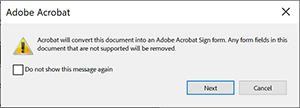

# Acrobat Sign-tekstlabels

Leer hoe u Acrobat Sign-formuliervelden maakt met tekstcodering. Tekstlabels kunnen rechtstreeks worden toegevoegd aan ontwerpgereedschappen zoals Microsoft Word, Adobe InDesign of als je een PDF hebt — in Acrobat. Ze kunnen de inspanningen om in Acrobat Sign gebruikte documenten voor te bereiden aanzienlijk verminderen. Nadat u een gelabeld document in Acrobat Sign hebt geüpload, kan het worden ingesteld als een sjabloon, zodat iedereen geen velden hoeft toe te voegen aan zijn of haar documenten.

## Aan de slag

Tekstlabels zijn uniek opgemaakte tekst die ergens in een document is geplaatst en die automatisch als velden worden herkend wanneer ze naar Acrobat Sign worden geüpload.

Tekstlabels kunnen rechtstreeks worden toegevoegd aan ontwerpgereedschappen zoals Microsoft Word, Adobe InDesign of als u een PDF — Acrobat hebt. Tekstlabels verminderen aanzienlijk de moeite die het kost om documenten voor te bereiden die in Acrobat Sign worden gebruikt.

### Tags toevoegen in Microsoft Word

Om tekstmarkeringen aan een document van Microsoft Word toe te voegen, controleer dit [&#x200B; videoleerprogramma &#x200B;](text-tagging-word.md).

### Tags toevoegen in Acrobat

Adobe Acrobat heeft een krachtige ontwerpomgeving voor slepen en neerzetten. Door tekstlabels toe te passen in Acrobat kunt u gebruikmaken van de extra mogelijkheden die beschikbaar zijn in Acrobat Sign.

1. Open uw formulier in Acrobat.

1. Selecteer **[!UICONTROL Bereid een Vorm]** van het **[!UICONTROL Alle hulpmiddelen]** paneel voor.

1. Selecteer **[!UICONTROL creeer vorm]**.

1. Selecteer **[!UICONTROL vorm voor e-het ondertekenen]** van het **[!UICONTROL het paneeldrop-down van Opties]** voorbereidt.

   

1. Selecteer **[!UICONTROL daarna]** om te bevestigen.

   

1. Dubbelklik op een gebied om de **[!UICONTROL dialoog van Eigenschappen]** omhoog te brengen.

   Gebruik de syntaxis die in [&#x200B; wordt gedetailleerd de Gids van de Markering van de Tekst van Acrobat Sign &#x200B;](https://helpx.adobe.com/nl/sign/using/text-tag.html) om de naam van het vormgebied te veranderen.

1. Bijvoorbeeld, kunt u *OInt_es_ :signer1: optiinitials* op de gebiedsnaam typen om een aanvankelijk gebied facultatief te maken.

   

   Tekstlabels worden toegevoegd aan de naam van het formulierveld. In tegenstelling tot de syntaxis die u zou gebruiken in Microsoft Word (of andere ontwerpgereedschappen), worden de accolades niet opgenomen.

   U kunt ook tekstcodes toevoegen aan het venster Velden door de naam van het formulierveld te wijzigen.

   

1. Sla het bestand op en sluit het.

1. Upload het bestand in Acrobat Sign en maak een herbruikbare sjabloon zoals beschreven in de volgende sectie.

### Een herbruikbare sjabloon maken

Nadat u een gecodeerd document hebt gemaakt, stelt u dit in als een herbruikbare sjabloon, zodat iedereen geen velden hoeft toe te voegen aan zijn documenten.

Om een herbruikbaar malplaatje te creëren, controleer dit [&#x200B; videoleerprogramma &#x200B;](../sign-advanced-users/create-a-template.md).
