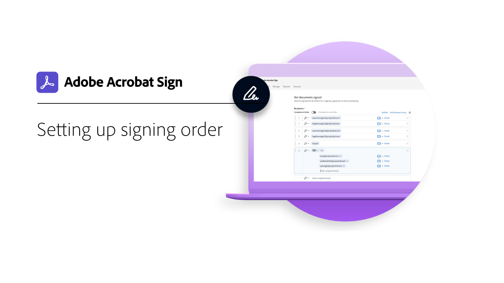
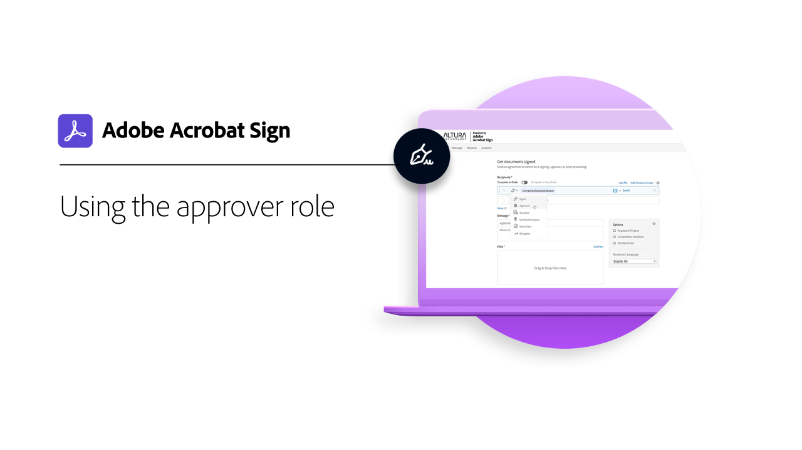

# Overzicht van geavanceerde taken

Leer hoe u een document ter ondertekening kunt verzenden naar 100 ontvangers tegelijk, een document voor uw website kunt maken dat klaar is voor ondertekening, de transacties voor handtekeningen kunt beheren en documentsjablonen kunt maken en beheren. Deze zelfstudies zijn bedoeld voor iedereen die al vertrouwd is met de basisbeginselen van het verzenden en aanvragen van handtekeningen, en die meer wil weten over de manieren waarop Acrobat Sign voor hen kan werken.

## Nieuw

* [ verzend in bulk ](megasign.md)
Leer hoe je in een paar korte stappen duizenden handtekeningen tegelijk verzamelt voor elk document
* [ methodes van de Authentificatie in Acrobat Sign ](authentication-methods.md)
Leer meer over de verschillende methoden die beschikbaar zijn in Acrobat Sign voor het verifiëren van de identiteit van iemand die een document ondertekent

## Verzenden

<table style="table-layout:fixed">
<tr>
  <td>
    
    

    <a href="setting-up-routing.md"><strong> het ondertekenen van de vestigingsorde </strong></a>
    

    <em> opstelling de het ondertekenen orde voor veelvoudige ondertekenaars </em>
     
  </td>
  <td>
      
    

    <a href="delegate-signature.md"><strong> Gebruikend de rol van de delegeerder </strong></a>
    

    <em> gebruik de rol van de delegeerder om een document naar een intermediair te verzenden die dan het document voor handtekening </em> kan leiden
     
  </td>
  <td>
    
    

    <a href="add-an-approver.md"><strong> Gebruikend de goedkeurderrol </strong></a>
    

    <em> voeg een rol van de fiatteur aan uw proces van de contractgoedkeuring toe </em>
     
  </td>
  <td>
    
    

    <a href="authentication-methods.md"><strong> methodes van de Authentificatie in Acrobat Sign </strong></a>
    

    <em> Leer over de waaier van identiteitsauthentificatiemethodes beschikbaar in Acrobat Sign </em>
     
  </td>
</tr>
<tr>
  <td>
      
      

      <a href="manage-form-data.md"><strong> beheer vormgegevens </strong></a>
      

      <em> Leer hoe te om vormgegevens van uw documenten te consolideren </em>
       
    </td>
  <td>
    
    

    <a href="set-up-online-payments.md"><strong> Opstelling online betalingen </strong></a>
    

    <em> Leer hoe te opstelling en online betalingen in uw documenten goed te keuren </em>
     
  </td>
  <td>
      
      

      <a href="megasign.md"><strong> verzend in bulk </strong></a>
      

      <em> verzamel honderden handtekeningen onmiddellijk voor om het even welk document in enkel een paar korte stappen </em>
       
  </td>
 <td>
      
      

      <a href="webform.md"><strong> Creërend een Webvorm </strong></a>
      

      <em> Leer hoe te om een document tot stand te brengen dat elektronisch op uw website kan worden ondertekend </em>
       
  </td>
</tr>
<tr>
  <td>
      
      

      <a href="adobe-sign-text-tagging.md"><strong> Tekst Tagging van Acrobat Sign </strong></a>
      

      <em> bouw de vormgebieden van Acrobat Sign door tekst het etiketteren gebruikend Adobe Acrobat </em>
       
    </td>
  <td>
    
    

    <a href="text-tagging-word.md"><strong> Tekstlabels gebruiken in [!DNL Microsoft Word]</strong></a>
    

    <em> Leer hoe u een herbruikbare documentsjabloon kunt maken door Acrobat Sign-teksttags toe te voegen in [!DNL Microsoft Word]</em>
     
  </td>
  <td>
    
    

     
  </td>
  <td>
    
    

     
  </td>
</tr>
</table>

## Beheren

<table style="table-layout:fixed">
<tr>
<td>
    
    

    <a href="creating-a-report.md"><strong> Meldend en transactieverbruik </strong></a>
    

    <em> Leer hoe te om rapporten te produceren en transactiegebruik te volgen </em>
     
  </td>
  <td>
    
    

    <a href="edit-a-template.md"><strong> beheer documentmalplaatjes </strong></a>
    

    <em> geef of schrap een malplaatje uit uw bibliotheek </em> uit
     
  </td>
  <td>
    
    

    <a href="modify-webform.md"><strong> wijzig een bestaand Webvorm </strong></a>
    

    <em> Leer om, een bestaande Webvorm onbruikbaar te maken uit te geven en re-toe te laten </em>
     
  </td>  
  <td>
    
    

    <a href="manage-webform-data.md"><strong> Beherend de gegevens van de Webvorm </strong></a>
    

    <em> Leer hoe te, gegevens van een Webvorm te volgen te beheren en uit te voeren </em>
     
  </td>  
</tr>
</table>