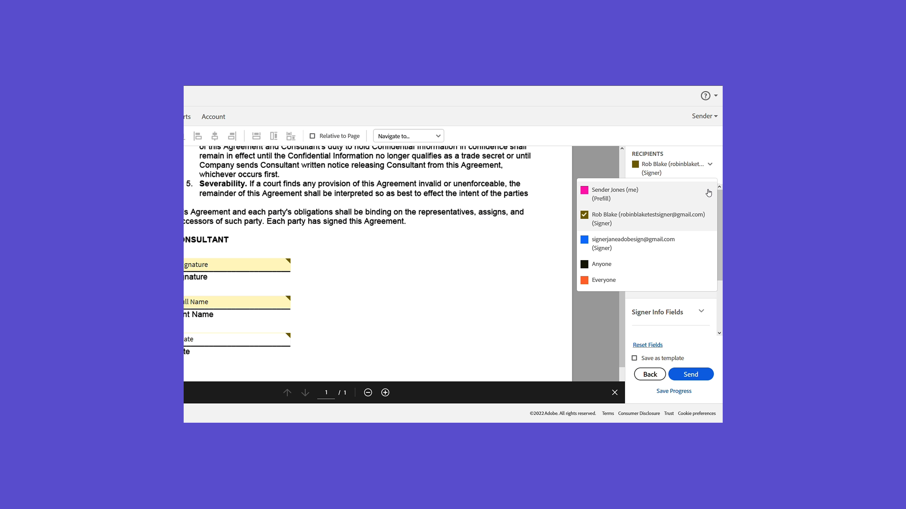

# Aan de slag - overzicht

Met deze korte, stapsgewijze tutorials leer je hoe je documenten verzendt, ondertekent en bijhoudt. Bekijk een korte rondleiding door Acrobat Sign en begin met het verzenden van een document naar een of meer personen. Deze content is ontworpen om je te laten werken in workflows voor elektronische handtekeningen.

## Nieuw

>[!BEGINTABS]

>[!TAB  beheer en volg overeenkomsten ]

Leer hoe te [ overeenkomsten ](../sign-beginner-tutorials/manage-and-track.md) te beheren en te volgen die voor ondertekening worden verzonden.

>[!TAB  Elektronisch een document ] ondertekenen

Leer hoe gemakkelijk het  een document te ondertekenen dat naar u met Acrobat Sign wordt verzonden.

>[!TAB  creeer een herbruikbaar malplaatje ]

Leer hoe te om a [ herbruikbare documentmalplaatje ](../sign-advanced-users/create-a-template.md) te creëren.

>[!TAB  vorm verzend opties ]

Leer hoe te [ diverse opties ](sending-options.md) vormen wanneer het verzenden van een document uit voor handtekening.

>[!ENDTABS]

## Verzenden

<table style="table-layout:fixed">
<tr>
  <td>
    
    

    <a href="new-sender.md"><strong> begin met Acrobat Sign </strong></a>
    

    Deze zelfstudie vormt een uitstekende startpunt voor nieuwe gebruikers in Acrobat Sign
     
  </td>
 <td>
    
    

    <a href="quick-tour.md"><strong> de grondbeginselen van de Werkruimte </strong></a>
    

    Volg een korte rondleiding door de Acrobat Sign-werkruimte om aan de slag te gaan
     
  </td>
  <td>
    
    

    <a href="send-to-single-recipient.md"><strong> verzend een document naar één enkele ondertekenaar </strong></a>
    

    Ga naar binnen en ontdek hoe eenvoudig het is om een document ter ondertekening te verzenden
     
  </td>
  <td>
    
    

    <a href="send-to-multiple-recipients.md"><strong> verzend naar veelvoudige ondertekenaars </strong></a>
    

    Verzend een document voor elektronische ondertekening naar meer dan één persoon in exact de gewenste volgorde
     
  </td>
</tr>
<tr>
  <td>
    
    

    <a href="sending-options.md"><strong> vorm verzend opties </strong></a>
    

    Leer hoe u verschillende opties kunt configureren bij het verzenden van een document ter ondertekening
     
  </td>
  <td>
    
    

    <a href="adding-fields.md"><strong> Toevoegend gebieden aan uw documenten </strong></a>
    

    Leer hoe u verschillende typen velden aan uw documenten kunt toevoegen
     
  </td>
  <td>
    
    

    <a href="modify-in-flight.md"><strong> Wijzigend een document na het verzenden </strong></a>
    

    Een document wijzigen dat al in uitvoering is
     
  </td>
  <td>
    
    

    <a href="replace-signer.md"><strong> Vervangend een ondertekenaar </strong></a>
    

    Leer hoe u de ondertekenaar wijzigt van een document dat al in uitvoering is
      
  </td>
</tr>
<tr>
  <td>
      
      

      <a href="set-deadlines-reminders.md"><strong> Vastgestelde termijnen en herinneringen </strong></a>
      

      Leer hoe u regelmatig e-mailherinneringen en deadlines kunt verzenden, zodat uw documenten snel kunnen worden ondertekend
       
    </td> 
  <td>
    
    

    <a href="../sign-advanced-users/create-a-template.md"><strong> creeer een herbruikbaar malplaatje </strong></a>
    

    Maak een herbruikbare documentsjabloon die snel en consistent is voor uw organisatie
     
  </td>
    <td>
      
      

       
    </td>
    <td>
      
      

       
    </td>
</tr>
</table>

## Ondertekenen

<table style="table-layout:fixed">
<tr>
  <td>
    
    

    <a href="electronically-sign-a-document.md"><strong> Elektronisch een document </strong></a> ondertekenen
    

    Leer hoe eenvoudig het is om een document te ondertekenen dat naar u is verzonden met Acrobat Sign
     
  </td>
  <td>
    
    

    <a href="fill-and-sign.md"><strong> het Vullen en het ondertekenen van een document </strong></a>
    

    Formulieren invullen en uw elektronische handtekening toevoegen aan documenten
     
  </td>
  <td>
    
    

    <a href="sign-in-person.md"><strong> die een handtekening in persoon krijgen </strong></a>
    

    Persoonlijk iemands handtekening verkrijgen met de mobiele Acrobat Sign-app
     
  </td>
  <td>
    
    

    <a href="delegate-signing.md"><strong> Delegeer het ondertekenen aan iemand anders </strong></a>
    

    Leer hoe u het ondertekenen van een document kunt delegeren aan iemand anders
     
  </td>
</tr>
<tr>
  <td>
    
    

    <a href="sign-with-a-digital-signature.md"><strong> wat een digitale handtekening </strong></a> is
    

    Meer informatie over op een certificaat gebaseerde digitale handtekeningen
     
  </td>
  <td>
    
    

    <a href="sign-with-a-stamp.md"><strong> het Ondertekenen gebruikend een stempel </strong></a>
    

    Stempels gebruiken om een goedgekeurd of voltooid document te markeren
      
  </td> 
 <td>
    
    

     
  </td>
  <td>
    
    

     
  </td>
</tr>  
</table>

## Beheren

<table style="table-layout:fixed">
<tr>
  <td>
    
    

    <a href="manage-and-track.md"><strong> beheer en volg uw overeenkomsten </strong></a>
    

    Leer hoe u overeenkomsten die ter ondertekening zijn verzonden beheert en bijhoudt
     
  </td>
  <td>
    
    

     
  </td>
  <td>
    
    

     
  </td>
  <td>
    
    

     
  </td>
</tr>
</table>
