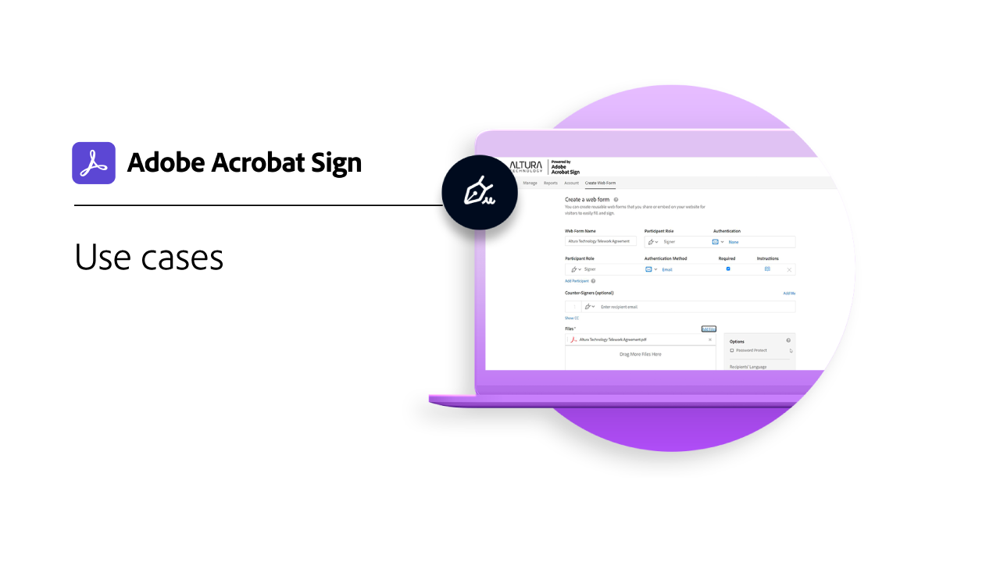

# Overzicht van sectoren en afdelingen

Ontdek hoe je de e-ondertekeningservaringen van je organisatie kunt transformeren door deze praktijkvoorbeelden, recepten en webinars uit de branche en de afdeling te bekijken.

<table style="table-layout:fixed">
<tr>
  <td>
    
    

    <a href="innovation-series.md"><strong> de Bouwer van de Vaardigheid </strong></a>
    

    <em> sluit zich bij ons voor een Bouwer van de Vaardigheid van 30 minuten aan om te leren hoe te om uw e-handtekeningen te zetten aan werk-zonder om het even welk extra werk aan uw dag toe te voegen </em>
     
  </td>
  <td>
    
    

    <a href="recipes.md"><strong> gevallen van het Gebruik </strong></a>
    

    <em> Onderzoek hoe diverse organisaties Acrobat Sign met deze praktijkvoorbeelden gebruiken </em>
     
  </td>
 </td>
  <td>
    
    

     
  </td>
  <td>
    
    

     
  </td>
</tr>
</table>
