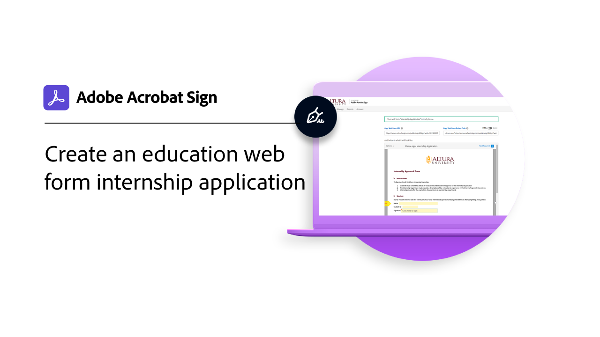

# Gebruiksscenario&#39;s

Ontdek hoe verschillende organisaties Acrobat Sign gebruiken om de digitale workflows van hun organisatie te transformeren met deze praktijkvoorbeelden.

## Nieuw

>[!BEGINTABS]

>[!TAB  het werkschema van de Douane voor het proces van onderwijsIEP ]

Leer hoe de [ Designer van het Werkschema van de Douane ](usecase-edu-iep.md) wordt gebruikt om een proces van het Programma van het Individualized Onderwijs (IEP) te digitaliseren.

>[!TAB  toepassing van de het Webvorm van het onderwijs ]

Leer hoe [ Webvormen ](usecase-edu-intern.md) worden gebruikt om de toegang van studenten tot vereiste vormen te verbeteren.

>[!TAB  creeer een toepassing van het het onderwijsWeb van de interieur ]

Leer hoe te om een intership [ Webvorm ](usecase-edu-intern-create.md) tot stand te brengen.

>[!TAB  de leningstoepassing van de overheid met veelvoudige onbekende ondertekenaars ]

Leer hoe de vorm van het a [ Web ](webform-multiple-signers.md) voor een complexe werkschema van de de toepassingstoepassing van de overheidslening wordt gebruikt die veelvoudige onbekende deelnemers impliceert.

>[!ENDTABS]

## Gebruiksscenario’s voor de overheid

<table style="table-layout:fixed">
<tr>
  <td>
    
    

    <a href="webform-multiple-signers.md"><strong> de leningstoepassing van de overheid met veelvoudige onbekende ondertekenaars </strong></a>
    

    <em> Leer hoe een Webvorm voor een complexe werkschema van de de toepassingstoepassing van de overheidslening wordt gebruikt die veelvoudige onbekende deelnemers </em> impliceert
     
  </td> 
  <td>
    
    

    <a href="usecasegovgrants.md"><strong> Bedrijfs subsidies en leningen </strong></a>
    

    <em> verstrek snelle hulp aan ondernemingen door zelfservice toegang te verlenen om, leningen, en de vormen van het belastinguitstel te verlenen verzoeken </em>
     
  </td> 
  <td>
    
    

    <a href="usecasegovtelework.md"><strong> overeenkomst van het OverzichtWerk </strong></a>
    

    <em> verzamel efficiënt handtekeningen van al uw werknemers op telewerkovereenkomsten, beleidsupdates, en meer </em>
     
  </td>
  <td>
    
    

    <a href="usecasegovcontracts.md"><strong> Contracten en aanvraagvormen </strong></a>
    

    <em> vervangt snel papierverwerking met volgzame digitale workflows, volledig met controlerapporten </em>
     
  </td>
</tr>
<tr>
 <td>
    
    

    <a href="usecasegovreemployment.md"><strong> hulp voor herintreding </strong></a>
    

    <em> hulp burgers krijgen de hulp die zij nodig hebben zonder in lijn met volledig-digitale toepassingsvormen te staan die in dagen kunnen leven </em>
     
  </td>
  <td>
    
    

    <a href="usecasegovpaycheck.md"><strong> Bescherming van de Paycheck </strong></a>
    

    <em> zie hoe u Acrobat Sign kunt gebruiken om de vorm van het Programma van de Bescherming van de Betaling in een online interactieve vorm om te zetten </em>
     
  </td>
  <td>
    
    

    <a href="usecasegovremote.md"><strong> Verre verzoek van het Verzoek van het Verzoek </strong></a>
    

    <em> gebruik samen e-handtekeningen en Webconfereren om de tijd te verminderen het neemt om bevelen van rechters te verzoeken en te beveiligen </em>
     
  </td>
  <td>
    
    

     
  </td>
</tr>
</table>

## Commercieel gebruik

<table style="table-layout:fixed">
<tr>
  <td>
    
    

    <a href="usecasecomcontracts.md"><strong> Contracten en aanvraagvormen </strong></a>
    

    <em> vervangt snel papierverwerking met volgzame digitale workflows, volledig met controlerapporten </em>
     
  </td> 
  <td>
    
    

    <a href="usecasecompolicy.md"><strong> de overeenkomsten van het Beleid </strong></a>
    

    <em> verzamel efficiënt handtekeningen van al uw werknemers op beleidsovereenkomsten en updates </em>
     
  </td>
  <td>
    
    

    <a href="usecasecomtelework.md"><strong> overeenkomst van het OverzichtWerk </strong></a>
    

    <em> verzamel efficiënt handtekeningen van al uw werknemers op telewerkovereenkomsten </em>
     
  </td>
  <td>
    
    

     
  </td>
</tr>
</table>

## Gebruiksscenario’s voor onderwijsinstellingen

<table style="table-layout:fixed">
<tr>
  <td>
    
    

    <a href="usecase-edu-intern.md"><strong> toepassing van de het Webvorm van het onderwijs </strong></a>
    

    <em> Leer hoe de Webvormen worden gebruikt om de toegang van studenten tot vereiste vormen te verbeteren </em>
     
  </td> 
  <td>
    
    

    <a href="usecase-edu-intern-create.md"><strong> creeer een toepassing van het het onderwijsWeb van de interieur </strong></a>
    

    <em> Leer hoe te om een vorm van het intershipWeb </em> te creëren
     
  </td> 
  <td>
    
    

    <a href="usecase-edu-iep.md"><strong> het werkschema van de Douane voor het proces van onderwijsIEP </strong></a>
    

    <em> Leer hoe de Designer van het Werkschema van de Douane wordt gebruikt om een Individueel proces van het Programma van het Onderwijs (IEP) te digitaliseren </em>
     
  </td>
  <td>
    
    

     
  </td>
</tr>
</table>

