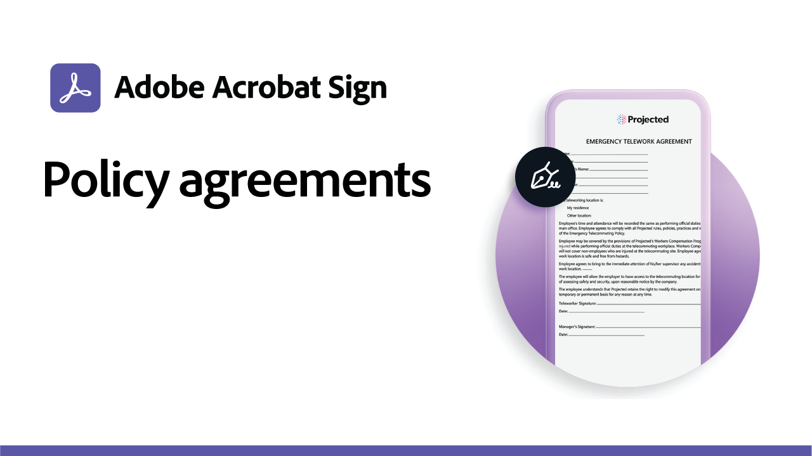

# Hoofdletterrecepten gebruiken

Versnel de digitale workflows van je organisatie met deze voorbeelden van overheid en commerciële elektronische handtekeningen. Klik om een PDF te bekijken met bronnen en informatie over hoe u deze specifieke gebruiksscenario&#39;s voor elektronische handtekeningen instelt.

## Gebruiksscenario’s voor de overheid

<table style="table-layout:fixed">
<tr>
  <td>
    
    

    <a href="usecasegovgrants.md"><strong>Bedrijfssubsidies en leningen</strong></a>
    

    <em>Snel hulp bieden aan bedrijven door zelfservice toegang te bieden tot aanvraagformulieren voor subsidies, leningen en belastinguitstel</em>
     
  </td> 
  <td>
    
    

    <a href="usecasegovtelework.md"><strong>Telovereenkomst</strong></a>
    

    <em>Verzamel op efficiënte wijze handtekeningen van al je medewerkers op telewerkovereenkomsten, beleidsupdates en meer</em>
     
  </td>
  <td>
    
    

    <a href="usecasegovcontracts.md"><strong>Contracten en aanvraagformulieren</strong></a>
    

    <em>Snel papierverwerking vervangen door compatibele digitale workflows, compleet met controlerapporten</em>
     
  </td>
  <td>
    
    

    <a href="usecasegovreemployment.md"><strong>Herwerkgelegenheidssteun</strong></a>
    

    <em>Help burgers om de hulp te krijgen die ze nodig hebben zonder zich aan te sluiten bij volledig digitale aanvraagformulieren die binnen enkele dagen kunnen worden gebruikt</em>
     
  </td>
</tr>
<tr>
  <td>
    
    

    <a href="usecasegovpaycheck.md"><strong>Paycheck-beveiliging</strong></a>
    

    <em>Zie hoe u Acrobat Sign kunt gebruiken om het formulier Betalingsbeschermingsprogramma om te zetten in een online interactief formulier</em>
     
  </td>
  <td>
    
    

    <a href="usecasegovremote.md"><strong>Verzoek om extern bevel</strong></a>
    

    <em>Gebruik samen elektronische handtekeningen en webconferenties om rechters sneller om verzoeken te ontvangen en om warrants te beveiligen</em>
     
  </td>
  <td>
    
    

     
  </td>
  <td>
    
    

     
  </td>
</tr>
</table>

## Commercieel gebruik

<table style="table-layout:fixed">
<tr>
  <td>
    
    

    <a href="usecasecomcontracts.md"><strong>Contracten en aanvraagformulieren</strong></a>
    

    <em>Snel papierverwerking vervangen door compatibele digitale workflows, compleet met controlerapporten</em>
     
  </td> 
  <td>
    
    

    <a href="usecasecompolicy.md"><strong>Beleidsovereenkomsten</strong></a>
    

    <em>Verzamel op efficiënte wijze handtekeningen van al je medewerkers op beleidsovereenkomsten en updates</em>
     
  </td>
  <td>
    
    

    <a href="usecasecomtelework.md"><strong>Telovereenkomst</strong></a>
    

    <em>Efficiënt handtekeningen verzamelen van al je medewerkers op telewerkovereenkomsten</em>
     
  </td>
  <td>
    
    

     
  </td>
</tr>
</table>
